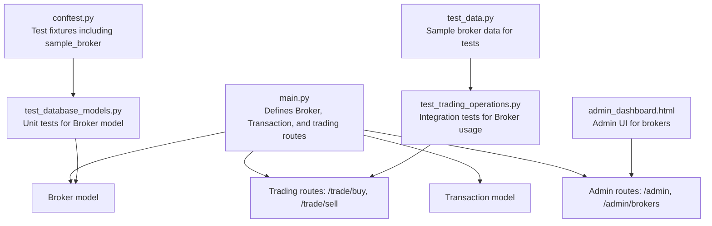
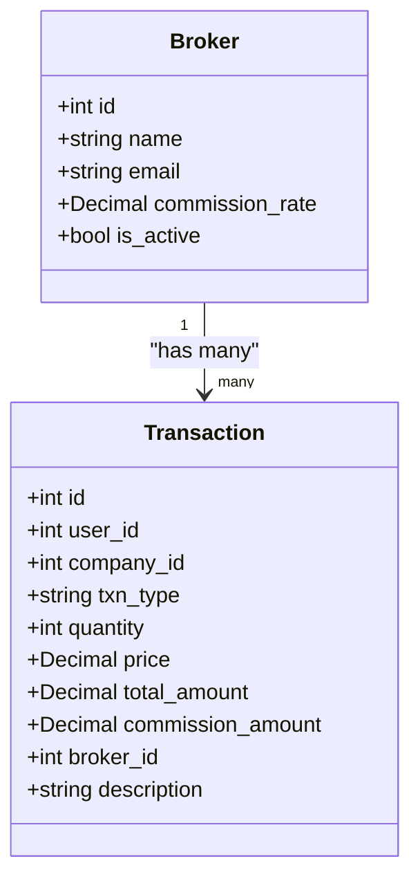
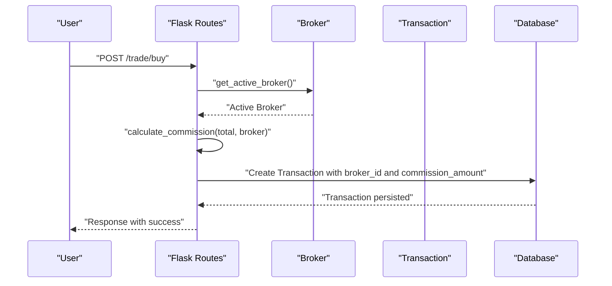
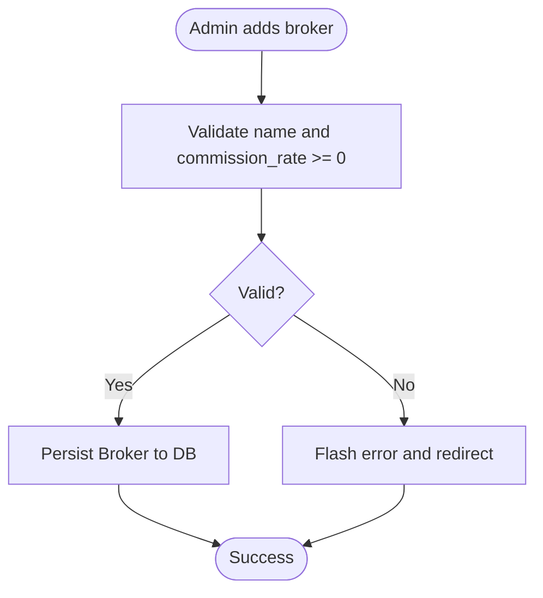
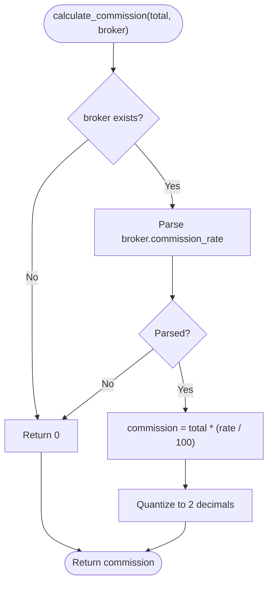
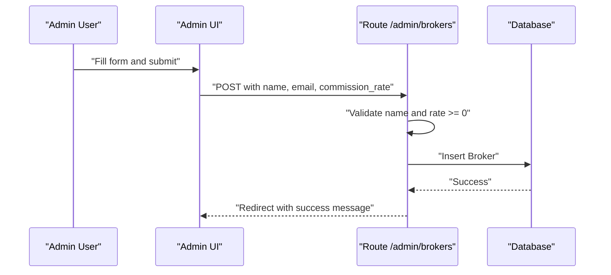
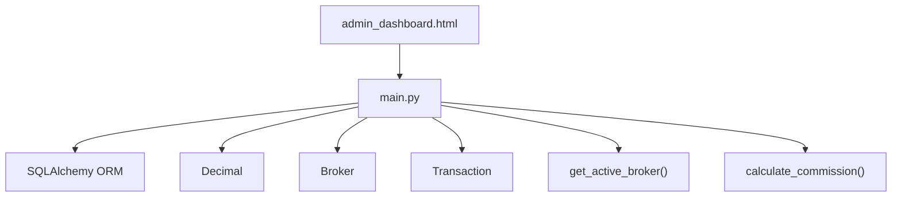

# Broker Model

<cite>
**Referenced Files in This Document**
- [main.py](file://main.py)
- [admin_dashboard.html](file://templates/admin_dashboard.html)
- [test_database_models.py](file://tests/test_database_models.py)
- [test_trading_operations.py](file://tests/test_trading_operations.py)
- [conftest.py](file://tests/conftest.py)
- [test_data.py](file://tests/test_data.py)
</cite>

## Table of Contents
1. [Introduction](#introduction)
2. [Project Structure](#project-structure)
3. [Core Components](#core-components)
4. [Architecture Overview](#architecture-overview)
5. [Detailed Component Analysis](#detailed-component-analysis)
6. [Dependency Analysis](#dependency-analysis)
7. [Performance Considerations](#performance-considerations)
8. [Troubleshooting Guide](#troubleshooting-guide)
9. [Conclusion](#conclusion)
10. [Appendices](#appendices)

## Introduction
This document provides comprehensive data model documentation for the Broker model. It explains the Broker entity’s fields, relationships, and business rules, and demonstrates how brokers simulate realistic trading costs through commission calculations. It also documents how the active broker is selected for trading operations, how transactions reference brokers, and how administrators manage brokers via the admin interface. Finally, it includes examples of commission calculations for buy/sell operations and guidance on configuring realistic commission rates.

## Project Structure
The Broker model is defined alongside other domain models in the main application module and is used by trading routes and admin endpoints. The admin interface renders and manages brokers.

**Diagram sources**
- [main.py](file://main.py#L75-L109)
- [admin_dashboard.html](file://templates/admin_dashboard.html#L140-L195)
- [test_database_models.py](file://tests/test_database_models.py#L158-L193)
- [test_trading_operations.py](file://tests/test_trading_operations.py#L206-L305)
- [conftest.py](file://tests/conftest.py#L100-L112)
- [test_data.py](file://tests/test_data.py#L74-L101)

**Section sources**
- [main.py](file://main.py#L75-L109)
- [admin_dashboard.html](file://templates/admin_dashboard.html#L140-L195)

## Core Components
The Broker model defines the broker entity used to simulate trading costs. It includes the following fields:
- id: Integer, primary key
- name: String, not null
- email: String
- commission_rate: Numeric with precision 5, scale 2, not null, default 0
- is_active: Boolean, default true

Relationships:
- One-to-many with Transaction via broker_id foreign key

Key behaviors:
- Active broker selection: The system retrieves the first active broker ordered by id.
- Commission calculation: Commission equals total_amount multiplied by (commission_rate / 100), rounded to two decimal places.
- Admin management: Administrators can add brokers with non-negative commission rates.

**Section sources**
- [main.py](file://main.py#L75-L81)
- [main.py](file://main.py#L94-L109)
- [main.py](file://main.py#L172-L185)
- [main.py](file://main.py#L492-L515)
- [test_database_models.py](file://tests/test_database_models.py#L158-L193)

## Architecture Overview
The Broker model integrates with:
- Transaction model: Each transaction references a broker via broker_id.
- Trading routes: Buy and sell routes compute commission using the active broker and persist the broker_id and commission_amount on the transaction.
- Admin routes: Administrators add brokers and configure commission rates.
- Admin UI: The admin dashboard displays brokers and allows adding new ones.

**Diagram sources**
- [main.py](file://main.py#L75-L109)

**Section sources**
- [main.py](file://main.py#L94-L109)

## Detailed Component Analysis

### Broker Data Model
- Fields and constraints:
  - id: primary key
  - name: not null
  - email: nullable
  - commission_rate: not null, default 0, numeric with precision 5 and scale 2
  - is_active: default true
- Defaults verified by tests:
  - Default commission_rate is 0
  - Default is_active is true

**Section sources**
- [main.py](file://main.py#L75-L81)
- [test_database_models.py](file://tests/test_database_models.py#L178-L193)

### Relationship with Transaction (One-to-Many)
- Transaction has a broker_id foreign key referencing Broker.id.
- Each transaction stores commission_amount and optionally broker_id.
- Broker is fetched via get_active_broker() and linked to transactions during buy/sell operations.

**Diagram sources**
- [main.py](file://main.py#L172-L185)
- [main.py](file://main.py#L268-L324)
- [main.py](file://main.py#L327-L375)

**Section sources**
- [main.py](file://main.py#L94-L109)
- [main.py](file://main.py#L268-L324)
- [main.py](file://main.py#L327-L375)

### Business Rules and Validation
- Prevent negative commission rates:
  - Admin route validates commission_rate is not negative.
- Ensure only one active broker is used for commission calculations:
  - get_active_broker() selects the first active broker ordered by id.
- Maintain broker configuration via admin interface:
  - Admin dashboard form posts to /admin/brokers with name, email, and commission_rate.
- Simulation default:
  - Default commission_rate is 0, enabling simulation without real-world cost impact.

**Diagram sources**
- [main.py](file://main.py#L492-L515)

**Section sources**
- [main.py](file://main.py#L492-L515)
- [main.py](file://main.py#L172-L185)
- [test_trading_operations.py](file://tests/test_trading_operations.py#L272-L290)

### Commission Calculation Logic
- Formula: commission = total_amount × (commission_rate / 100)
- Rounding: Two decimal places using quantization
- Edge cases handled:
  - No active broker returns zero commission
  - Invalid broker or rate returns zero commission

**Diagram sources**
- [main.py](file://main.py#L176-L185)

**Section sources**
- [main.py](file://main.py#L176-L185)
- [test_trading_operations.py](file://tests/test_trading_operations.py#L209-L232)

### Admin Management of Brokers
- Admin dashboard UI:
  - Form to add broker with fields: name, email, commission_rate
  - Table displaying brokers with name, email, commission_rate, and active status
- Backend endpoint:
  - Validates inputs and persists new Broker
  - Enforces non-negative commission_rate

**Diagram sources**
- [admin_dashboard.html](file://templates/admin_dashboard.html#L140-L159)
- [main.py](file://main.py#L492-L515)

**Section sources**
- [admin_dashboard.html](file://templates/admin_dashboard.html#L140-L195)
- [main.py](file://main.py#L492-L515)

### Examples: Calculating Commissions and Using Active Broker
- Example 1: Buy operation
  - Total amount computed from price × quantity
  - Active broker retrieved and commission calculated
  - Transaction created with broker_id and commission_amount
- Example 2: Sell operation
  - Total amount computed from price × quantity
  - Active broker retrieved and commission calculated
  - Transaction created with broker_id and commission_amount

These behaviors are exercised by integration tests and route handlers.

**Section sources**
- [main.py](file://main.py#L268-L324)
- [main.py](file://main.py#L327-L375)
- [test_trading_operations.py](file://tests/test_trading_operations.py#L233-L267)

### Default Commission Rate and Realism
- Default commission_rate is 0, enabling simulation without charging fees.
- To introduce realism, administrators can add brokers with non-zero commission rates via the admin interface.
- Sample broker configurations are provided in test data for demonstration.

**Section sources**
- [test_database_models.py](file://tests/test_database_models.py#L178-L184)
- [admin_dashboard.html](file://templates/admin_dashboard.html#L140-L159)
- [test_data.py](file://tests/test_data.py#L74-L101)

## Dependency Analysis
- Broker depends on:
  - SQLAlchemy ORM for persistence
  - Decimal for precise numeric calculations
- Broker is referenced by:
  - Transaction via broker_id foreign key
  - Routes for active broker selection and commission computation
- Admin UI depends on:
  - Admin routes for posting new brokers

**Diagram sources**
- [main.py](file://main.py#L1-L34)
- [main.py](file://main.py#L75-L109)
- [admin_dashboard.html](file://templates/admin_dashboard.html#L140-L159)

**Section sources**
- [main.py](file://main.py#L1-L34)
- [main.py](file://main.py#L75-L109)

## Performance Considerations
- Commission calculation uses Decimal arithmetic to avoid floating-point errors.
- Active broker retrieval uses a simple query filtering by is_active and ordering by id; this is efficient for small datasets typical in simulations.
- Consider indexing broker.is_active if the number of brokers grows significantly.

## Troubleshooting Guide
- Negative commission rate rejected:
  - Ensure commission_rate is not negative when adding a broker.
- No active broker:
  - If no broker is marked active, commission will be zero; set is_active=True for the intended broker.
- Insufficient funds for buy with commission:
  - Verify user wallet_balance covers total_amount plus commission.
- Broker not reflected in transactions:
  - Confirm an active broker exists and that routes are invoked with a valid broker.

**Section sources**
- [main.py](file://main.py#L492-L515)
- [main.py](file://main.py#L172-L185)
- [main.py](file://main.py#L268-L324)
- [main.py](file://main.py#L327-L375)

## Conclusion
The Broker model provides a simple yet powerful mechanism to simulate trading costs. Its fields and defaults support simulation out-of-the-box, while its relationships and admin interface enable realistic configuration. The active broker is consistently used for commission calculations across buy and sell operations, and the admin dashboard streamlines broker management.

## Appendices

### Field Reference
- id: Integer, primary key
- name: String, not null
- email: String
- commission_rate: Numeric(5,2), not null, default 0
- is_active: Boolean, default true

**Section sources**
- [main.py](file://main.py#L75-L81)

### Relationship Reference
- Broker (1) ←→ Transaction (many)
- Foreign key: Transaction.broker_id → Broker.id

**Section sources**
- [main.py](file://main.py#L94-L109)

### Admin UI Reference
- Add Broker form: name, email, commission_rate
- Brokers table: name, email, commission_rate, active

**Section sources**
- [admin_dashboard.html](file://templates/admin_dashboard.html#L140-L195)