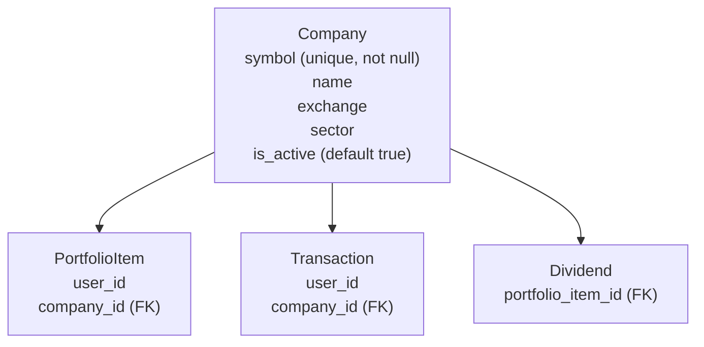
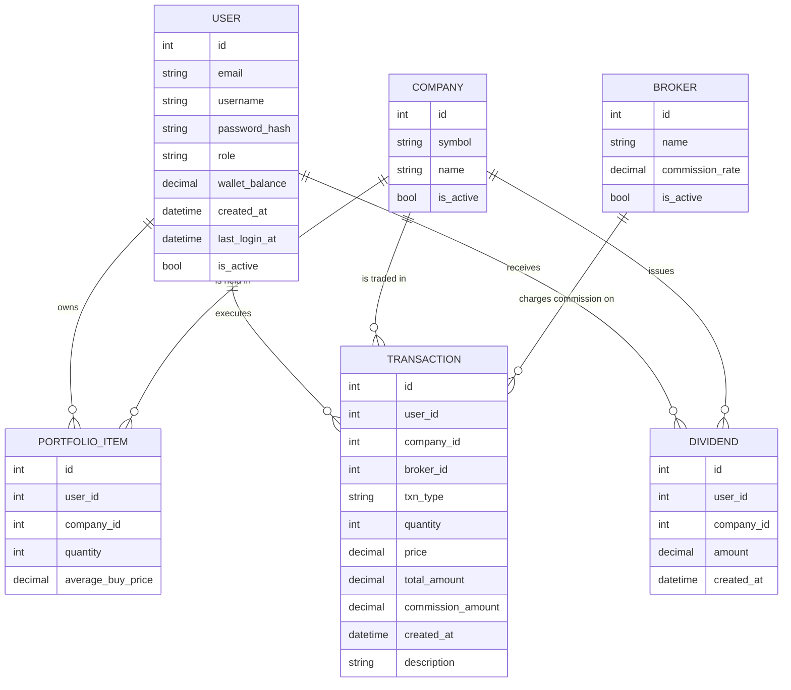
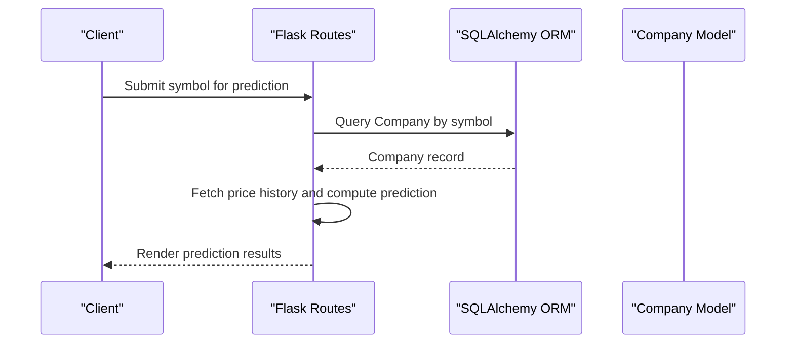
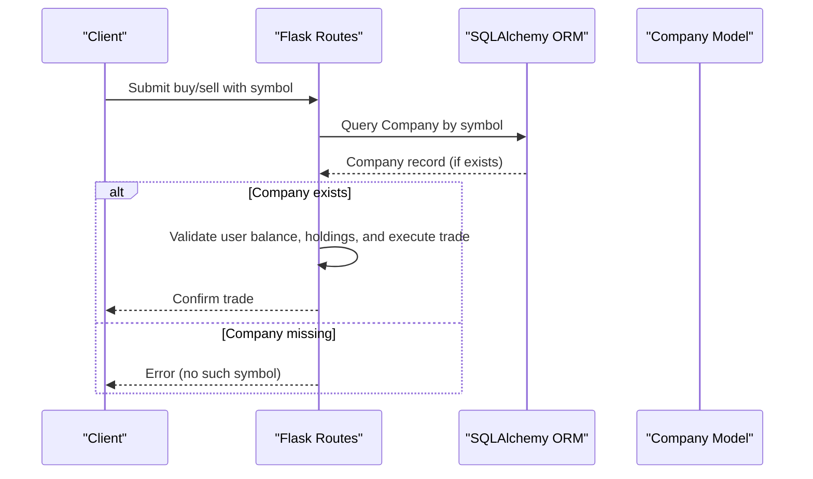
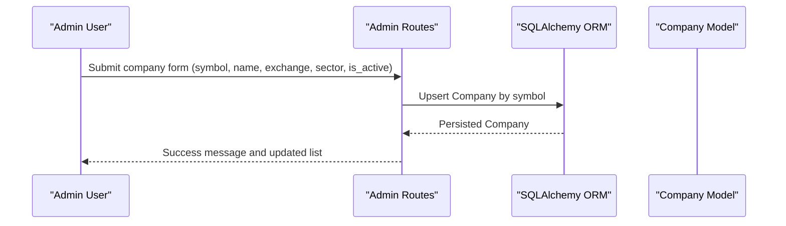
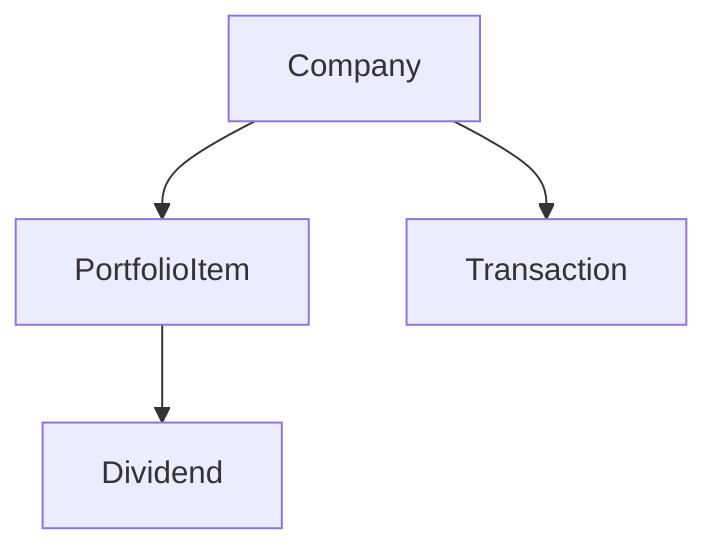

# Company Model

<cite>
**Referenced Files in This Document**
- [main.py](file://main.py)
- [test_database_models.py](file://tests/test_database_models.py)
- [admin_dashboard.html](file://templates/admin_dashboard.html)
- [er_diagram.md](file://docs/diagrams/er_diagram.md)
- [draft-report.md](file://draft-report.md)
</cite>

## Table of Contents
1. [Introduction](#introduction)
2. [Project Structure](#project-structure)
3. [Core Components](#core-components)
4. [Architecture Overview](#architecture-overview)
5. [Detailed Component Analysis](#detailed-component-analysis)
6. [Dependency Analysis](#dependency-analysis)
7. [Performance Considerations](#performance-considerations)
8. [Troubleshooting Guide](#troubleshooting-guide)
9. [Conclusion](#conclusion)

## Introduction
This document provides comprehensive data model documentation for the Company entity used in the stock prediction and portfolio management system. It defines the Company model fields, their purposes, and constraints; describes relationships with PortfolioItem, Transaction, and Dividend; documents business rules such as symbol uniqueness and active status; and outlines operational usage patterns for prediction and trading workflows. It also clarifies indexing expectations for efficient lookups during trading and prediction.

## Project Structure
The Company model is defined in the application’s ORM layer and is part of the core database schema alongside User, Broker, PortfolioItem, Transaction, and Dividend. The model participates in multiple workflows:
- Trading operations: buy/sell routes query companies by symbol to resolve target securities.
- Prediction workflows: the system retrieves company metadata and resolves symbol-based price feeds.
- Admin management: administrators create or update company profiles and toggle active status.
- Dividend recording: dividends are associated with a company and user holdings.

**Diagram sources**
- [main.py](file://main.py#L66-L119)
- [er_diagram.md](file://docs/diagrams/er_diagram.md#L1-L68)

**Section sources**
- [main.py](file://main.py#L66-L119)
- [er_diagram.md](file://docs/diagrams/er_diagram.md#L1-L68)

## Core Components
- id: Primary key for the Company entity.
- symbol: Unique, not null identifier for the stock (e.g., ticker). Used extensively for lookups in trading and prediction.
- name: Human-readable company name; optional.
- exchange: Exchange listing (e.g., NASDAQ); optional.
- sector: Sector classification; optional.
- is_active: Boolean flag indicating whether the company is eligible for trading; defaults to true.

Purpose in context:
- symbol uniqueness ensures reliable identification of securities across the system and prevents ambiguity in trading and prediction.
- is_active controls trading eligibility; inactive companies should not be tradable.
- name, exchange, and sector enrich metadata for display and filtering in dashboards and admin panels.

**Section sources**
- [main.py](file://main.py#L66-L73)
- [test_database_models.py](file://tests/test_database_models.py#L115-L155)
- [admin_dashboard.html](file://templates/admin_dashboard.html#L205-L219)

## Architecture Overview
The Company model participates in the following relationships:
- One-to-many with PortfolioItem: A company can be held by many users’ portfolio items.
- One-to-many with Transaction: A company can have many buy/sell/dividend transactions.
- One-to-many with Dividend: Dividends are issued against a company and tracked per portfolio item.

**Diagram sources**
- [er_diagram.md](file://docs/diagrams/er_diagram.md#L1-L68)

**Section sources**
- [er_diagram.md](file://docs/diagrams/er_diagram.md#L1-L68)

## Detailed Component Analysis

### Field Definitions and Business Purpose
- id: Primary key; uniquely identifies each company record.
- symbol: Unique, not null; serves as the canonical identifier for stock lookups in trading and prediction.
- name: Optional; human-readable company name; displayed in dashboards and admin panels.
- exchange: Optional; exchange listing; useful for filtering and display.
- sector: Optional; sector classification; useful for analytics and grouping.
- is_active: Optional; defaults to true; controls whether a company is eligible for trading.

Operational implications:
- symbol uniqueness prevents duplicate entries and ensures deterministic resolution of trades and predictions.
- is_active allows administrators to disable trading for a company without deleting its record.
- Metadata fields (name, exchange, sector) enhance user experience and reporting.

**Section sources**
- [main.py](file://main.py#L66-L73)
- [test_database_models.py](file://tests/test_database_models.py#L115-L155)
- [admin_dashboard.html](file://templates/admin_dashboard.html#L205-L219)

### Relationships and Referential Integrity
- Company to PortfolioItem: Foreign key company_id on PortfolioItem references Company.id.
- Company to Transaction: Foreign key company_id on Transaction references Company.id.
- Company to Dividend: Dividend is linked via portfolio_item_id to PortfolioItem, which references Company.id indirectly.

These relationships enable:
- Tracking holdings per company.
- Recording all transactions against a company.
- Associating dividends with company-level issuance.

**Section sources**
- [main.py](file://main.py#L83-L119)
- [er_diagram.md](file://docs/diagrams/er_diagram.md#L1-L68)

### Business Rules and Constraints
- Symbol uniqueness: Enforced at the database level; attempting to insert a duplicate symbol raises an integrity error.
- Default is_active: True if not explicitly set.
- Active status for trading: While the Company model has is_active, trading routes rely on the presence of a Company record keyed by symbol. Inactive status is not enforced in the trading routes; trading eligibility is determined by the existence of a Company record and user holdings.

Validation evidence:
- Tests confirm symbol uniqueness and default is_active behavior.
- Admin routes accept is_active toggles when saving company records.

**Section sources**
- [test_database_models.py](file://tests/test_database_models.py#L115-L155)
- [main.py](file://main.py#L517-L539)

### Example Workflows

#### Querying Companies by Symbol for Prediction Requests
- Prediction routes accept a stock symbol and use it to retrieve company metadata and price history.
- The system resolves symbol-based price feeds and displays prediction results.

**Diagram sources**
- [main.py](file://main.py#L268-L324)

**Section sources**
- [main.py](file://main.py#L268-L324)

#### Filtering Active Companies for Trading Operations
- Trading routes resolve a Company by symbol and proceed if the record exists.
- There is no explicit filter for is_active in trading routes; trading eligibility is based on symbol existence and user holdings.

**Diagram sources**
- [main.py](file://main.py#L296-L375)

**Section sources**
- [main.py](file://main.py#L296-L375)

#### Admin Company Management
- Admin routes allow adding/updating companies, including toggling is_active.
- The admin dashboard lists companies and displays symbol/name/exchange/sector/active status.

**Diagram sources**
- [main.py](file://main.py#L517-L539)
- [admin_dashboard.html](file://templates/admin_dashboard.html#L205-L258)

**Section sources**
- [main.py](file://main.py#L517-L539)
- [admin_dashboard.html](file://templates/admin_dashboard.html#L205-L258)

### Indexing Expectations
- Symbol is unique and frequently used as a lookup key in trading and prediction workflows.
- The model definition declares unique=True on symbol, which typically creates a unique index at the database level.
- For optimal performance during high-frequency trading and prediction lookups, ensure the unique index on symbol remains enabled and consider:
  - Using the existing unique constraint to enforce uniqueness and enable efficient lookups.
  - Avoiding redundant custom indexes on symbol beyond the unique constraint.
  - Ensuring database maintenance routines keep indexes healthy.

Evidence:
- The model explicitly enforces symbol uniqueness.
- Admin and trading routes perform symbol-based lookups.

**Section sources**
- [main.py](file://main.py#L66-L73)
- [main.py](file://main.py#L296-L375)
- [main.py](file://main.py#L517-L539)

## Dependency Analysis
- Company is referenced by:
  - PortfolioItem (foreign key company_id)
  - Transaction (foreign key company_id)
  - Dividend (via portfolio_item.company_id)
- Trading and prediction routes depend on symbol-based lookups to resolve Company records.

**Diagram sources**
- [main.py](file://main.py#L83-L119)

**Section sources**
- [main.py](file://main.py#L83-L119)

## Performance Considerations
- Use the unique index on symbol for O(1) average-case lookups in trading and prediction.
- Batch operations should still leverage symbol-based joins to minimize round-trips.
- Avoid scanning entire Company tables; always filter by symbol or composite keys.
- Keep symbol values normalized (uppercase) to prevent case-insensitive mismatches.

[No sources needed since this section provides general guidance]

## Troubleshooting Guide
Common issues and resolutions:
- Duplicate symbol insertion fails:
  - Symptom: Integrity error when inserting a company with an existing symbol.
  - Resolution: Ensure symbol is unique; update existing record instead of inserting a duplicate.
- Missing company for trading:
  - Symptom: Trade rejected because symbol not found.
  - Resolution: Create or activate the company record; ensure symbol matches user input (case normalization).
- Unexpected trading eligibility:
  - Symptom: Company exists but trading is blocked.
  - Resolution: Confirm that trading logic relies on symbol existence; is_active is not enforced in routes. If needed, add explicit checks in routes.

**Section sources**
- [test_database_models.py](file://tests/test_database_models.py#L137-L148)
- [main.py](file://main.py#L296-L375)
- [main.py](file://main.py#L517-L539)

## Conclusion
The Company model is central to the system’s identity and operations. Its unique symbol field, combined with optional metadata and active status, enables robust trading and prediction workflows. The documented relationships and business rules clarify how companies relate to portfolios, transactions, and dividends. By leveraging the unique index on symbol and adhering to the outlined constraints, the system maintains reliability and performance for both trading and prediction use cases.