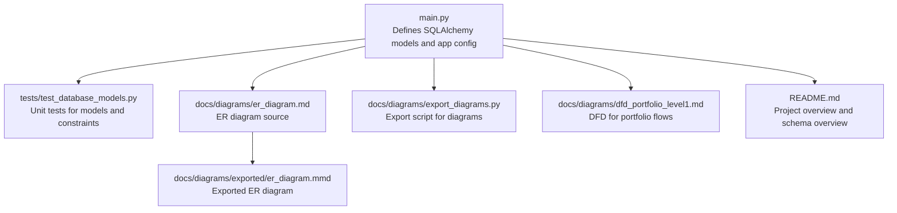
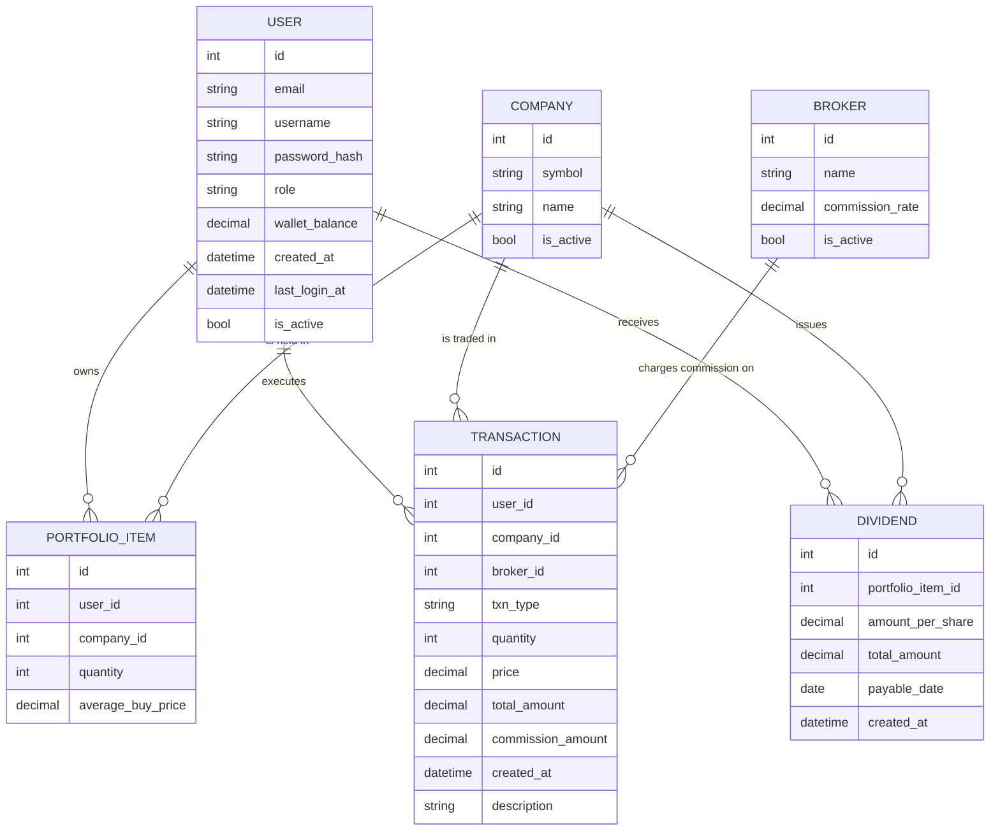
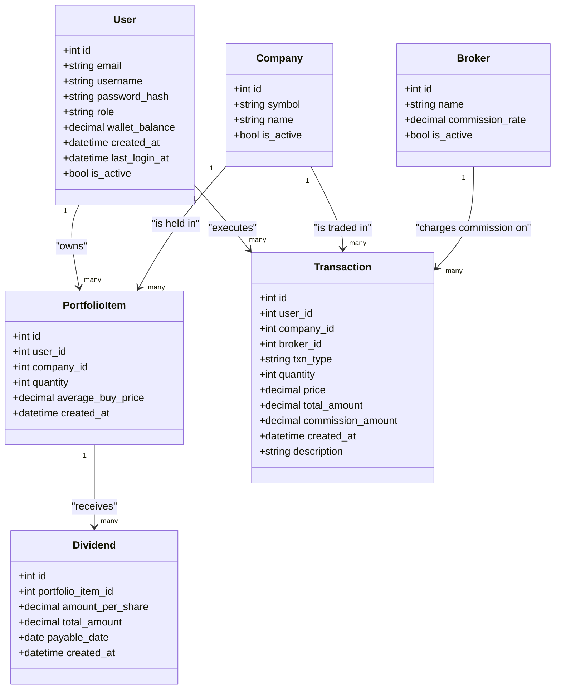
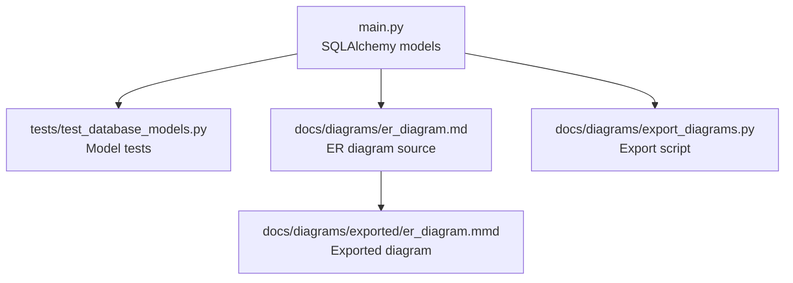

# Database Schema Design

<cite>
**Referenced Files in This Document**
- [main.py](file://main.py)
- [tests/test_database_models.py](file://tests/test_database_models.py)
- [tests/conftest.py](file://tests/conftest.py)
- [docs/diagrams/er_diagram.md](file://docs/diagrams/er_diagram.md)
- [docs/diagrams/exported/er_diagram.mmd](file://docs/diagrams/exported/er_diagram.mmd)
- [docs/diagrams/export_diagrams.py](file://docs/diagrams/export_diagrams.py)
- [docs/diagrams/dfd_portfolio_level1.md](file://docs/diagrams/dfd_portfolio_level1.md)
- [README.md](file://README.md)
</cite>

## Table of Contents
1. [Introduction](#introduction)
2. [Project Structure](#project-structure)
3. [Core Components](#core-components)
4. [Architecture Overview](#architecture-overview)
5. [Detailed Component Analysis](#detailed-component-analysis)
6. [Dependency Analysis](#dependency-analysis)
7. [Performance Considerations](#performance-considerations)
8. [Troubleshooting Guide](#troubleshooting-guide)
9. [Conclusion](#conclusion)
10. [Appendices](#appendices)

## Introduction
This document provides comprehensive data model documentation for the application’s database schema. It defines all entities (User, Company, PortfolioItem, Transaction, Dividend, Broker), their fields, constraints, primary and foreign keys, and relationships. It explains business rules enforced through database constraints and application logic, outlines access patterns, and documents performance considerations, data lifecycle, and security aspects.

## Project Structure
The database schema is defined in the main application module and validated by unit tests. The ER diagram is maintained alongside the documentation and exported to images for visualization.

**Diagram sources**
- [main.py](file://main.py#L41-L50)
- [tests/test_database_models.py](file://tests/test_database_models.py#L1-L356)
- [docs/diagrams/er_diagram.md](file://docs/diagrams/er_diagram.md#L1-L68)
- [docs/diagrams/exported/er_diagram.mmd](file://docs/diagrams/exported/er_diagram.mmd#L1-L66)
- [docs/diagrams/export_diagrams.py](file://docs/diagrams/export_diagrams.py#L1-L211)
- [docs/diagrams/dfd_portfolio_level1.md](file://docs/diagrams/dfd_portfolio_level1.md#L1-L37)
- [README.md](file://README.md#L83-L91)

**Section sources**
- [main.py](file://main.py#L41-L50)
- [README.md](file://README.md#L83-L91)

## Core Components
This section defines each entity, its fields, constraints, and relationships.

- User
  - Fields: id (PK), email (unique, not null), username (unique, not null), password_hash (not null), role (not null, default "user"), wallet_balance (not null, default 0), created_at (default now), last_login_at, is_active (default true)
  - Constraints: unique(email), unique(username), not null on email, username, password_hash, role
  - Relationships: one-to-many with PortfolioItem and Transaction via user_id

- Company
  - Fields: id (PK), symbol (unique, not null), name, exchange, sector, is_active (default true)
  - Constraints: unique(symbol), not null on symbol
  - Relationships: one-to-many with PortfolioItem and Transaction via company_id

- Broker
  - Fields: id (PK), name (not null), email, commission_rate (not null, default 0), is_active (default true)
  - Constraints: not null on name; default commission_rate 0
  - Relationships: one-to-many with Transaction via broker_id

- PortfolioItem
  - Fields: id (PK), user_id (FK to User), company_id (FK to Company), quantity (not null, default 0), average_buy_price (not null, default 0), created_at (default now)
  - Constraints: not null on quantity, average_buy_price; foreign keys to User and Company
  - Relationships: belongs to User and Company; one-to-many with Dividend via portfolio_item_id

- Transaction
  - Fields: id (PK), user_id (FK to User), company_id (FK to Company), broker_id (FK to Broker), txn_type (not null), quantity (not null), price (not null), total_amount (not null), commission_amount (not null, default 0), description, created_at (default now)
  - Constraints: not null on txn_type, quantity, price, total_amount; foreign keys to User, Company, Broker
  - Relationships: belongs to User, Company, Broker

- Dividend
  - Fields: id (PK), portfolio_item_id (FK to PortfolioItem), amount_per_share (not null), total_amount (not null), payable_date, created_at (default now)
  - Constraints: not null on amount_per_share, total_amount; foreign key to PortfolioItem
  - Relationships: belongs to PortfolioItem

**Section sources**
- [main.py](file://main.py#L51-L119)
- [tests/test_database_models.py](file://tests/test_database_models.py#L15-L113)
- [tests/test_database_models.py](file://tests/test_database_models.py#L115-L156)
- [tests/test_database_models.py](file://tests/test_database_models.py#L158-L193)
- [tests/test_database_models.py](file://tests/test_database_models.py#L195-L247)
- [tests/test_database_models.py](file://tests/test_database_models.py#L249-L317)
- [tests/test_database_models.py](file://tests/test_database_models.py#L298-L330)

## Architecture Overview
The ER diagram captures entity relationships and cardinalities.

**Diagram sources**
- [docs/diagrams/er_diagram.md](file://docs/diagrams/er_diagram.md#L1-L68)
- [docs/diagrams/exported/er_diagram.mmd](file://docs/diagrams/exported/er_diagram.mmd#L1-L66)

## Detailed Component Analysis

### Entity Relationships and Cardinality
- One User owns many PortfolioItems and executes many Transactions.
- One Company is held in many PortfolioItems and participates in many Transactions.
- One Broker charges commission on many Transactions.
- One PortfolioItem receives many Dividends.

**Diagram sources**
- [main.py](file://main.py#L51-L119)
- [docs/diagrams/er_diagram.md](file://docs/diagrams/er_diagram.md#L1-L68)

**Section sources**
- [main.py](file://main.py#L83-L119)
- [docs/diagrams/er_diagram.md](file://docs/diagrams/er_diagram.md#L59-L68)

### Business Rules Enforced Through Constraints
- Uniqueness
  - User.email and User.username are unique.
  - Company.symbol is unique.
- Not-null constraints
  - User.email, User.username, User.password_hash, User.role; Company.symbol; Broker.name; Transaction fields txn_type, quantity, price, total_amount; PortfolioItem fields quantity, average_buy_price; Dividend fields amount_per_share, total_amount.
- Defaults
  - User.wallet_balance defaults to 0; User.is_active defaults to true; Broker.commission_rate defaults to 0; Broker.is_active defaults to true; PortfolioItem fields defaults apply; Transaction.commission_amount defaults to 0; Dividend.payable_date may be null.
- Foreign keys
  - PortfolioItem.user_id, PortfolioItem.company_id; Transaction.user_id, Transaction.company_id, Transaction.broker_id; Dividend.portfolio_item_id.

Validation and enforcement in application logic:
- Wallet balance checks before buy operations.
- Share availability checks before sell operations.
- Company creation on first purchase if not exists.
- Commission calculation and inclusion in total cost.

**Section sources**
- [tests/test_database_models.py](file://tests/test_database_models.py#L15-L113)
- [tests/test_database_models.py](file://tests/test_database_models.py#L115-L156)
- [tests/test_database_models.py](file://tests/test_database_models.py#L158-L193)
- [tests/test_database_models.py](file://tests/test_database_models.py#L195-L247)
- [tests/test_database_models.py](file://tests/test_database_models.py#L249-L317)
- [tests/test_database_models.py](file://tests/test_database_models.py#L331-L356)
- [main.py](file://main.py#L268-L375)
- [main.py](file://main.py#L378-L396)
- [main.py](file://main.py#L398-L433)

### Access Patterns and Queries
Common queries supported by the schema:
- Retrieve user holdings: filter PortfolioItem by user_id.
- Retrieve recent transactions: filter Transaction by user_id and order by created_at desc.
- Compute portfolio valuation: sum quantity * latest close price per holding.
- Aggregate transaction statistics: count by type, sum volumes, compute totals.
- Admin dashboards: counts and summaries across entities.

Representative usage in application:
- Dashboard reads user holdings and recent transactions.
- Admin dashboard aggregates transaction counts, volumes, and commission totals.

**Section sources**
- [main.py](file://main.py#L251-L266)
- [main.py](file://main.py#L436-L490)

### Security Aspects
- Password hashing: User.password_hash stores hashed passwords; verification uses check_password_hash.
- Role-based access control: login_required decorator enforces roles.
- Session security: cookie flags configured in app config.
- CSRF protection: token generation and verification helpers.

**Section sources**
- [main.py](file://main.py#L29-L34)
- [main.py](file://main.py#L51-L60)
- [main.py](file://main.py#L121-L159)
- [main.py](file://main.py#L199-L249)

### Data Lifecycle and Retention
- Transaction logs: Transactions are persisted for audit and reporting; admin dashboard aggregates recent transactions and computes totals.
- Dividends: Dividend records persist with timestamps; dividends increase wallet balances.
- No explicit retention policy is defined in the code; administrators can manage data via admin routes.

**Section sources**
- [main.py](file://main.py#L436-L490)
- [main.py](file://main.py#L398-L433)

### Backup Procedures
- The code uses a local SQLite database URI configured in app config.
- No explicit backup routine is defined in the code; production deployments should implement periodic backups of the SQLite file.

**Section sources**
- [main.py](file://main.py#L41-L48)

## Dependency Analysis
The models are defined in a single module and imported by tests and the application. The ER diagram is maintained separately and exported to images.

**Diagram sources**
- [main.py](file://main.py#L51-L119)
- [tests/test_database_models.py](file://tests/test_database_models.py#L1-L356)
- [docs/diagrams/er_diagram.md](file://docs/diagrams/er_diagram.md#L1-L68)
- [docs/diagrams/exported/er_diagram.mmd](file://docs/diagrams/exported/er_diagram.mmd#L1-L66)
- [docs/diagrams/export_diagrams.py](file://docs/diagrams/export_diagrams.py#L1-L211)

**Section sources**
- [main.py](file://main.py#L51-L119)
- [tests/test_database_models.py](file://tests/test_database_models.py#L1-L356)
- [docs/diagrams/er_diagram.md](file://docs/diagrams/er_diagram.md#L1-L68)
- [docs/diagrams/exported/er_diagram.mmd](file://docs/diagrams/exported/er_diagram.mmd#L1-L66)
- [docs/diagrams/export_diagrams.py](file://docs/diagrams/export_diagrams.py#L1-L211)

## Performance Considerations
- Indexing recommendations:
  - user_id on PortfolioItem and Transaction for frequent user-scoped queries.
  - company_id on PortfolioItem and Transaction for company-scoped queries.
  - broker_id on Transaction for broker aggregation.
  - created_at on Transaction and Dividend for chronological queries.
  - symbol on Company for fast symbol lookups.
- Decimal precision:
  - Numeric fields use fixed precision decimals suitable for financial computations.
- Query patterns:
  - Dashboard reads user holdings and recent transactions; ensure indexes on user_id and created_at.
  - Admin dashboard aggregates totals and counts; consider materialized summaries if traffic grows.

[No sources needed since this section provides general guidance]

## Troubleshooting Guide
- Integrity errors on inserts:
  - Unique constraint violations for email/username or symbol.
  - Foreign key constraint violations when linking to non-existent entities.
- Validation failures:
  - Insufficient funds for buy operations.
  - Insufficient shares for sell operations.
- Password verification:
  - Ensure correct hashing and verification flow.

**Section sources**
- [tests/test_database_models.py](file://tests/test_database_models.py#L331-L356)
- [main.py](file://main.py#L268-L375)
- [main.py](file://main.py#L378-L396)
- [main.py](file://main.py#L398-L433)

## Conclusion
The database schema is centered around six core entities with clear relationships and strong constraints ensuring data integrity. Business rules such as wallet balance checks, share availability, and commission calculations are enforced both at the database and application levels. The ER diagram and DFDs provide conceptual clarity, while tests validate model correctness and constraints. For production, consider adding indexes, retention policies, and automated backups.

[No sources needed since this section summarizes without analyzing specific files]

## Appendices

### A. ER Diagram Reference
- The ER diagram is maintained in Markdown and exported to images.

**Section sources**
- [docs/diagrams/er_diagram.md](file://docs/diagrams/er_diagram.md#L1-L68)
- [docs/diagrams/exported/er_diagram.mmd](file://docs/diagrams/exported/er_diagram.mmd#L1-L66)
- [docs/diagrams/export_diagrams.py](file://docs/diagrams/export_diagrams.py#L1-L211)

### B. Data Flow Reference
- Portfolio management flows show how buy/sell/dividend operations update wallet, holdings, and transaction logs.

**Section sources**
- [docs/diagrams/dfd_portfolio_level1.md](file://docs/diagrams/dfd_portfolio_level1.md#L1-L37)

### C. Schema Overview Reference
- The project overview lists the key entities.

**Section sources**
- [README.md](file://README.md#L83-L91)