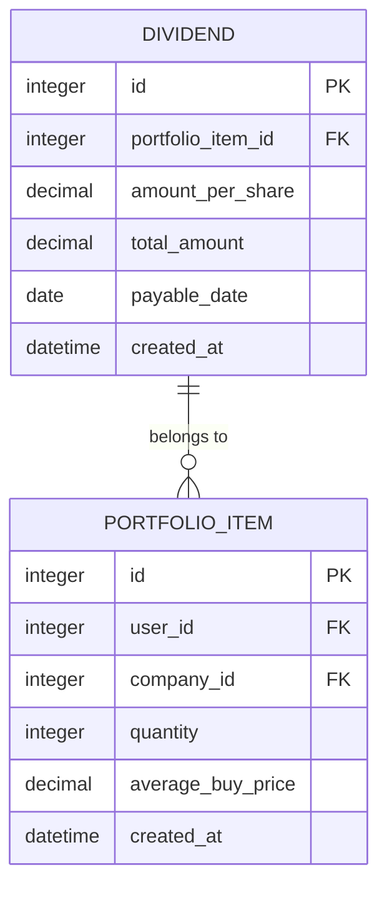
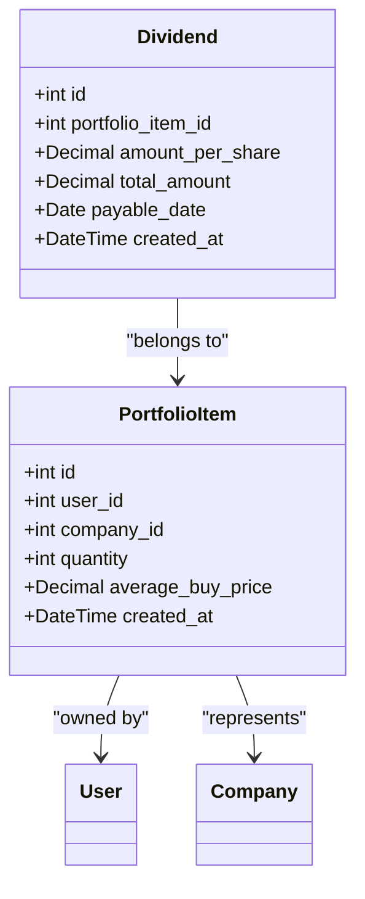
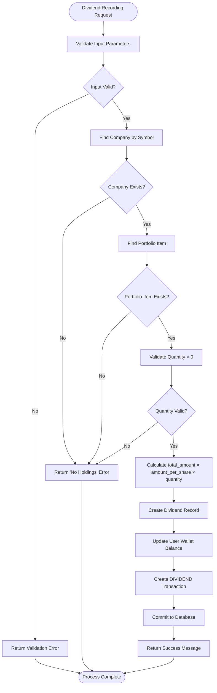

# Dividend Model

<cite>
**Referenced Files in This Document**   
- [main.py](file://main.py#L110-L118)
- [test_database_models.py](file://tests/test_database_models.py#L298-L328)
- [test_portfolio_management.py](file://tests/test_portfolio_management.py#L274-L315)
- [test_data.py](file://tests/test_data.py#L158-L170)
</cite>

## Table of Contents
1. [Introduction](#introduction)
2. [Data Model Structure](#data-model-structure)
3. [Field Definitions](#field-definitions)
4. [Relationships](#relationships)
5. [Business Rules](#business-rules)
6. [Dividend Recording Process](#dividend-recording-process)
7. [Cascade Deletion Behavior](#cascade-deletion-behavior)
8. [Usage Examples](#usage-examples)
9. [Data Integrity](#data-integrity)

## Introduction
The Dividend model is a core component of the portfolio management system that tracks dividend payouts for user holdings. This model captures dividend information at the portfolio item level, maintaining the financial relationship between users, their investments, and income generated from those investments. The model ensures accurate recording of dividend payments, automatic wallet updates, and maintains data integrity through proper relationships and constraints.

**Section sources**
- [main.py](file://main.py#L110-L118)
- [test_database_models.py](file://tests/test_database_models.py#L298-L328)

## Data Model Structure
The Dividend model represents dividend payouts for specific portfolio holdings. Each dividend record is associated with a single portfolio item and captures the dividend details including amount per share, total amount, and payment date. The model is designed to maintain historical dividend records while supporting financial reporting and portfolio analysis.



**Diagram sources**
- [main.py](file://main.py#L110-L118)
- [test_database_models.py](file://tests/test_database_models.py#L298-L328)

## Field Definitions
The Dividend model consists of the following fields:

| Field | Type | Constraints | Description |
|-------|------|-------------|-------------|
| id | Integer | Primary Key | Unique identifier for the dividend record |
| portfolio_item_id | Integer | Foreign Key, Not Null | References the portfolio item receiving the dividend |
| amount_per_share | Decimal(12,4) | Not Null | Dividend amount paid per share |
| total_amount | Decimal(12,2) | Not Null | Total dividend amount calculated as amount_per_share × quantity |
| payable_date | Date | Nullable | Date when the dividend is payable |
| created_at | DateTime | Default current timestamp | Timestamp when the dividend record was created |

**Section sources**
- [main.py](file://main.py#L110-L118)
- [test_database_models.py](file://tests/test_database_models.py#L301-L316)

## Relationships
The Dividend model maintains a many-to-one relationship with the PortfolioItem model. Each dividend record belongs to exactly one portfolio item, while a portfolio item can have multiple dividend records over time. This relationship enables tracking of all dividend income for specific holdings.

The relationship also indirectly connects to the User and Company models through the PortfolioItem:
- User: The dividend income is ultimately attributed to a specific user through their portfolio holdings
- Company: The dividend is paid by a specific company on its shares held in the portfolio



**Diagram sources**
- [main.py](file://main.py#L110-L118)
- [test_database_models.py](file://tests/test_database_models.py#L318-L328)

## Business Rules
The Dividend model enforces several business rules to ensure data accuracy and financial integrity:

1. **Zero/Negative Holdings Prevention**: Dividends cannot be recorded for portfolio items with zero or negative quantities. The system validates holdings before recording any dividend.
2. **Positive Dividend Amount**: The amount_per_share must be greater than zero. Negative or zero dividend amounts are rejected.
3. **Wallet Crediting**: When a dividend is recorded, the user's wallet balance is automatically increased by the total_amount.
4. **Transaction Recording**: Each dividend payment creates a corresponding transaction record with type 'DIVIDEND' for audit and reporting purposes.
5. **Foreign Key Constraints**: The portfolio_item_id must reference an existing portfolio item, ensuring data integrity.

**Section sources**
- [main.py](file://main.py#L408-L435)
- [test_portfolio_management.py](file://tests/test_portfolio_management.py#L274-L315)

## Dividend Recording Process
The dividend recording process follows these steps:



**Diagram sources**
- [main.py](file://main.py#L408-L435)
- [test_portfolio_management.py](file://tests/test_portfolio_management.py#L277-L291)

## Cascade Deletion Behavior
When a PortfolioItem is removed from the system, all associated dividend records are automatically deleted due to the foreign key relationship. This cascade deletion behavior ensures data consistency by preventing orphaned dividend records.

The deletion process follows this sequence:
1. PortfolioItem is marked for deletion
2. All Dividend records referencing the PortfolioItem are automatically removed
3. The PortfolioItem record is deleted from the database

This behavior is tested and verified in the test suite to ensure proper cleanup of related data.

**Section sources**
- [test_database_models.py](file://tests/test_database_models.py#L230-L246)

## Usage Examples
### Dividend Yield Calculation
Dividend yield can be calculated using the formula:
```
Dividend Yield = (Annual Dividends per Share / Current Share Price) × 100
```

For example, if a stock pays $0.25 per share quarterly ($1.00 annually) and the current price is $50.00:
```
Dividend Yield = ($1.00 / $50.00) × 100 = 2.0%
```

### Dividend Income Report
A dividend income report can be generated by aggregating all dividend records for a user:

```sql
SELECT 
    c.symbol,
    COUNT(d.id) as dividend_count,
    SUM(d.total_amount) as total_income,
    AVG(d.amount_per_share) as avg_per_share
FROM Dividend d
JOIN PortfolioItem pi ON d.portfolio_item_id = pi.id
JOIN Company c ON pi.company_id = c.id
JOIN User u ON pi.user_id = u.id
WHERE u.id = :user_id
GROUP BY c.symbol
ORDER BY total_income DESC;
```

**Section sources**
- [test_data.py](file://tests/test_data.py#L158-L170)
- [main.py](file://main.py#L421-L423)

## Data Integrity
The Dividend model maintains data integrity through several mechanisms:

1. **Foreign Key Constraints**: The portfolio_item_id field references the PortfolioItem table, ensuring every dividend is associated with a valid portfolio holding.
2. **NOT NULL Constraints**: Critical fields like portfolio_item_id, amount_per_share, and total_amount cannot be null.
3. **Data Type Precision**: Decimal fields use appropriate precision (12,4 for amount_per_share and 12,2 for total_amount) to maintain financial accuracy.
4. **Automatic Timestamps**: The created_at field automatically records when the dividend was registered.
5. **Referential Integrity**: Database-level constraints prevent deletion of referenced portfolio items without handling associated dividends.

These integrity measures ensure reliable dividend tracking and accurate financial reporting.

**Section sources**
- [main.py](file://main.py#L110-L118)
- [test_database_models.py](file://tests/test_database_models.py#L301-L316)