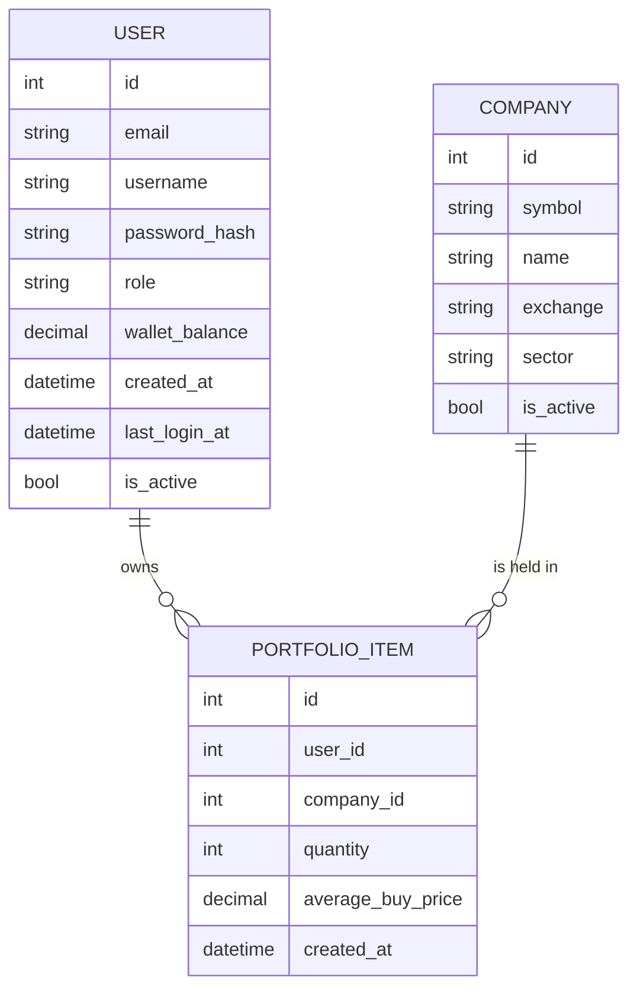

# PortfolioItem Model

<cite>
**Referenced Files in This Document**   
- [main.py](file://main.py#L83-L92)
- [test_database_models.py](file://tests/test_database_models.py#L195-L246)
- [test_portfolio_management.py](file://tests/test_portfolio_management.py#L78-L159)
- [er_diagram.md](file://docs/diagrams/er_diagram.md#L29-L35)
</cite>

## Table of Contents
1. [Introduction](#introduction)
2. [Field Definitions](#field-definitions)
3. [Relationships](#relationships)
4. [Business Rules](#business-rules)
5. [Cost Basis Calculation Methodology](#cost-basis-calculation-methodology)
6. [Unrealized Gains/Losses Calculation](#unrealized-gainslosses-calculation)
7. [Indexing Strategy](#indexing-strategy)
8. [Data Model Diagram](#data-model-diagram)

## Introduction
The PortfolioItem model represents a user's holdings in a specific company within the intelligent stock prediction application. It tracks key investment metrics such as quantity owned and average purchase price, enabling comprehensive portfolio management and performance analysis. This document provides detailed specifications of the model's structure, relationships, business rules, and operational methodologies.

## Field Definitions
The PortfolioItem model contains the following fields:

- **id**: Primary key identifier for the portfolio item (Integer, Primary Key)
- **user_id**: Foreign key reference to the User model, establishing ownership (Integer, Not Null)
- **company_id**: Foreign key reference to the Company model, identifying the invested company (Integer, Not Null)
- **quantity**: Number of shares held, with a default value of 0 (Integer, Not Null, Default: 0)
- **average_buy_price**: Weighted average price per share, with a default value of 0 (Numeric(12,2), Not Null, Default: 0)
- **created_at**: Timestamp of when the portfolio item was created, defaulting to the current UTC time (DateTime, Default: datetime.utcnow)

**Section sources**
- [main.py](file://main.py#L83-L89)

## Relationships
The PortfolioItem model establishes bidirectional relationships with both the User and Company models:

- **User Relationship**: A many-to-one relationship where multiple PortfolioItem records can belong to a single User. The relationship is defined by the user_id foreign key and accessed through the 'user' attribute. The User model contains a back-reference 'portfolio_items' that allows accessing all portfolio holdings for a user.
- **Company Relationship**: A many-to-one relationship where multiple PortfolioItem records can reference a single Company. This relationship is established through the company_id foreign key and accessed via the 'company' attribute.

These relationships enable efficient navigation between users, their portfolio holdings, and the underlying company information.

**Section sources**
- [main.py](file://main.py#L90-L91)
- [test_database_models.py](file://tests/test_database_models.py#L216-L229)

## Business Rules
The PortfolioItem model enforces several critical business rules to maintain data integrity and proper portfolio management:

- **Negative Quantity Prevention**: The system prevents portfolio quantities from becoming negative through validation in the trading operations. When selling shares, the application verifies that the requested quantity does not exceed the available holdings.
- **Zero Quantity Cleanup**: When a user sells all shares of a particular company (reducing quantity to zero), the PortfolioItem record is automatically deleted from the database to maintain a clean portfolio representation.
- **Cascade Deletion**: When a User is deleted from the system, all associated PortfolioItem records are automatically removed due to cascade delete configuration, ensuring referential integrity.
- **Foreign Key Constraints**: Both user_id and company_id fields enforce referential integrity, preventing the creation of portfolio items with non-existent users or companies.

**Section sources**
- [test_portfolio_management.py](file://tests/test_portfolio_management.py#L349-L362)
- [test_database_models.py](file://tests/test_database_models.py#L230-L246)
- [test_portfolio_management.py](file://tests/test_portfolio_management.py#L152-L159)

## Cost Basis Calculation Methodology
The average_buy_price field represents the weighted average cost basis per share and is dynamically updated when additional shares are purchased. The calculation methodology follows these principles:

When a user makes an additional purchase of a company they already own, the new average buy price is calculated using the formula:
```
new_average_price = (current_total_cost + new_purchase_cost) / (current_quantity + new_quantity)
```

For example, if a user initially purchased 10 shares at $150 each (total cost: $1,500) and then purchases 5 more shares at $160 each (total cost: $800), the new average buy price would be:
```
($1,500 + $800) / (10 + 5) = $2,300 / 15 = $153.33 per share
```

This methodology ensures that the cost basis accurately reflects the blended purchase price across all transactions for a particular holding.

**Section sources**
- [test_portfolio_management.py](file://tests/test_portfolio_management.py#L102-L124)
- [main.py](file://main.py#L302-L307)

## Unrealized Gains/Losses Calculation
The system calculates unrealized gains or losses by comparing the current market price with the average buy price. The calculation is performed as follows:

```
unrealized_gain_loss = (current_market_price - average_buy_price) * quantity
```

For example, with a portfolio holding of 15 shares with an average buy price of $153.33 per share, if the current market price is $175.50, the unrealized gain would be:
```
($175.50 - $153.33) * 15 = $22.17 * 15 = $332.55
```

This calculation is used in the dashboard to display portfolio performance and is also employed when determining percentage returns on investments.

**Section sources**
- [test_portfolio_management.py](file://tests/test_portfolio_management.py#L209-L236)

## Indexing Strategy
To ensure efficient querying of portfolio data, the database implements indexing on the foreign key fields:

- **user_id Index**: Enables fast retrieval of all portfolio items for a specific user, which is essential for dashboard display and portfolio analysis.
- **company_id Index**: Facilitates efficient queries for all users holding a particular company, supporting market analysis and company-specific operations.

These indexes optimize the performance of portfolio queries, particularly when users access their dashboard or when the system needs to aggregate data across multiple portfolio holdings.

**Section sources**
- [main.py](file://main.py#L85-L86)

## Data Model Diagram
The following Entity Relationship Diagram illustrates the PortfolioItem model and its relationships with other entities in the system.



**Diagram sources**
- [er_diagram.md](file://docs/diagrams/er_diagram.md#L1-L68)
- [main.py](file://main.py#L83-L92)