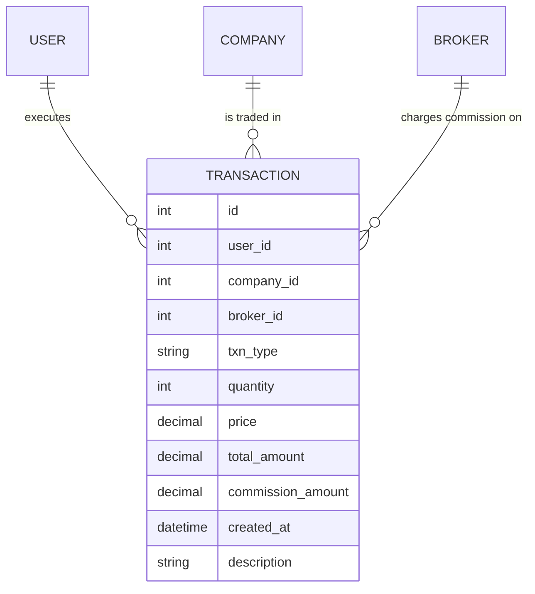
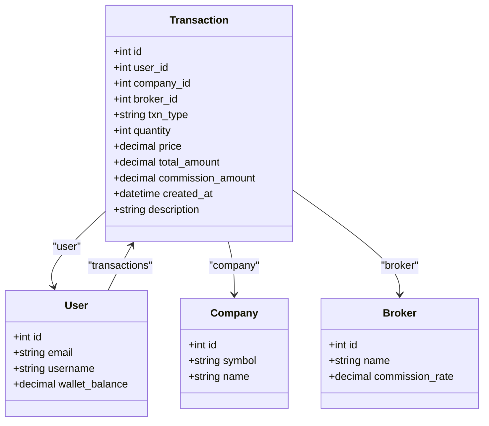
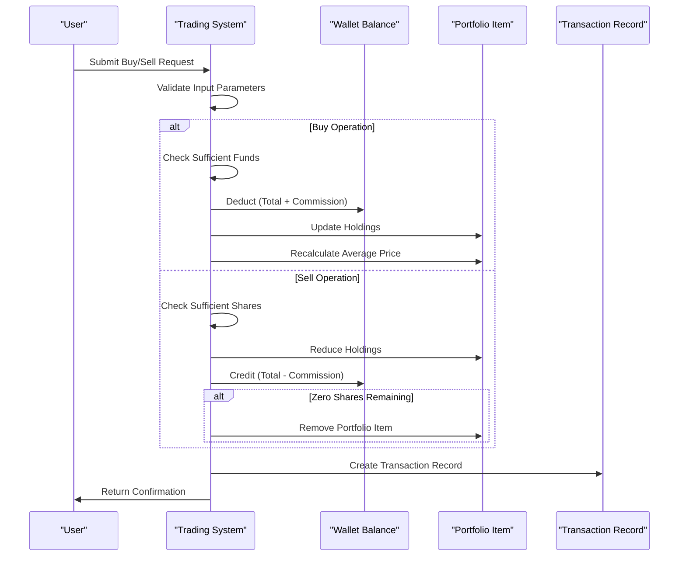
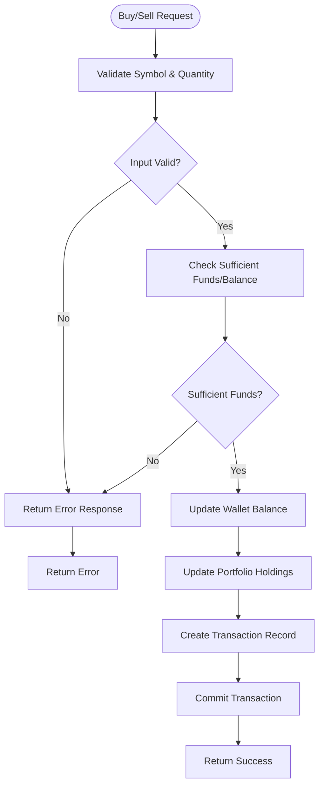
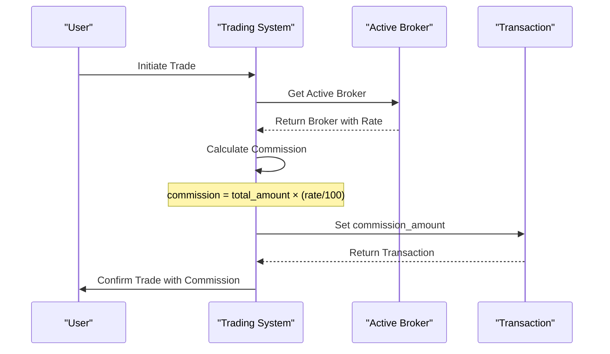
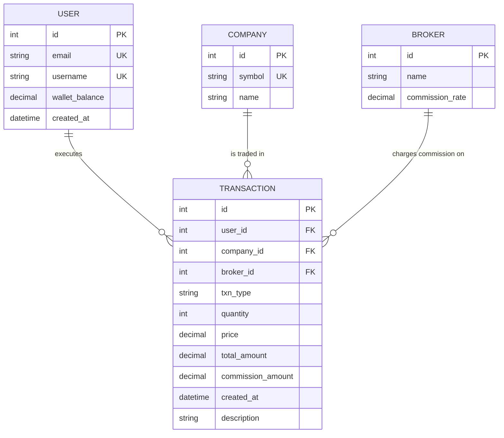

# Transaction Model

<cite>
**Referenced Files in This Document**   
- [main.py](file://main.py#L94-L109)
- [test_database_models.py](file://tests/test_database_models.py#L249-L295)
- [test_trading_operations.py](file://tests/test_trading_operations.py#L16-L348)
- [er_diagram.md](file://docs/diagrams/er_diagram.md#L37-L49)
- [conftest.py](file://tests/conftest.py#L218-L253)
</cite>

## Table of Contents
1. [Introduction](#introduction)
2. [Data Model Definition](#data-model-definition)
3. [Field Specifications](#field-specifications)
4. [Relationships](#relationships)
5. [Transaction Lifecycle](#transaction-lifecycle)
6. [Business Rules](#business-rules)
7. [Commission Calculation](#commission-calculation)
8. [Query Examples](#query-examples)
9. [Performance Optimization](#performance-optimization)
10. [Data Model Diagram](#data-model-diagram)

## Introduction
The Transaction model represents financial transactions in the stock trading system, capturing buy, sell, and dividend operations. This document provides comprehensive documentation of the model's structure, relationships, business logic, and usage patterns. The model serves as the central record for all trading activities, maintaining an audit trail of user transactions while enforcing business rules around fund availability, commission calculations, and portfolio updates.

## Data Model Definition

The Transaction model is implemented as a SQLAlchemy ORM class that tracks all trading activities within the system. Each transaction record captures essential details about the trade, including the involved parties (user, company, broker), financial details, and metadata.



**Diagram sources**
- [main.py](file://main.py#L94-L109)
- [er_diagram.md](file://docs/diagrams/er_diagram.md#L37-L49)

**Section sources**
- [main.py](file://main.py#L94-L109)
- [test_database_models.py](file://tests/test_database_models.py#L249-L295)

## Field Specifications

The Transaction model contains the following fields with their respective constraints and data types:

| Field | Type | Constraints | Description |
|-------|------|-------------|-------------|
| id | Integer | Primary Key | Unique identifier for the transaction |
| user_id | Integer | Foreign Key to User, Not Null | References the user who executed the transaction |
| company_id | Integer | Foreign Key to Company, Not Null | References the company whose stock was traded |
| broker_id | Integer | Foreign Key to Broker | References the broker through which the transaction was executed |
| txn_type | String(16) | Not Null, Values: BUY/SELL/DIVIDEND | Type of transaction |
| quantity | Integer | Not Null | Number of shares traded |
| price | Numeric(12,2) | Not Null | Price per share at the time of transaction |
| total_amount | Numeric(12,2) | Not Null | Total value of the transaction (quantity × price) |
| commission_amount | Numeric(12,2) | Not Null, Default: 0 | Commission charged for the transaction |
| created_at | DateTime | Default: Current Timestamp | Timestamp when the transaction was created |
| description | String(255) | Nullable | Additional details about the transaction |

**Section sources**
- [main.py](file://main.py#L94-L109)
- [test_database_models.py](file://tests/test_database_models.py#L249-L295)

## Relationships

The Transaction model establishes relationships with three key entities in the system:



### User Relationship (Many-to-One)
Each transaction is associated with exactly one user, while a user can have multiple transactions. The relationship is defined through the `user_id` foreign key and the `user` relationship property with a backref that allows accessing a user's transactions via `user.transactions`.

### Company Relationship (Many-to-One)
Each transaction involves exactly one company's stock, while a company can be involved in multiple transactions. The relationship is established through the `company_id` foreign key and the `company` relationship property.

### Broker Relationship (Many-to-One)
Each transaction may be associated with a broker, while a broker can handle multiple transactions. The relationship is optional (nullable foreign key) and defined through the `broker_id` foreign key and the `broker` relationship property.

**Diagram sources**
- [main.py](file://main.py#L106-L108)
- [er_diagram.md](file://docs/diagrams/er_diagram.md#L62-L64)

**Section sources**
- [main.py](file://main.py#L96-L98)
- [test_database_models.py](file://tests/test_database_models.py#L279-L295)

## Transaction Lifecycle

The transaction lifecycle for buy and sell operations follows a well-defined sequence of steps that ensure data consistency and business rule enforcement.



### Buy Operation Flow
1. User submits a buy request with symbol and quantity
2. System validates input parameters (positive quantity, valid symbol)
3. System checks if user has sufficient funds (total amount + commission)
4. System deducts the total cost from the user's wallet balance
5. System updates the portfolio item with new quantity and recalculated average buy price
6. System creates a transaction record with type 'BUY'
7. System returns success confirmation to the user

### Sell Operation Flow
1. User submits a sell request with symbol and quantity
2. System validates input parameters (positive quantity, valid symbol)
3. System checks if user has sufficient shares to sell
4. System reduces the portfolio item quantity by the sold amount
5. If quantity reaches zero, the portfolio item is removed
6. System credits the user's wallet balance with proceeds (total - commission)
7. System creates a transaction record with type 'SELL'
8. System returns success confirmation to the user

**Diagram sources**
- [main.py](file://main.py#L268-L375)
- [test_trading_operations.py](file://tests/test_trading_operations.py#L16-L204)

**Section sources**
- [main.py](file://main.py#L268-L375)
- [test_trading_operations.py](file://tests/test_trading_operations.py#L16-L204)

## Business Rules

The Transaction model enforces several critical business rules to maintain data integrity and prevent invalid operations.

### Atomic Updates
All transaction operations are performed atomically within database transactions to ensure consistency. When a transaction is processed, the following updates occur together:
- Wallet balance adjustment
- Portfolio holdings update
- Transaction record creation

If any part of this process fails, the entire transaction is rolled back, preventing partial updates that could lead to inconsistent state.

### Validation of Sufficient Funds
Before executing a buy transaction, the system validates that the user has sufficient funds to cover both the total purchase amount and the commission. This check occurs in the `trade_buy` function where the system compares the user's wallet balance against the sum of `total + commission`.

### Proper Handling of Partial Sales
When selling shares, the system properly handles partial sales by:
1. Reducing the portfolio item quantity by the sold amount
2. Keeping the existing average buy price unchanged
3. Creating a transaction record for the sale
4. Only removing the portfolio item when the quantity reaches zero

This approach maintains accurate cost basis information for tax and performance tracking purposes.



**Diagram sources**
- [main.py](file://main.py#L268-L375)
- [test_trading_operations.py](file://tests/test_trading_operations.py#L41-L102)

**Section sources**
- [main.py](file://main.py#L293-L295)
- [test_trading_operations.py](file://tests/test_trading_operations.py#L41-L102)

## Commission Calculation

Commission amounts are calculated based on the active broker's commission rate and the total transaction value.



The commission calculation follows these steps:
1. Retrieve the active broker using `get_active_broker()`
2. Calculate commission as: `total_amount × (commission_rate / 100)`
3. Quantize the result to two decimal places
4. Apply the commission amount to the transaction
5. Deduct the commission from the user's wallet (buy) or from proceeds (sell)

The `calculate_commission` function in main.py implements this logic, handling edge cases such as null brokers or invalid rate values by returning zero commission.

**Diagram sources**
- [main.py](file://main.py#L176-L184)
- [test_trading_operations.py](file://tests/test_trading_operations.py#L209-L232)

**Section sources**
- [main.py](file://main.py#L176-L184)
- [test_trading_operations.py](file://tests/test_trading_operations.py#L209-L232)

## Query Examples

### Generating Transaction History Reports
To generate a user's transaction history, query the Transaction model filtered by user_id and ordered by creation date:

```python
transactions = Transaction.query.filter_by(user_id=user.id).order_by(Transaction.created_at.desc()).all()
```

This returns all transactions for a specific user in reverse chronological order, suitable for display in a transaction history report.

### Calculating Total Trading Volume by Symbol
To calculate the total trading volume (quantity) for a specific stock symbol:

```python
from sqlalchemy import func

total_volume = db.session.query(func.sum(Transaction.quantity)).\
    join(Company).\
    filter(Company.symbol == 'AAPL', Transaction.txn_type.in_(['BUY', 'SELL'])).\
    scalar() or 0
```

For a comprehensive view of trading activity by symbol, aggregate data across all transactions:

```python
trading_stats = db.session.query(
    Company.symbol,
    func.sum(Transaction.quantity).label('total_quantity'),
    func.sum(Transaction.total_amount).label('total_value')
).join(Company).\
filter(Transaction.txn_type.in_(['BUY', 'SELL'])).\
group_by(Company.symbol).\
order_by(func.sum(Transaction.total_amount).desc()).\
all()
```

**Section sources**
- [main.py](file://main.py#L256)
- [test_trading_operations.py](file://tests/test_trading_operations.py#L55-L66)

## Performance Optimization

The Transaction model includes indexing on key fields to optimize query performance for common access patterns.

### Indexing Strategy
The following indexes are recommended for optimal performance:

| Field | Purpose | Query Pattern |
|-------|--------|---------------|
| user_id | User-specific queries | Retrieve transaction history for a user |
| company_id | Company-specific queries | Analyze trading volume by stock symbol |
| created_at | Time-based queries | Retrieve recent transactions, generate time-series reports |

These indexes support the most common query patterns in the application:
- User dashboard showing recent transactions
- Portfolio analysis by stock symbol
- Admin reports on trading activity
- Historical analysis of transaction trends

The combination of these indexes enables efficient filtering and sorting operations, particularly when retrieving transaction history or generating trading volume reports.

**Section sources**
- [main.py](file://main.py#L256)
- [test_trading_operations.py](file://tests/test_trading_operations.py#L329-L347)

## Data Model Diagram

The complete data model for the Transaction entity within the broader system context:



**Diagram sources**
- [er_diagram.md](file://docs/diagrams/er_diagram.md#L37-L49)
- [exported/er_diagram.mmd](file://docs/diagrams/exported/er_diagram.mmd#L36-L48)

**Section sources**
- [er_diagram.md](file://docs/diagrams/er_diagram.md#L37-L49)
- [main.py](file://main.py#L94-L109)