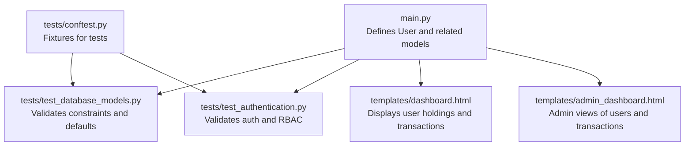
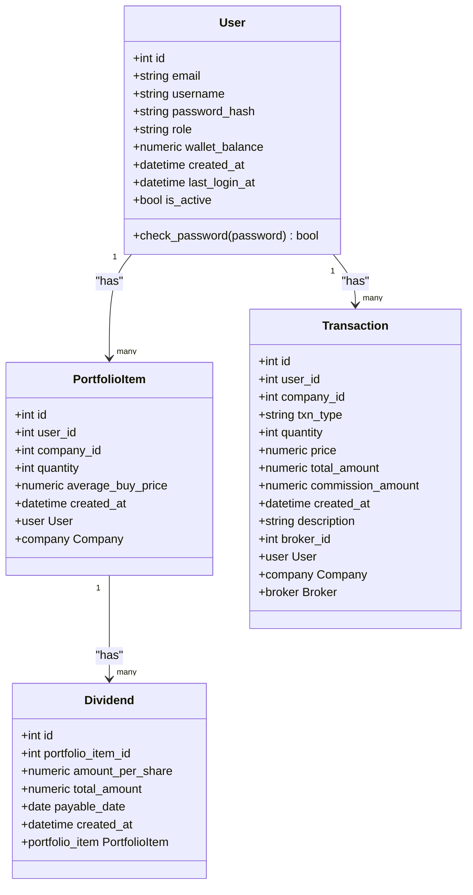
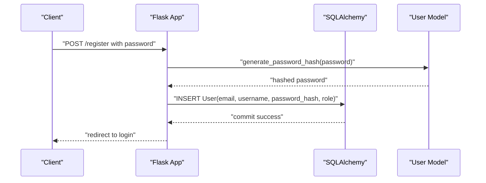
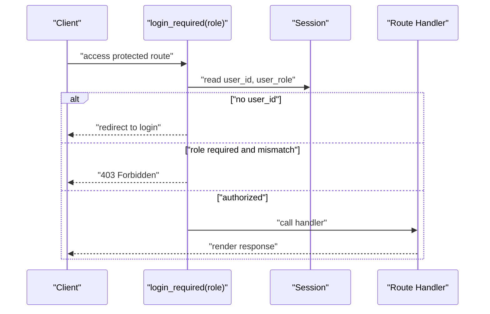
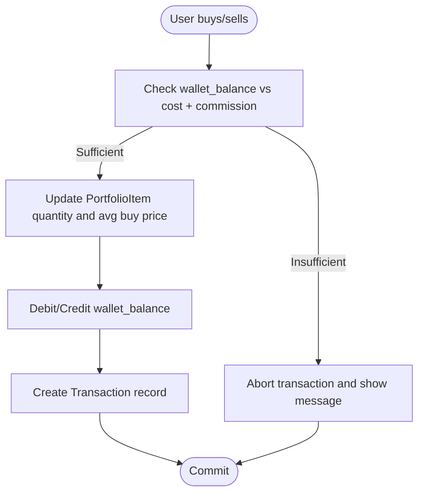
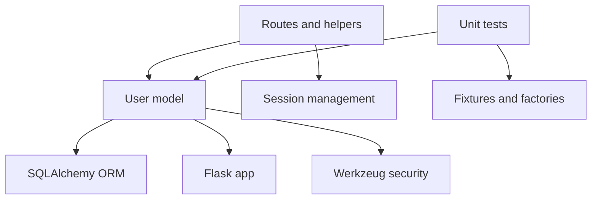

# User Model

<cite>
**Referenced Files in This Document**
- [main.py](file://main.py)
- [tests/test_database_models.py](file://tests/test_database_models.py)
- [tests/test_authentication.py](file://tests/test_authentication.py)
- [tests/conftest.py](file://tests/conftest.py)
- [templates/dashboard.html](file://templates/dashboard.html)
- [templates/admin_dashboard.html](file://templates/admin_dashboard.html)
</cite>

## Table of Contents
1. [Introduction](#introduction)
2. [Project Structure](#project-structure)
3. [Core Components](#core-components)
4. [Architecture Overview](#architecture-overview)
5. [Detailed Component Analysis](#detailed-component-analysis)
6. [Dependency Analysis](#dependency-analysis)
7. [Performance Considerations](#performance-considerations)
8. [Troubleshooting Guide](#troubleshooting-guide)
9. [Conclusion](#conclusion)

## Introduction
This document provides comprehensive data model documentation for the User model used in the intelligent stock prediction web application. It covers all field definitions, constraints, relationships, security measures, role-based access control, business rules around wallet balance and transactions, and practical examples for querying user portfolio holdings and transaction history. It also documents the indexing strategy for authentication performance.

## Project Structure
The User model is defined within the main application module alongside other SQLAlchemy models. Supporting tests validate constraints, authentication, and role-based access control. Templates demonstrate how user data is presented in dashboards.

**Diagram sources**
- [main.py](file://main.py#L51-L64)
- [tests/test_database_models.py](file://tests/test_database_models.py#L15-L114)
- [tests/test_authentication.py](file://tests/test_authentication.py#L14-L171)
- [templates/dashboard.html](file://templates/dashboard.html#L140-L189)
- [templates/admin_dashboard.html](file://templates/admin_dashboard.html#L268-L309)
- [tests/conftest.py](file://tests/conftest.py#L53-L83)

**Section sources**
- [main.py](file://main.py#L51-L64)
- [tests/test_database_models.py](file://tests/test_database_models.py#L15-L114)
- [tests/test_authentication.py](file://tests/test_authentication.py#L14-L171)
- [templates/dashboard.html](file://templates/dashboard.html#L140-L189)
- [templates/admin_dashboard.html](file://templates/admin_dashboard.html#L268-L309)
- [tests/conftest.py](file://tests/conftest.py#L53-L83)

## Core Components
- User model fields and constraints:
  - id: Integer, primary key
  - email: String, unique, not null
  - username: String, unique, not null
  - password_hash: String, not null
  - role: String, not null, default 'user'
  - wallet_balance: Numeric, not null, default 0
  - created_at: DateTime, default current UTC timestamp
  - last_login_at: DateTime
  - is_active: Boolean, default true

- Security:
  - Passwords are hashed using Werkzeug’s generate_password_hash and verified with check_password_hash.
  - Login checks are_active status.

- Relationships:
  - One-to-many with PortfolioItem (user has many holdings)
  - One-to-many with Transaction (user has many transactions)
  - Indirect relationship with Dividend via PortfolioItem (dividends belong to portfolio items)

- Business rules:
  - Unique constraints on email and username enforced at the database level.
  - Wallet balance is debited on buy and credited on sell, minus applicable commission.
  - Account activation controls login access.

**Section sources**
- [main.py](file://main.py#L51-L64)
- [tests/test_database_models.py](file://tests/test_database_models.py#L55-L114)
- [tests/test_authentication.py](file://tests/test_authentication.py#L96-L171)
- [templates/dashboard.html](file://templates/dashboard.html#L140-L189)

## Architecture Overview
The User model participates in a layered architecture:
- Data layer: SQLAlchemy models (User, Company, Broker, PortfolioItem, Transaction, Dividend)
- Application layer: Flask routes and helpers (login_required decorator, CSRF protection, commission calculation)
- Presentation layer: Jinja templates rendering user dashboard and admin monitoring

**Diagram sources**
- [main.py](file://main.py#L51-L119)

## Detailed Component Analysis

### User Model Fields and Constraints
- Field definitions and defaults are declared in the model definition.
- Unique constraints on email and username are enforced by the database schema.
- Default values for role, wallet_balance, is_active, and created_at are applied automatically.
- last_login_at is updated upon successful login.

**Section sources**
- [main.py](file://main.py#L51-L64)
- [tests/test_database_models.py](file://tests/test_database_models.py#L55-L114)
- [tests/test_authentication.py](file://tests/test_authentication.py#L158-L171)

### Security: Password Hashing with Werkzeug
- Passwords are hashed using Werkzeug’s generate_password_hash during registration.
- Verification uses check_password_hash against stored password_hash.
- Tests confirm that stored hashes differ from plaintext and that verification succeeds for correct passwords.

**Diagram sources**
- [main.py](file://main.py#L217-L223)
- [tests/test_authentication.py](file://tests/test_authentication.py#L23-L40)
- [tests/test_database_models.py](file://tests/test_database_models.py#L38-L54)

**Section sources**
- [main.py](file://main.py#L217-L223)
- [tests/test_authentication.py](file://tests/test_authentication.py#L291-L336)
- [tests/test_database_models.py](file://tests/test_database_models.py#L38-L54)

### Role-Based Access Control (RBAC)
- login_required decorator enforces authentication and optional role enforcement.
- Admin-only routes require user_role == 'admin'.
- Tests verify that non-admin users cannot access admin routes and that admin users can access them.

**Diagram sources**
- [main.py](file://main.py#L139-L151)
- [tests/test_authentication.py](file://tests/test_authentication.py#L216-L252)

**Section sources**
- [main.py](file://main.py#L139-L151)
- [tests/test_authentication.py](file://tests/test_authentication.py#L216-L252)

### Relationship with PortfolioItem, Transaction, and Dividend
- PortfolioItem: user_id foreign key links users to their holdings; relationship backrefs enable querying user.holdings.
- Transaction: user_id foreign key links users to their transactions; includes commission_amount and broker_id.
- Dividend: portfolio_item_id foreign key links dividends to specific holdings; dividends credit wallet_balance.

**Diagram sources**
- [main.py](file://main.py#L268-L375)
- [main.py](file://main.py#L378-L433)

**Section sources**
- [main.py](file://main.py#L83-L109)
- [main.py](file://main.py#L268-L375)
- [main.py](file://main.py#L378-L433)

### Business Rules: Unique Email/Username, Wallet Balance, Account Activation
- Unique constraints: Registration rejects duplicate email or username at the database level.
- Wallet balance management: Buy deducts (price × qty + commission); Sell credits (price × qty − commission).
- Account activation: Login fails for is_active=false users.

**Section sources**
- [tests/test_database_models.py](file://tests/test_database_models.py#L55-L98)
- [tests/test_authentication.py](file://tests/test_authentication.py#L131-L171)
- [main.py](file://main.py#L293-L312)
- [main.py](file://main.py#L360-L363)

### Indexing for Authentication Performance
- The User model defines email and username as unique fields. While explicit index declarations are not shown in the model, SQLAlchemy typically creates unique indexes for unique=True columns. These indexes optimize login queries by email and registration checks for uniqueness.

**Section sources**
- [main.py](file://main.py#L53-L54)
- [tests/test_authentication.py](file://tests/test_authentication.py#L54-L81)

### Examples: Querying User Portfolio Holdings and Transaction History
- Portfolio holdings:
  - Query all holdings for the current user using the relationship backref.
  - Example path: [main.py](file://main.py#L251-L266)
- Transaction history:
  - Query recent transactions for the current user ordered by creation time.
  - Example path: [main.py](file://main.py#L251-L266)
- Template usage:
  - Dashboard template renders holdings and recent transactions for display.
  - Example path: [templates/dashboard.html](file://templates/dashboard.html#L140-L189)

**Section sources**
- [main.py](file://main.py#L251-L266)
- [templates/dashboard.html](file://templates/dashboard.html#L140-L189)

## Dependency Analysis
- Internal dependencies:
  - User depends on SQLAlchemy ORM for persistence.
  - Routes depend on login_required decorator and session management.
  - Tests depend on fixtures and model definitions.
- External dependencies:
  - Werkzeug for password hashing and verification.
  - Flask-SQLAlchemy for ORM integration.

**Diagram sources**
- [main.py](file://main.py#L29-L34)
- [tests/conftest.py](file://tests/conftest.py#L16-L18)

**Section sources**
- [main.py](file://main.py#L29-L34)
- [tests/conftest.py](file://tests/conftest.py#L16-L18)

## Performance Considerations
- Unique indexes on email and username improve login and registration performance.
- Using numeric types for wallet_balance and prices ensures precise financial calculations.
- Avoid frequent recomputation of totals; cache derived metrics where appropriate in templates.

[No sources needed since this section provides general guidance]

## Troubleshooting Guide
- Registration errors:
  - Duplicate email or username triggers database integrity errors; tests confirm this behavior.
  - Missing fields cause validation failures; tests assert error messages.
- Login errors:
  - Invalid credentials or inactive accounts prevent login; tests assert error messages and session clearing.
- RBAC errors:
  - Non-admin users attempting admin routes receive redirect or forbidden responses; tests assert expected statuses.

**Section sources**
- [tests/test_database_models.py](file://tests/test_database_models.py#L55-L98)
- [tests/test_authentication.py](file://tests/test_authentication.py#L40-L81)
- [tests/test_authentication.py](file://tests/test_authentication.py#L131-L171)
- [tests/test_authentication.py](file://tests/test_authentication.py#L216-L252)

## Conclusion
The User model is a central entity in the application with strong constraints, robust security, and clear relationships to portfolio and transaction data. Its design supports secure authentication, role-based access control, and accurate financial tracking through wallet balance adjustments. The provided tests and templates demonstrate practical usage and expected behaviors.