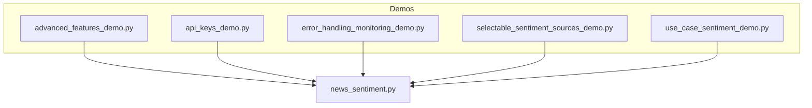
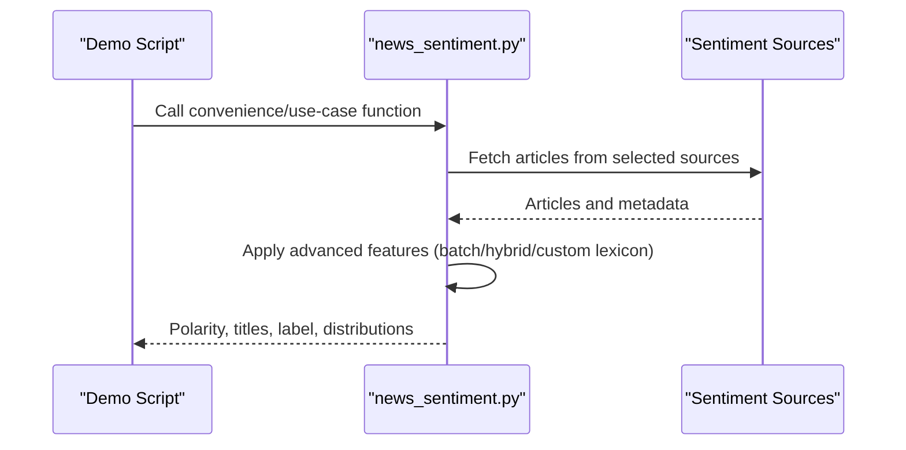
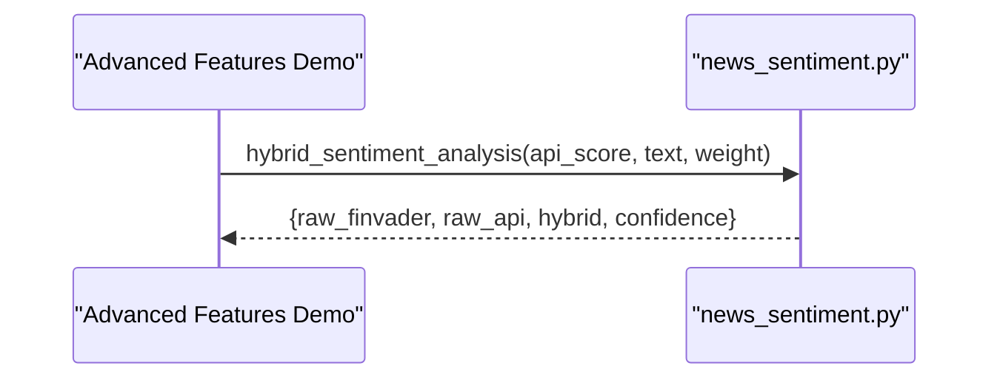
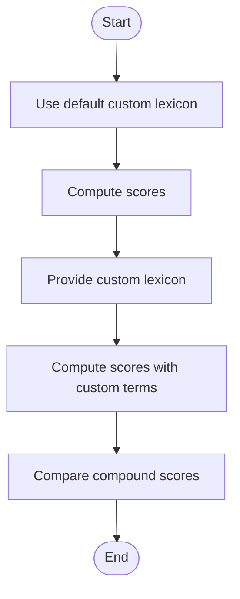
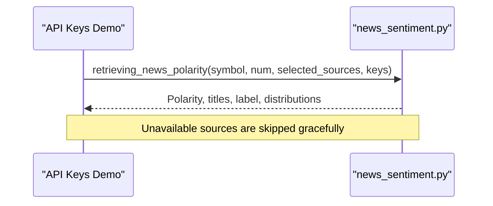
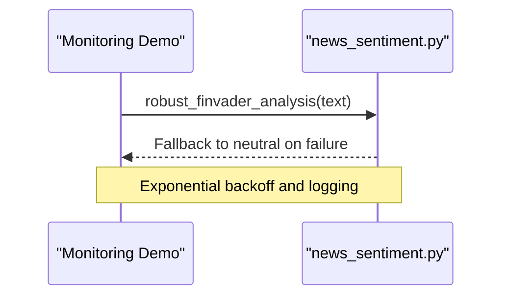
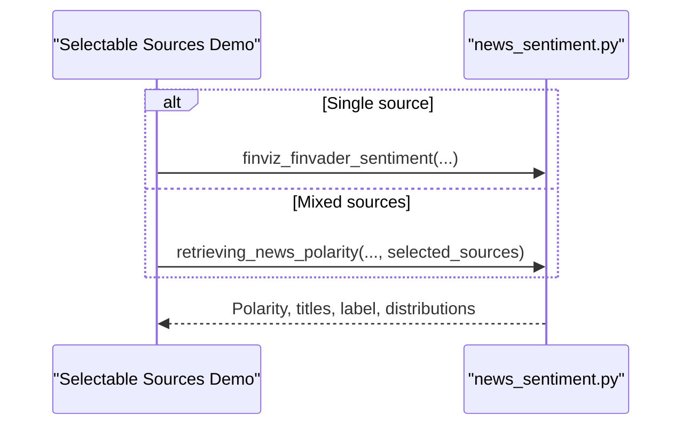
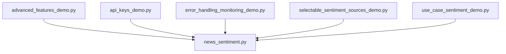

# Demos & Examples

<cite>
**Referenced Files in This Document**
- [advanced_features_demo.py](file://demos/advanced_features_demo.py)
- [api_keys_demo.py](file://demos/api_keys_demo.py)
- [error_handling_monitoring_demo.py](file://demos/error_handling_monitoring_demo.py)
- [selectable_sentiment_sources_demo.py](file://demos/selectable_sentiment_sources_demo.py)
- [use_case_sentiment_demo.py](file://demos/use_case_sentiment_demo.py)
- [news_sentiment.py](file://news_sentiment.py)
- [ADVANCED_FEATURES.md](file://docs/ADVANCED_FEATURES.md)
- [API_KEYS_GUIDE.md](file://docs/API_KEYS_GUIDE.md)
- [ERROR_HANDLING_MONITORING.md](file://docs/ERROR_HANDLING_MONITORING.md)
- [SELECTABLE_SENTIMENT_SOURCES.md](file://docs/SELECTABLE_SENTIMENT_SOURCES.md)
- [USE_CASE_SENTIMENT_ANALYSIS.md](file://docs/USE_CASE_SENTIMENT_ANALYSIS.md)
</cite>

## Table of Contents
1. [Introduction](#introduction)
2. [Project Structure](#project-structure)
3. [Core Components](#core-components)
4. [Architecture Overview](#architecture-overview)
5. [Detailed Component Analysis](#detailed-component-analysis)
6. [Dependency Analysis](#dependency-analysis)
7. [Performance Considerations](#performance-considerations)
8. [Troubleshooting Guide](#troubleshooting-guide)
9. [Conclusion](#conclusion)

## Introduction
This section documents the demonstration scripts that showcase the sentiment analysis system’s advanced capabilities. Each demo script focuses on a specific aspect:
- Advanced features: batch processing, hybrid scoring, and custom lexicons
- API keys: integrating and managing API credentials safely
- Error handling and monitoring: resilience, retries, and observability
- Selectable sentiment sources: choosing and mixing data sources
- Use case adaptations: configuring the system for HFT, retail apps, quant funds, academia, and fintech startups

These demos are designed to be educational and practical, enabling new developers to learn the system quickly and experienced users to validate capabilities efficiently.

## Project Structure
The demos live under the demos/ directory and import from the main sentiment module news_sentiment.py. Each demo encapsulates a cohesive workflow and prints expected outcomes and usage examples.

**Diagram sources**
- [advanced_features_demo.py](file://demos/advanced_features_demo.py#L1-L154)
- [api_keys_demo.py](file://demos/api_keys_demo.py#L1-L162)
- [error_handling_monitoring_demo.py](file://demos/error_handling_monitoring_demo.py#L1-L112)
- [selectable_sentiment_sources_demo.py](file://demos/selectable_sentiment_sources_demo.py#L1-L136)
- [use_case_sentiment_demo.py](file://demos/use_case_sentiment_demo.py#L1-L150)
- [news_sentiment.py](file://news_sentiment.py#L1190-L1334)

**Section sources**
- [advanced_features_demo.py](file://demos/advanced_features_demo.py#L1-L154)
- [api_keys_demo.py](file://demos/api_keys_demo.py#L1-L162)
- [error_handling_monitoring_demo.py](file://demos/error_handling_monitoring_demo.py#L1-L112)
- [selectable_sentiment_sources_demo.py](file://demos/selectable_sentiment_sources_demo.py#L1-L136)
- [use_case_sentiment_demo.py](file://demos/use_case_sentiment_demo.py#L1-L150)
- [news_sentiment.py](file://news_sentiment.py#L1190-L1334)

## Core Components
- Advanced features: batch processing, hybrid scoring, and custom lexicons
- API integration: safe usage of API keys and graceful fallbacks
- Error handling and monitoring: robustness, retries, and logging
- Selectable sentiment sources: source selection logic and mixing
- Use case adaptations: pre-configured stacks for different domains

**Section sources**
- [ADVANCED_FEATURES.md](file://docs/ADVANCED_FEATURES.md#L1-L298)
- [API_KEYS_GUIDE.md](file://docs/API_KEYS_GUIDE.md#L1-L246)
- [ERROR_HANDLING_MONITORING.md](file://docs/ERROR_HANDLING_MONITORING.md#L1-L313)
- [SELECTABLE_SENTIMENT_SOURCES.md](file://docs/SELECTABLE_SENTIMENT_SOURCES.md#L1-L208)
- [USE_CASE_SENTIMENT_ANALYSIS.md](file://docs/USE_CASE_SENTIMENT_ANALYSIS.md#L1-L165)

## Architecture Overview
The demos orchestrate calls into the sentiment module, which coordinates multiple sources and applies advanced features. The module exposes convenience functions for single-source workflows and higher-level orchestrators for multi-source and use-case-specific configurations.

**Diagram sources**
- [news_sentiment.py](file://news_sentiment.py#L1190-L1334)
- [advanced_features_demo.py](file://demos/advanced_features_demo.py#L1-L154)
- [selectable_sentiment_sources_demo.py](file://demos/selectable_sentiment_sources_demo.py#L1-L136)
- [use_case_sentiment_demo.py](file://demos/use_case_sentiment_demo.py#L1-L150)

## Detailed Component Analysis

### Advanced Features Demo
Purpose:
- Demonstrate batch processing, hybrid scoring, custom lexicons, and performance comparisons.

Execution steps:
- Run the script to execute four demos in sequence:
  - Batch processing multiple symbols
  - Hybrid scoring with configurable weights
  - Custom lexicon extension with defaults and custom terms
  - Performance comparison between standard and batch processing

Expected outcomes:
- Printed summaries of processing times, results, and distributions
- Usage examples for batch processing, hybrid scoring, custom lexicons, and performance hints

Educational value:
- Shows how to optimize throughput and accuracy
- Demonstrates how to combine API signals with FinVADER
- Illustrates extending the lexicon for domain-specific nuances

Annotated code excerpts:
- Batch processing invocation and timing: [demo_batch_processing](file://demos/advanced_features_demo.py#L19-L40)
- Hybrid scoring with different weights: [demo_hybrid_scoring](file://demos/advanced_features_demo.py#L41-L64)
- Custom lexicon extension: [demo_custom_lexicon](file://demos/advanced_features_demo.py#L65-L91)
- Performance comparison: [demo_performance_comparison](file://demos/advanced_features_demo.py#L92-L115)

Suggestions for custom scenarios:
- Modify symbol lists for portfolio-wide analysis
- Adjust weights in hybrid scoring to reflect domain preferences
- Extend the custom lexicon with industry-specific terms

Validation and learning:
- Use the printed usage examples to replicate patterns in your own code
- Compare performance across methods to select the right approach for your workload

**Section sources**
- [advanced_features_demo.py](file://demos/advanced_features_demo.py#L1-L154)
- [ADVANCED_FEATURES.md](file://docs/ADVANCED_FEATURES.md#L1-L298)

#### Sequence: Hybrid Scoring Workflow

**Diagram sources**
- [advanced_features_demo.py](file://demos/advanced_features_demo.py#L41-L64)
- [news_sentiment.py](file://news_sentiment.py#L1298-L1311)

#### Flowchart: Custom Lexicon Extension

**Diagram sources**
- [advanced_features_demo.py](file://demos/advanced_features_demo.py#L65-L91)
- [news_sentiment.py](file://news_sentiment.py#L1305-L1311)

### API Keys Demo
Purpose:
- Demonstrate how to integrate API keys with the sentiment system and how the system handles missing or invalid keys.

Execution steps:
- Run the script to execute five demos:
  - Finviz + FinVADER without API key
  - API sources without keys (graceful skip)
  - API sources with invalid keys (graceful error handling)
  - Mixed sources with and without keys
  - Instructions for adding real API keys

Expected outcomes:
- Success messages for available sources and notes about graceful fallbacks
- Clear guidance on obtaining and using API keys securely

Educational value:
- Highlights which sources require keys and which do not
- Shows how to mix free and paid sources
- Reinforces secure key management via environment variables

Annotated code excerpts:
- Finviz demo: [demo_finviz_no_api_key](file://demos/api_keys_demo.py#L19-L32)
- API without keys: [demo_api_without_key](file://demos/api_keys_demo.py#L33-L58)
- API with fake keys: [demo_api_with_fake_keys](file://demos/api_keys_demo.py#L59-L76)
- Mixed sources: [demo_mixed_sources](file://demos/api_keys_demo.py#L77-L99)
- Adding real keys: [demo_how_to_add_real_keys](file://demos/api_keys_demo.py#L101-L134)

Suggestions for custom scenarios:
- Replace placeholder keys with your actual keys
- Use environment variables for production deployments
- Combine multiple sources with different keys for redundancy

Validation and learning:
- Confirm that missing keys do not break the pipeline
- Verify that valid keys unlock premium features

**Section sources**
- [api_keys_demo.py](file://demos/api_keys_demo.py#L1-L162)
- [API_KEYS_GUIDE.md](file://docs/API_KEYS_GUIDE.md#L1-L246)

#### Sequence: Mixed Sources with Keys

**Diagram sources**
- [api_keys_demo.py](file://demos/api_keys_demo.py#L77-L99)
- [news_sentiment.py](file://news_sentiment.py#L1190-L1334)

### Error Handling and Monitoring Demo
Purpose:
- Showcase robust error handling, retries, and monitoring features.

Execution steps:
- Run the script to execute three demos:
  - Robust FinVADER with retries and edge case handling
  - Sentiment distribution logging
  - Error recovery and graceful degradation overview

Expected outcomes:
- Printed results for normal and edge cases
- Demonstrated logging output for sentiment distributions
- Explanation of layered error handling and recovery

Educational value:
- Illustrates production-grade resilience patterns
- Emphasizes logging and observability
- Shows fallback strategies for transient failures

Annotated code excerpts:
- Robust FinVADER: [demo_robust_finvader](file://demos/error_handling_monitoring_demo.py#L20-L39)
- Sentiment distribution logging: [demo_sentiment_distribution_logging](file://demos/error_handling_monitoring_demo.py#L40-L63)
- Error recovery overview: [demo_error_recovery](file://demos/error_handling_monitoring_demo.py#L64-L83)

Suggestions for custom scenarios:
- Integrate structured logging in your application
- Use retry decorators for transient API calls
- Monitor extreme sentiment occurrences and error rates

Validation and learning:
- Verify that empty or malformed inputs fall back to neutral
- Confirm that logging captures distribution metrics

**Section sources**
- [error_handling_monitoring_demo.py](file://demos/error_handling_monitoring_demo.py#L1-L112)
- [ERROR_HANDLING_MONITORING.md](file://docs/ERROR_HANDLING_MONITORING.md#L1-L313)

#### Sequence: Robust FinVADER Analysis

**Diagram sources**
- [error_handling_monitoring_demo.py](file://demos/error_handling_monitoring_demo.py#L20-L39)
- [news_sentiment.py](file://news_sentiment.py#L1312-L1319)

### Selectable Sentiment Sources Demo
Purpose:
- Demonstrate how to choose and mix sentiment sources for different needs.

Execution steps:
- Run the script to execute five demos:
  - Using all sources (default)
  - Using only Finviz + FinVADER
  - Using only Google News RSS
  - Custom selection (Finviz + Google News)
  - Using an API source without a key (graceful skip)

Expected outcomes:
- Printed results for each configuration
- Notes on execution times and distributions

Educational value:
- Shows flexibility in source selection
- Demonstrates cost and performance trade-offs
- Illustrates graceful fallback when keys are missing

Annotated code excerpts:
- All sources: [demo_all_sources](file://demos/selectable_sentiment_sources_demo.py#L22-L36)
- Single source Finviz: [demo_single_source_finviz](file://demos/selectable_sentiment_sources_demo.py#L37-L51)
- Single source Google News: [demo_single_source_google_news](file://demos/selectable_sentiment_sources_demo.py#L52-L66)
- Custom selection: [demo_custom_source_selection](file://demos/selectable_sentiment_sources_demo.py#L67-L85)
- API source without key: [demo_api_source](file://demos/selectable_sentiment_sources_demo.py#L86-L101)

Suggestions for custom scenarios:
- Build custom source lists tailored to your domain
- Mix free and paid sources to balance cost and quality
- Use environment variables to manage keys dynamically

Validation and learning:
- Confirm that missing keys skip unavailable sources
- Compare performance across different source combinations

**Section sources**
- [selectable_sentiment_sources_demo.py](file://demos/selectable_sentiment_sources_demo.py#L1-L136)
- [SELECTABLE_SENTIMENT_SOURCES.md](file://docs/SELECTABLE_SENTIMENT_SOURCES.md#L1-L208)

#### Sequence: Single vs Mixed Sources

**Diagram sources**
- [selectable_sentiment_sources_demo.py](file://demos/selectable_sentiment_sources_demo.py#L37-L85)
- [news_sentiment.py](file://news_sentiment.py#L1190-L1334)

### Use Case Adaptation Demo
Purpose:
- Show how the system adapts to different use cases with pre-configured stacks.

Execution steps:
- Run the script to execute five demos:
  - HFT: Webz.io + FinVADER + Redis cache
  - Retail: Tradestie + FinVADER + Free tier
  - Quant: Alpha Vantage Premium + FinVADER + Hybrid scoring
  - Academic: Pushshift (historical) + FinVADER + NLTK
  - Fintech: StockGeist + FinVADER + FastAPI

Expected outcomes:
- Printed results and performance notes for each use case
- Guidance on expected latencies and backtested performance

Educational value:
- Demonstrates how to align system configuration with domain requirements
- Shows trade-offs among speed, cost, and accuracy
- Provides ready-to-use patterns for production deployments

Annotated code excerpts:
- HFT: [demo_hft_sentiment](file://demos/use_case_sentiment_demo.py#L19-L36)
- Retail: [demo_retail_sentiment](file://demos/use_case_sentiment_demo.py#L37-L54)
- Quant: [demo_quant_sentiment](file://demos/use_case_sentiment_demo.py#L55-L73)
- Academic: [demo_academic_sentiment](file://demos/use_case_sentiment_demo.py#L74-L91)
- Fintech: [demo_fintech_sentiment](file://demos/use_case_sentiment_demo.py#L92-L109)

Suggestions for custom scenarios:
- Switch between use cases by calling the respective convenience functions
- Adjust article counts and keys to match your SLAs and budgets
- Combine use-case stacks with custom source selections

Validation and learning:
- Validate that each use case runs without manual tuning
- Compare expected performance characteristics across use cases

**Section sources**
- [use_case_sentiment_demo.py](file://demos/use_case_sentiment_demo.py#L1-L150)
- [USE_CASE_SENTIMENT_ANALYSIS.md](file://docs/USE_CASE_SENTIMENT_ANALYSIS.md#L1-L165)

## Dependency Analysis
The demos depend on the sentiment module’s convenience functions and orchestrators. The module centralizes source selection, error handling, and advanced features.

**Diagram sources**
- [advanced_features_demo.py](file://demos/advanced_features_demo.py#L1-L154)
- [api_keys_demo.py](file://demos/api_keys_demo.py#L1-L162)
- [error_handling_monitoring_demo.py](file://demos/error_handling_monitoring_demo.py#L1-L112)
- [selectable_sentiment_sources_demo.py](file://demos/selectable_sentiment_sources_demo.py#L1-L136)
- [use_case_sentiment_demo.py](file://demos/use_case_sentiment_demo.py#L1-L150)
- [news_sentiment.py](file://news_sentiment.py#L1190-L1334)

**Section sources**
- [news_sentiment.py](file://news_sentiment.py#L1190-L1334)

## Performance Considerations
- Batch processing: Designed for high throughput with vectorized operations and efficient concatenation.
- Hybrid scoring: Combines API signals with FinVADER to improve accuracy.
- Custom lexicons: Enable domain-specific enhancements without retraining.
- Source selection: Choose faster sources for latency-sensitive tasks and premium sources for accuracy-sensitive tasks.
- Use-case stacks: Align configurations to minimize latency and cost while meeting quality targets.

[No sources needed since this section provides general guidance]

## Troubleshooting Guide
Common issues and tips:
- Missing API keys: The system gracefully skips unavailable sources and continues with available ones. See [API Keys Guide](file://docs/API_KEYS_GUIDE.md#L190-L207).
- Rate limit exceeded: Reduce call frequency or upgrade plans; see [Rate Limiting Awareness](file://docs/API_KEYS_GUIDE.md#L224-L231).
- Network failures: Robust FinVADER includes retry mechanisms with exponential backoff; see [Robust Error Handling](file://docs/ERROR_HANDLING_MONITORING.md#L1-L105).
- Logging and monitoring: Configure structured logging to capture sentiment distributions and error rates; see [Monitoring Strategy](file://docs/ERROR_HANDLING_MONITORING.md#L134-L217).
- Edge cases: Empty or malformed inputs fall back to neutral sentiment; see [Edge Case Handling](file://docs/ERROR_HANDLING_MONITORING.md#L20-L31).

**Section sources**
- [API_KEYS_GUIDE.md](file://docs/API_KEYS_GUIDE.md#L190-L231)
- [ERROR_HANDLING_MONITORING.md](file://docs/ERROR_HANDLING_MONITORING.md#L1-L105)
- [ERROR_HANDLING_MONITORING.md](file://docs/ERROR_HANDLING_MONITORING.md#L134-L217)

## Conclusion
The demos provide a practical, hands-on way to explore the sentiment analysis system’s capabilities. They demonstrate how to:
- Optimize for performance and accuracy using batch processing, hybrid scoring, and custom lexicons
- Safely integrate and manage API keys with graceful fallbacks
- Build resilient systems with robust error handling and monitoring
- Choose and mix sentiment sources to meet diverse needs
- Adapt configurations for real-world use cases

By running these demos and experimenting with the suggested modifications, new developers can quickly become proficient, while experienced users can validate system capabilities and refine configurations for production.