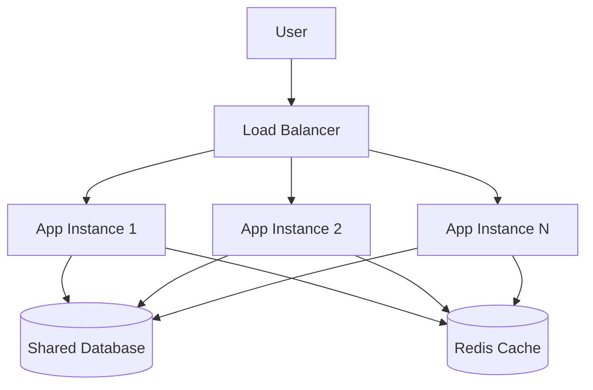
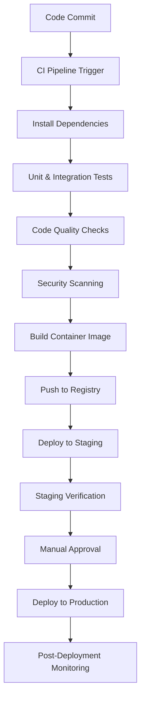
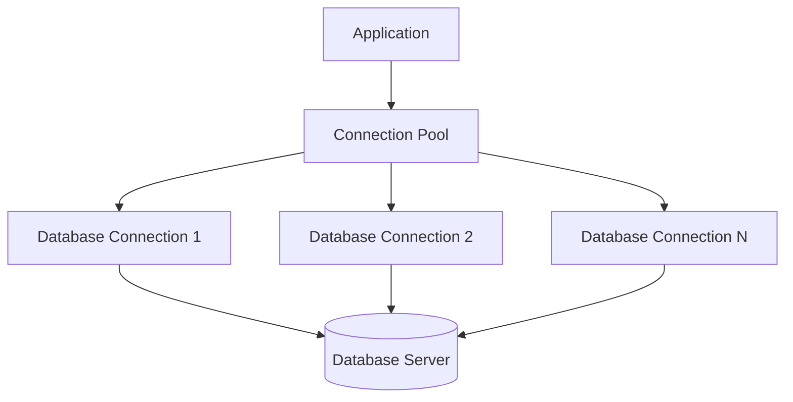

# Deployment & Configuration

<cite>
**Referenced Files in This Document**   
- [main.py](file://main.py)
- [requirements.txt](file://requirements.txt)
- [news_sentiment.py](file://news_sentiment.py)
- [docs/COMPLETE_INTEGRATION_SUMMARY.md](file://docs/COMPLETE_INTEGRATION_SUMMARY.md)
- [pytest.ini](file://pytest.ini)
- [tests/conftest.py](file://tests/conftest.py)
- [tests/test_e2e_api_perf_security_deployment.py](file://tests/test_e2e_api_perf_security_deployment.py)
</cite>

## Table of Contents
1. [Introduction](#introduction)
2. [Production Environment Setup](#production-environment-setup)
3. [Configuration Management](#configuration-management)
4. [Scaling Considerations](#scaling-considerations)
5. [CI/CD Integration](#cicd-integration)
6. [Containerization & Cloud Deployment](#containerization--cloud-deployment)
7. [Performance Optimization](#performance-optimization)
8. [Monitoring & Logging](#monitoring--logging)
9. [Backup & Disaster Recovery](#backup--disaster-recovery)
10. [Production Readiness Checklist](#production-readiness-checklist)
11. [Security Audit Checklist](#security-audit-checklist)

## Introduction

The intelligent-stock-prediction application is a full-stack web application that combines machine learning-based stock price prediction with sentiment analysis of financial news and integrated portfolio management. This document provides comprehensive guidance for deploying and configuring the application in production environments, covering all aspects from environment setup to security audits.

The application follows a three-tier architecture with a Flask-based backend, SQLite database (with SQLAlchemy ORM), and a responsive frontend using Bootstrap and D3.js. The system includes sophisticated machine learning models (LSTM, ARIMA, Linear Regression) for stock prediction and a multi-source sentiment analysis pipeline that integrates seven different sentiment sources with graceful fallback mechanisms.

This deployment guide focuses on the practical aspects of running the application in production, including configuration best practices, scaling strategies, containerization options, and operational considerations for maintaining a reliable and secure service.

**Section sources**
- [main.py](file://main.py#L1-L50)
- [README.md](file://README.md#L1-L202)

## Production Environment Setup

### Gunicorn Configuration

The application is designed to be deployed with Gunicorn as the WSGI HTTP server. Gunicorn is included in the requirements.txt file, making it readily available for production deployment.

For optimal performance in production, configure Gunicorn with the following settings:

```bash
gunicorn --bind 0.0.0.0:8000 --workers 4 --worker-class sync --timeout 120 --max-requests 1000 --max-requests-jitter 100 main:app
```

Key configuration parameters:
- **Workers**: Set to 4 (2-4 times the number of CPU cores) for optimal concurrency
- **Worker class**: Use sync for CPU-intensive ML operations
- **Timeout**: Extended to 120 seconds to accommodate ML model inference
- **Max requests**: Set to 1000 with jitter to prevent worker processes from running indefinitely
- **Bind**: Listen on all interfaces on port 8000

The application's main.py file is structured to work seamlessly with Gunicorn, with the Flask app instance created at the module level for easy import.

### Nginx Reverse Proxy Configuration

Nginx should be used as a reverse proxy in front of Gunicorn to handle static files efficiently and provide additional security layers. A sample Nginx configuration:

```nginx
server {
    listen 80;
    server_name your-domain.com;
    
    location / {
        proxy_pass http://127.0.0.1:8000;
        proxy_set_header Host $host;
        proxy_set_header X-Real-IP $remote_addr;
        proxy_set_header X-Forwarded-For $proxy_add_x_forwarded_for;
        proxy_set_header X-Forwarded-Proto $scheme;
        proxy_connect_timeout 60s;
        proxy_send_timeout 120s;
        proxy_read_timeout 120s;
    }
    
    location /static/ {
        alias /path/to/intelligent-stock-prediction/static/;
        expires 1y;
        add_header Cache-Control "public, immutable";
    }
}
```

This configuration ensures proper request forwarding, header preservation, and efficient static file serving from the application's static directory.

### Environment Variables

The application uses environment variables for critical configuration, as shown in main.py:

```python
app.config['SECRET_KEY'] = os.environ.get('SECRET_KEY', 'CHANGE_ME_IN_PRODUCTION')
app.config['SQLALCHEMY_DATABASE_URI'] = os.environ.get('DATABASE_URL', 'sqlite:///sams_database.db')
```

Essential environment variables for production:
- **SECRET_KEY**: Must be set to a strong, randomly generated value
- **DATABASE_URL**: Should point to a production-grade database (PostgreSQL recommended)
- **FLASK_ENV**: Set to 'production' to disable debug mode
- **API keys**: For Alpha Vantage, Finnhub, and other integrated services

The application provides fallback values for development but requires explicit configuration for production deployment.

**Section sources**
- [main.py](file://main.py#L43-L45)
- [requirements.txt](file://requirements.txt#L14)
- [tests/test_e2e_api_perf_security_deployment.py](file://tests/test_e2e_api_perf_security_deployment.py#L257)

## Configuration Management

### Configuration File Structure

The application uses a combination of code-based configuration and environment variables. The main.py file contains the primary configuration, with sensitive settings pulled from environment variables.

Key configuration aspects:
- **Database**: Configured via DATABASE_URL environment variable
- **Security**: SECRET_KEY from environment, with CSRF protection enabled
- **Session management**: HTTP-only cookies with SameSite=Lax policy
- **Caching**: Disabled for prediction results to ensure fresh calculations

The configuration is designed to be environment-agnostic, allowing the same codebase to run in development, staging, and production with different environment variables.

### Environment-Specific Configuration

For different deployment environments, use environment variables rather than configuration files. This follows the 12-factor app methodology and enhances security by keeping sensitive information out of version control.

Recommended approach:
1. Create environment-specific .env files (not committed to version control)
2. Use a process manager like systemd or Docker to load environment variables
3. Implement configuration validation at startup

The application's use of os.environ.get() with fallback values provides graceful degradation when environment variables are not set, but production deployments should explicitly define all required variables.

### API Key Management

The sentiment analysis system integrates with multiple external APIs, each requiring API keys:

- **Alpha Vantage**: For financial data and news sentiment
- **Finnhub**: For social sentiment analysis
- **EODHD**: For professional sentiment data
- **StockGeist**: For real-time streaming sentiment
- **Tradestie**: For Reddit sentiment analysis

API keys should be managed as environment variables:
- **ALPHA_VANTAGE_API_KEY**
- **FINNHUB_API_KEY** 
- **EODHD_API_KEY**
- **STOCKGEIST_API_KEY**
- **TRADESTIE_API_KEY**

The COMPLETE_INTEGRATION_SUMMARY.md document details the prioritized fallback chain for sentiment analysis, starting with Finviz scraping and progressing through the API-based sources when available.

**Section sources**
- [main.py](file://main.py#L43-L48)
- [news_sentiment.py](file://news_sentiment.py#L313-L327)
- [docs/COMPLETE_INTEGRATION_SUMMARY.md](file://docs/COMPLETE_INTEGRATION_SUMMARY.md#L1-L193)

## Scaling Considerations

### Handling Multiple Users

The application's architecture supports multiple users through its database schema and session management. Each user has isolated portfolio data, with transactions and holdings tracked separately.

To scale for multiple users:
- **Database connection pooling**: Use SQLAlchemy's built-in connection pooling
- **Session storage**: Consider external session storage (Redis) for horizontal scaling
- **Rate limiting**: Implement rate limiting for prediction endpoints to prevent abuse

The current implementation uses SQLite, which has limitations for high-concurrency scenarios. For production deployments with multiple users, migrate to PostgreSQL or MySQL.

### Handling Frequent Prediction Requests

The prediction engine is the most resource-intensive component, combining:
- Historical data retrieval from yfinance
- Machine learning model inference (LSTM, ARIMA, Linear Regression)
- Sentiment analysis from multiple sources

Strategies for handling frequent prediction requests:
- **Caching**: Implement result caching for recent predictions
- **Asynchronous processing**: Offload prediction tasks to background workers
- **Rate limiting**: Limit requests per user to prevent system overload
- **Resource monitoring**: Track CPU and memory usage during prediction tasks

The LSTM model training is not performed in real-time; instead, the model is loaded and used for inference, making predictions faster than training.

### Horizontal Scaling

For high-traffic scenarios, consider horizontal scaling:
- Deploy multiple application instances behind a load balancer
- Use a shared database (PostgreSQL) rather than SQLite
- Implement external session storage (Redis)
- Use a message queue (Celery with Redis/RabbitMQ) for background tasks

The stateless nature of the Flask application makes it suitable for horizontal scaling, with the primary constraint being the shared database backend.



**Diagram sources**
- [main.py](file://main.py#L584-L778)
- [news_sentiment.py](file://news_sentiment.py#L737-L800)

## CI/CD Integration

### Testing Framework

The application includes a comprehensive testing framework using pytest, with tests organized in the tests/ directory. The pytest.ini file configures the test environment with appropriate markers for test categorization.

Key test categories:
- **Unit tests**: Fast, isolated tests for individual functions
- **Integration tests**: Tests for component interactions
- **ML tests**: Validation of machine learning model outputs
- **Security tests**: Vulnerability and security feature testing
- **Performance tests**: API performance and deployment compatibility

The conftest.py file provides shared fixtures for database setup, test users, and mocked external services, enabling consistent test execution.

### Continuous Integration

For CI integration, configure a pipeline that:
1. Installs dependencies from requirements.txt
2. Runs the comprehensive test suite
3. Performs code quality checks (linting, formatting)
4. Executes security scans
5. Builds and pushes container images

The test suite includes an end-to-end test for deployment compatibility (test_e2e_api_perf_security_deployment.py), which verifies Gunicorn compatibility and security configurations.

### Deployment Pipeline

A recommended CI/CD pipeline for production deployment:



**Diagram sources**
- [pytest.ini](file://pytest.ini#L1-L56)
- [tests/conftest.py](file://tests/conftest.py#L1-L273)
- [tests/test_e2e_api_perf_security_deployment.py](file://tests/test_e2e_api_perf_security_deployment.py#L1-L300)

## Containerization & Cloud Deployment

### Docker Configuration

The application can be containerized using Docker for consistent deployment across environments. A sample Dockerfile:

```dockerfile
FROM python:3.9-slim

WORKDIR /app

COPY requirements.txt .
RUN pip install --no-cache-dir -r requirements.txt

COPY . .

EXPOSE 8000

CMD ["gunicorn", "--bind", "0.0.0.0:8000", "--workers", "4", "main:app"]
```

Key considerations for containerization:
- Use a slim Python base image to minimize attack surface
- Install only required dependencies
- Run as a non-root user in production
- Mount configuration and database as volumes
- Set appropriate environment variables

### Cloud Deployment Patterns

The application can be deployed on various cloud platforms using different patterns:

#### Platform as a Service (PaaS)
- **Heroku**: Simple deployment with minimal configuration
- **Render**: Easy container deployment with free tier
- **Railway**: Developer-friendly deployment with integrated database

#### Container Orchestration
- **AWS ECS**: Container management with auto-scaling
- **Google Cloud Run**: Serverless container execution
- **Azure Container Instances**: Simple container deployment

#### Kubernetes
For high-availability deployments, consider Kubernetes with:
- Multiple replicas for the web application
- Persistent storage for the database
- Ingress controller for routing
- Horizontal pod autoscaler based on CPU usage
- Liveness and readiness probes

### Database Considerations

The current SQLite implementation is suitable for development and low-traffic scenarios but should be replaced for production:

- **PostgreSQL**: Recommended for production deployments
- **Cloud SQL**: Managed database services (AWS RDS, Google Cloud SQL)
- **Connection pooling**: Use PgBouncer or similar for high concurrency

Migrating from SQLite to PostgreSQL requires minimal code changes due to SQLAlchemy's ORM abstraction.

**Section sources**
- [requirements.txt](file://requirements.txt#L1-L19)
- [main.py](file://main.py#L44)
- [tests/conftest.py](file://tests/conftest.py#L24)

## Performance Optimization

### ML Model Optimization

The application uses three prediction models with different performance characteristics:

1. **LSTM Neural Network**: Most accurate but computationally intensive
2. **ARIMA**: Statistical model with moderate computational requirements
3. **Linear Regression**: Fastest but least accurate

Optimization strategies:
- **Model loading**: Load models at startup rather than on each request
- **Caching**: Cache recent prediction results to avoid redundant calculations
- **Batch processing**: Process multiple predictions asynchronously
- **Hardware acceleration**: Use GPU instances for LSTM inference when available

The LSTM model is trained with 25 epochs and batch size of 32, balancing accuracy and training time.

### Caching Strategies

Implement multi-layer caching to improve performance:

1. **Result caching**: Cache prediction results for a short duration
2. **Data caching**: Cache historical stock data from yfinance
3. **Sentiment caching**: Cache sentiment analysis results
4. **Database query caching**: Cache frequent database queries

The news_sentiment.py module includes commented Redis integration for caching, which can be enabled for production deployments:

```python
# Redis caching
self.redis_client = None
if REDIS_AVAILABLE:
    try:
        self.redis_client = redis.Redis(host=redis_host, port=redis_port, decode_responses=True)
    except Exception as e:
        logger.warning(f"Redis connection failed: {e}")
```

### Database Connection Pooling

For production deployments with multiple users, implement database connection pooling:

- **SQLAlchemy**: Built-in connection pooling with configurable pool size
- **PgBouncer**: External connection pooler for PostgreSQL
- **Connection limits**: Configure appropriate connection limits based on expected concurrency

The current SQLite implementation does not support connection pooling, making the migration to PostgreSQL essential for high-concurrency scenarios.



**Diagram sources**
- [main.py](file://main.py#L647-L778)
- [news_sentiment.py](file://news_sentiment.py#L718-L736)

## Monitoring & Logging

### Application Logging

The application includes basic logging configuration in news_sentiment.py:

```python
logging.basicConfig(level=logging.INFO)
logger = logging.getLogger(__name__)
```

For production, enhance logging with:
- **Structured logging**: JSON-formatted logs for easier parsing
- **Log levels**: Differentiate between INFO, WARNING, ERROR messages
- **Log rotation**: Prevent log files from growing indefinitely
- **Centralized logging**: Forward logs to a centralized system (ELK, Splunk)

Monitor key events:
- Prediction requests and response times
- Database query performance
- External API calls and response times
- Authentication attempts
- Error conditions

### Performance Monitoring

Track key performance metrics:
- **Response times**: For prediction endpoints and user interactions
- **Error rates**: HTTP error codes and application exceptions
- **Resource utilization**: CPU, memory, and disk usage
- **Database performance**: Query execution times and connection counts
- **External service latency**: API response times for sentiment sources

The application's end-to-end test includes performance verification, ensuring that the system meets performance requirements in production.

### Alerting Configuration

Set up alerts for critical conditions:
- High error rates (5xx responses)
- Slow response times (predictions taking longer than expected)
- Database connection issues
- External API failures
- High resource utilization
- Failed health checks

Use the health check endpoint (if implemented) or create a simple health check route to monitor application availability.

**Section sources**
- [news_sentiment.py](file://news_sentiment.py#L36-L38)
- [tests/test_e2e_api_perf_security_deployment.py](file://tests/test_e2e_api_perf_security_deployment.py#L1-L300)

## Backup & Disaster Recovery

### Database Backup Strategy

Implement regular database backups:
- **Frequency**: Daily full backups with hourly incremental backups
- **Retention**: Keep 7 daily backups and 30 incremental backups
- **Storage**: Store backups in a separate location from the primary system
- **Encryption**: Encrypt backups at rest
- **Testing**: Regularly test backup restoration

For SQLite, copy the database file with the application stopped or use SQLite's backup API. For PostgreSQL, use pg_dump with appropriate compression.

### Configuration Backup

Backup critical configuration:
- Environment variables and configuration files
- SSL certificates and keys
- API keys and credentials
- Deployment scripts and infrastructure as code

Store configuration backups separately from data backups, with appropriate access controls.

### Disaster Recovery Plan

Develop a comprehensive disaster recovery plan:
- **Recovery Time Objective (RTO)**: Target time to restore service
- **Recovery Point Objective (RPO)**: Maximum acceptable data loss
- **Failover procedures**: Steps to restore service on alternative infrastructure
- **Communication plan**: Notification procedures for stakeholders
- **Regular testing**: Conduct regular disaster recovery drills

The application's stateless design simplifies recovery, as application instances can be recreated from container images, with data restored from backups.

**Section sources**
- [main.py](file://main.py#L44)
- [docs/COMPLETE_INTEGRATION_SUMMARY.md](file://docs/COMPLETE_INTEGRATION_SUMMARY.md#L146-L154)

## Production Readiness Checklist

### Technical Requirements
- [ ] Migrate from SQLite to PostgreSQL or MySQL
- [ ] Configure proper SECRET_KEY environment variable
- [ ] Set up Gunicorn with appropriate worker configuration
- [ ] Implement Nginx reverse proxy with SSL termination
- [ ] Configure proper logging and log rotation
- [ ] Set up monitoring and alerting
- [ ] Implement regular database backups
- [ ] Configure rate limiting for prediction endpoints
- [ ] Set up external session storage for horizontal scaling
- [ ] Implement CDN for static assets

### Performance Requirements
- [ ] Test application under expected load
- [ ] Optimize database queries and add appropriate indexes
- [ ] Implement caching for frequent operations
- [ ] Configure connection pooling
- [ ] Set up auto-scaling based on load
- [ ] Optimize ML model inference performance
- [ ] Test failover and recovery procedures

### Operational Requirements
- [ ] Document deployment and rollback procedures
- [ ] Set up monitoring dashboards
- [ ] Configure alerting for critical conditions
- [ ] Establish on-call procedures
- [ ] Document incident response procedures
- [ ] Set up audit logging
- [ ] Implement change management processes

## Security Audit Checklist

### Authentication & Authorization
- [ ] Verify password hashing with secure algorithms
- [ ] Implement multi-factor authentication
- [ ] Enforce strong password policies
- [ ] Implement proper session management
- [ ] Set secure cookie attributes (HttpOnly, Secure, SameSite)
- [ ] Implement rate limiting for login attempts
- [ ] Ensure role-based access control is properly enforced

### Data Security
- [ ] Encrypt sensitive data at rest
- [ ] Use HTTPS for all communications
- [ ] Implement proper input validation and sanitization
- [ ] Prevent SQL injection through parameterized queries
- [ ] Prevent XSS attacks with proper output encoding
- [ ] Implement CSRF protection for state-changing operations
- [ ] Regularly update dependencies to address vulnerabilities

### Infrastructure Security
- [ ] Harden the operating system and container images
- [ ] Implement network segmentation
- [ ] Configure firewalls and security groups
- [ ] Regularly patch and update systems
- [ ] Implement intrusion detection/prevention systems
- [ ] Conduct regular security assessments
- [ ] Implement security information and event management (SIEM)

### Compliance & Governance
- [ ] Document security policies and procedures
- [ ] Conduct regular security training
- [ ] Perform vulnerability scanning
- [ ] Conduct penetration testing
- [ ] Implement change control processes
- [ ] Maintain audit trails
- [ ] Ensure compliance with relevant regulations