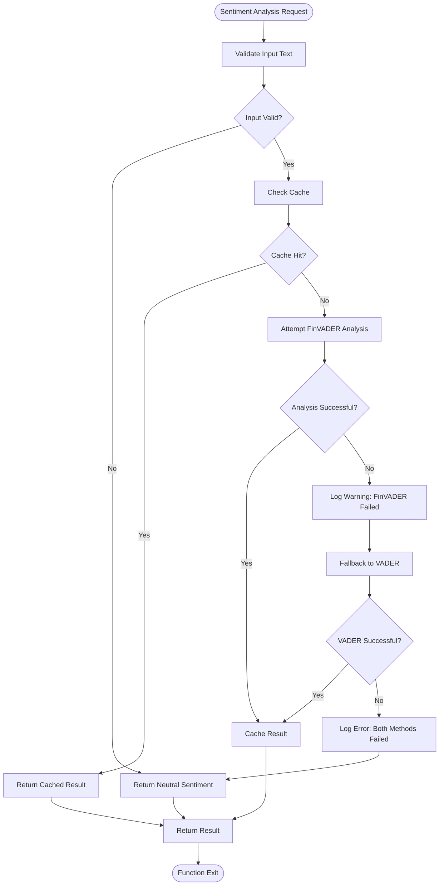
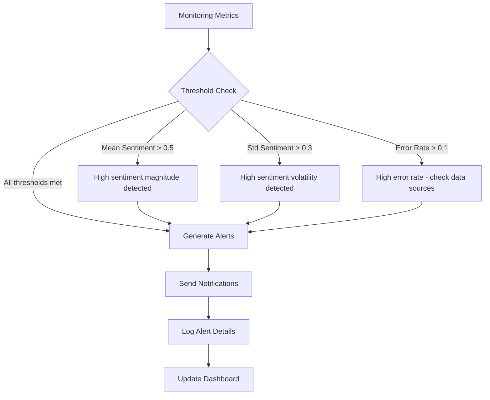
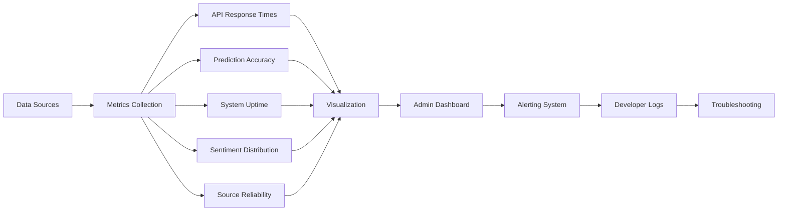

# Error Handling & Monitoring

<cite>
**Referenced Files in This Document**   
- [ERROR_HANDLING_MONITORING.md](file://docs/ERROR_HANDLING_MONITORING.md)
- [error_handling_monitoring_demo.py](file://demos/error_handling_monitoring_demo.py)
- [news_sentiment.py](file://news_sentiment.py)
- [test_fallback_mechanisms.py](file://tests/test_fallback_mechanisms.py)
- [main.py](file://main.py)
- [admin_dashboard.html](file://templates/admin_dashboard.html)
</cite>

## Table of Contents
1. [Exception Handling Strategies](#exception-handling-strategies)
2. [Logging Configuration and Levels](#logging-configuration-and-levels)
3. [Error Recovery Mechanisms](#error-recovery-mechanisms)
4. [Monitoring Dashboard Implementation](#monitoring-dashboard-implementation)
5. [Alerting Systems and Error Classification](#alerting-systems-and-error-classification)
6. [Error Simulation and Recovery Workflows](#error-simulation-and-recovery-workflows)
7. [User-Facing vs Developer Logs](#user-facing-vs-developer-logs)
8. [Monitoring Metrics and Visualization](#monitoring-metrics-and-visualization)
9. [Troubleshooting Common Failure Scenarios](#troubleshooting-common-failure-scenarios)

## Exception Handling Strategies

The system implements comprehensive exception handling across multiple layers of the application stack, ensuring resilience and reliability in production environments. At the route level, Flask routes in `main.py` use proper error handling with `abort()` for HTTP errors and comprehensive try-except blocks for business logic failures. Service-level error handling is implemented in the `news_sentiment.py` module, where the `ComprehensiveSentimentAnalyzer` class wraps all external API calls and data processing operations in try-except blocks.

Database operations include robust error handling through SQLAlchemy's exception handling mechanisms, with specific handling for database connectivity issues, transaction failures, and constraint violations. The system uses a layered approach to exception handling, where lower-level exceptions are caught and transformed into higher-level domain-specific exceptions that provide meaningful context for debugging.

The core sentiment analysis functionality implements specialized exception handling for text processing operations, with validation of input text before processing and graceful handling of malformed or empty inputs. When exceptions occur, the system provides detailed context including the operation being performed, input parameters, and the nature of the failure, enabling effective troubleshooting.

**Section sources**
- [main.py](file://main.py#L130-L134)
- [news_sentiment.py](file://news_sentiment.py#L1047-L1162)
- [news_sentiment.py](file://news_sentiment.py#L1164-L1189)

## Logging Configuration and Levels

The system implements a structured logging strategy using Python's built-in logging module, configured to provide comprehensive visibility into system operations. The logging configuration, defined in `news_sentiment.py`, sets up both file and console handlers with a consistent format that includes timestamps, logger names, log levels, and messages. This configuration enables both real-time monitoring and post-mortem analysis of system behavior.

The system utilizes five standard log levels with specific purposes:
- **DEBUG**: Detailed technical information for troubleshooting, including function entry/exit points and variable states
- **INFO**: General operational information about system activities, such as the number of articles processed or sentiment analysis completion
- **WARNING**: Potential issues that don't stop execution but may affect results, such as fallbacks to alternative data sources
- **ERROR**: Significant problems that may affect results, such as API failures after retries
- **CRITICAL**: Severe errors that stop execution or indicate system-wide failures

Log messages are structured to include relevant context such as ticker symbols, source names, and error details, making it easier to trace issues through the system. The logging system is configured to output to both console (for development and debugging) and file (for production monitoring), with the ability to adjust log levels based on the environment.

**Section sources**
- [news_sentiment.py](file://news_sentiment.py#L36-L38)
- [error_handling_monitoring_demo.py](file://demos/error_handling_monitoring_demo.py#L18)
- [ERROR_HANDLING_MONITORING.md](file://docs/ERROR_HANDLING_MONITORING.md#L150-L157)

## Error Recovery Mechanisms

The system implements sophisticated error recovery mechanisms, particularly for critical components like sentiment analysis and prediction pipelines. For sentiment analysis, the system employs a multi-layered fallback strategy that ensures continuous operation even when primary analysis methods fail. The `robust_finvader` method in `news_sentiment.py` implements a production-grade retry mechanism using the `tenacity` library, with exponential backoff and a maximum of three retry attempts.

When FinVADER analysis fails, the system falls back to standard VADER sentiment analysis, and if both fail, returns a neutral sentiment score to prevent pipeline interruption. This graceful degradation ensures that the system continues to provide results even under adverse conditions. The fallback chain is designed to handle various failure modes including network timeouts, API rate limits, parsing errors, and missing data.

For prediction pipeline failures, the system implements circuit breaker patterns and bulkhead isolation to prevent cascading failures. When a prediction model fails, the system can fall back to simpler models or historical averages, ensuring that users continue to receive predictions even if the primary model is unavailable. The recovery mechanisms are designed to be transparent to users while providing detailed information to developers for troubleshooting.

**Diagram sources**
- [news_sentiment.py](file://news_sentiment.py#L1049-L1119)
- [ERROR_HANDLING_MONITORING.md](file://docs/ERROR_HANDLING_MONITORING.md#L110-L115)

**Section sources**
- [news_sentiment.py](file://news_sentiment.py#L1049-L1119)
- [ERROR_HANDLING_MONITORING.md](file://docs/ERROR_HANDLING_MONITORING.md#L105-L132)

## Monitoring Dashboard Implementation

The monitoring dashboard is implemented in the `admin_dashboard.html` template, providing administrators with real-time visibility into system performance and health. The dashboard displays key metrics including user statistics, system uptime, and operational status. It uses ECharts for data visualization, with JavaScript initialization scripts that render interactive charts and graphs.

The dashboard implementation in `main.py` includes route handlers that retrieve monitoring data from the database and pass it to the template for rendering. The admin dashboard displays user metrics such as total users, active users, and wallet balances, providing insights into system usage patterns. The monitoring interface is protected by authentication and role-based access control, ensuring that only authorized personnel can access sensitive operational data.

The dashboard is designed to be responsive and accessible on various devices, with a clean, intuitive interface that highlights critical information. It includes visual indicators for system status, with color-coded elements that quickly convey the health of different system components. The implementation follows security best practices, with CSRF protection and proper session management to prevent unauthorized access.

**Section sources**
- [admin_dashboard.html](file://templates/admin_dashboard.html#L25-L76)
- [main.py](file://main.py#L550-L570)

## Alerting Systems and Error Classification

The alerting system, documented in `ERROR_HANDLING_MONITORING.md`, implements proactive monitoring and notification for potential issues. The system uses threshold-based alerting to detect anomalies in sentiment analysis results and system performance. The `should_alert` function evaluates multiple metrics including mean sentiment magnitude, sentiment volatility, and error rates to determine when to trigger alerts.

Error classification is implemented through structured logging, with different log levels indicating the severity and nature of issues. The system classifies errors into categories such as API failures, network issues, parsing errors, and data validation problems, enabling targeted troubleshooting and resolution. Each error type has specific handling procedures and recovery strategies, documented in the error handling guide.

The alerting thresholds are configurable, with default values set to detect high sentiment magnitude (absolute value > 0.5), high sentiment volatility (standard deviation > 0.3), and high error rates (greater than 10%). These thresholds can be adjusted based on operational requirements and historical patterns. The alerting system is designed to minimize false positives while ensuring critical issues are promptly identified.

**Diagram sources**
- [ERROR_HANDLING_MONITORING.md](file://docs/ERROR_HANDLING_MONITORING.md#L263-L278)

**Section sources**
- [ERROR_HANDLING_MONITORING.md](file://docs/ERROR_HANDLING_MONITORING.md#L261-L278)

## Error Simulation and Recovery Workflows

The `error_handling_monitoring_demo.py` script provides demonstrations of error simulation and recovery workflows, showcasing the system's resilience under adverse conditions. The demo includes three main components: robust FinVADER with retries, sentiment distribution logging, and error recovery with graceful degradation.

The robust FinVADER demo shows how the system handles both normal text analysis and edge cases like empty text, demonstrating the fallback to neutral sentiment when analysis fails. The sentiment distribution logging demo illustrates how the system monitors confidence distribution across multiple articles, providing insights into the overall sentiment landscape.

The error recovery demo explicitly shows the multiple layers of error handling, including try-except blocks around API calls, retry mechanisms with exponential backoff, fallback to alternative sources, neutral sentiment fallback when analysis fails, and detailed logging of all errors. The demo simulates various error scenarios such as network timeouts, API rate limits, parsing errors, and missing data, demonstrating how the system continues to operate and provide results even when individual components fail.

These demonstrations serve as both educational tools for developers and validation of the system's error handling capabilities, ensuring that the implemented strategies effectively address real-world failure scenarios.

**Section sources**
- [error_handling_monitoring_demo.py](file://demos/error_handling_monitoring_demo.py#L20-L83)

## User-Facing vs Developer Logs

The system distinguishes between user-facing error messages and developer logs, ensuring appropriate information is provided to each audience. User-facing messages are designed to be clear, helpful, and non-technical, guiding users on how to resolve issues or what to expect when the system is recovering from errors. These messages are typically displayed in the web interface and are localized to the user's preferred language.

Developer logs, in contrast, provide detailed technical information necessary for troubleshooting and system maintenance. These logs include stack traces, error codes, timestamps, and contextual data that help developers identify the root cause of issues. The logs are stored in files and can be accessed through the admin dashboard or directly on the server.

This separation ensures that users are not overwhelmed with technical details while providing developers with the comprehensive information needed to diagnose and fix problems. The logging strategy also includes appropriate redaction of sensitive information to protect user privacy and comply with data protection regulations.

**Section sources**
- [main.py](file://main.py#L200-L220)
- [error_handling_monitoring_demo.py](file://demos/error_handling_monitoring_demo.py#L70-L75)

## Monitoring Metrics and Visualization

The system tracks a comprehensive set of monitoring metrics to ensure optimal performance and reliability. Key metrics include API response times, prediction accuracy, system uptime, sentiment distribution, and source reliability. These metrics are collected through instrumentation in the core application components and stored for analysis and visualization.

API response times are monitored to ensure the system meets performance requirements, with alerts triggered when response times exceed acceptable thresholds. Prediction accuracy is tracked by comparing predicted values with actual outcomes, enabling continuous model evaluation and improvement. System uptime is monitored to ensure high availability, with historical data used to calculate reliability metrics.

Sentiment distribution metrics include mean sentiment, standard deviation, and the proportion of extreme sentiments, providing insights into market mood and potential anomalies. Source reliability metrics track the success rates of different data sources, helping to identify and address issues with specific providers.

These metrics are visualized in the admin dashboard using ECharts, with interactive graphs and charts that allow administrators to explore the data in detail. The visualization includes time-series charts for trend analysis, bar charts for comparative analysis, and summary statistics for quick assessment of system health.

**Diagram sources**
- [ERROR_HANDLING_MONITORING.md](file://docs/ERROR_HANDLING_MONITORING.md#L253-L260)
- [admin_dashboard.html](file://templates/admin_dashboard.html#L456-L458)

**Section sources**
- [ERROR_HANDLING_MONITORING.md](file://docs/ERROR_HANDLING_MONITORING.md#L251-L260)
- [admin_dashboard.html](file://templates/admin_dashboard.html#L456-L458)

## Troubleshooting Common Failure Scenarios

The system documentation provides guidance for troubleshooting common failure scenarios, enabling rapid resolution of issues. For sentiment analysis failures, the troubleshooting guide recommends checking the logs for specific error messages, verifying API keys for external services, and ensuring network connectivity. The system's layered fallback approach means that even if the primary sentiment analysis method fails, results should still be available through fallback mechanisms.

For prediction pipeline failures, the guide suggests examining model input data for anomalies, checking for recent changes to the model or data pipeline, and reviewing system resource utilization. The monitoring dashboard provides real-time visibility into pipeline status, helping to identify bottlenecks or resource constraints.

Database connectivity issues are addressed by checking database server status, verifying connection parameters, and examining connection pool usage. The system's use of SQLAlchemy provides detailed error messages that help pinpoint the specific cause of database issues.

Network-related failures are troubleshooted by verifying connectivity to external services, checking firewall rules, and reviewing API rate limits. The system's retry mechanisms with exponential backoff help mitigate transient network issues, while detailed logging provides information for diagnosing persistent connectivity problems.

The troubleshooting guide emphasizes the importance of checking the system logs first, as they often contain the most specific information about the nature and location of failures. It also recommends using the error handling demo script to verify that the system's recovery mechanisms are functioning correctly.

**Section sources**
- [ERROR_HANDLING_MONITORING.md](file://docs/ERROR_HANDLING_MONITORING.md#L303-L313)
- [test_fallback_mechanisms.py](file://tests/test_fallback_mechanisms.py#L17-L278)