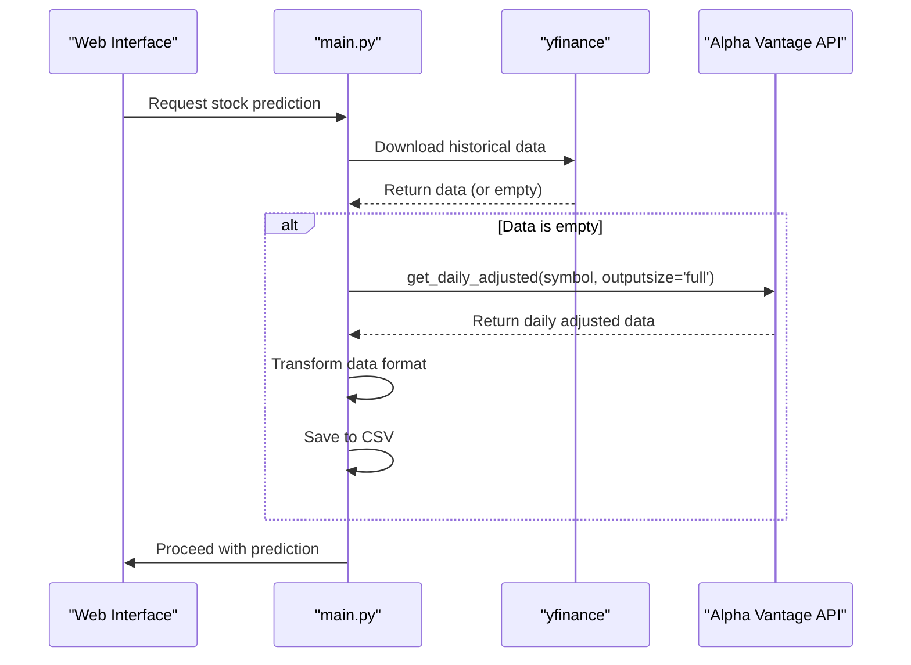
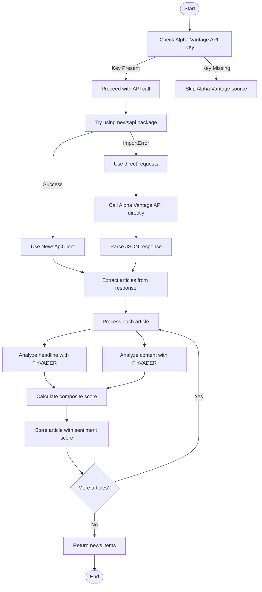
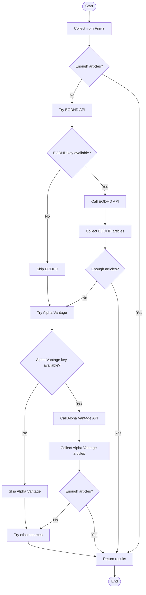

# Alpha Vantage API

<cite>
**Referenced Files in This Document**   
- [main.py](file://main.py)
- [news_sentiment.py](file://news_sentiment.py)
- [tests/test_e2e_api_perf_security_deployment.py](file://tests/test_e2e_api_perf_security_deployment.py)
- [demos/api_keys_demo.py](file://demos/api_keys_demo.py)
- [docs/API_KEYS_GUIDE.md](file://docs/API_KEYS_GUIDE.md)
- [requirements.txt](file://requirements.txt)
</cite>

## Table of Contents
1. [Introduction](#introduction)
2. [Financial Data Retrieval](#financial-data-retrieval)
3. [News Sentiment Analysis](#news-sentiment-analysis)
4. [Fallback Implementation](#fallback-implementation)
5. [API Configuration and Authentication](#api-configuration-and-authentication)
6. [Error Handling and Troubleshooting](#error-handling-and-troubleshooting)
7. [Performance and Caching](#performance-and-caching)
8. [Conclusion](#conclusion)

## Introduction
The Alpha Vantage API integration in the intelligent-stock-prediction system serves dual purposes: financial data retrieval as a fallback mechanism and news sentiment analysis for market sentiment assessment. This documentation details the implementation of both use cases, focusing on the integration patterns, data transformation logic, and error handling strategies employed throughout the system.

The system leverages Alpha Vantage as a secondary source for financial data when the primary source (yfinance) fails, ensuring continuous operation and data availability. For sentiment analysis, Alpha Vantage provides real-time news ingestion capabilities that complement the system's multi-source approach to sentiment gathering. The integration follows a robust fallback pattern that prioritizes data availability while maintaining system reliability.

**Section sources**
- [main.py](file://main.py#L8)
- [news_sentiment.py](file://news_sentiment.py#L8)
- [docs/COMPLETE_INTEGRATION_SUMMARY.md](file://docs/COMPLETE_INTEGRATION_SUMMARY.md#L148)

## Financial Data Retrieval
The financial data retrieval implementation uses the Alpha Vantage TimeSeries API to obtain daily adjusted stock data when the primary yfinance source fails. The integration is implemented in the `get_historical` function within the main application, where it serves as a fallback mechanism when yfinance returns empty data.

The system specifically utilizes the `get_daily_adjusted` endpoint from the Alpha Vantage timeseries module, which provides comprehensive daily data including open, high, low, close, adjusted close prices, and volume. The API call is configured with the following parameters:
- **Output format**: Pandas DataFrame for seamless integration with the existing data processing pipeline
- **Output size**: Full dataset to ensure comprehensive historical data coverage
- **Symbol format**: NSE-prefixed ticker symbols to target the appropriate market

The implementation includes data transformation logic to standardize the Alpha Vantage response format with the yfinance output. This involves renaming columns to match the expected schema ('date' to 'Date', '1. open' to 'Open', etc.), resetting the index, and ensuring the data is sorted in ascending chronological order. The transformed data is then saved to a CSV file for subsequent analysis by the prediction models.

**Diagram sources **
- [main.py](file://main.py#L549-L581)
- [tests/test_e2e_api_perf_security_deployment.py](file://tests/test_e2e_api_perf_security_deployment.py#L47-L55)

**Section sources**
- [main.py](file://main.py#L549-L581)
- [tests/test_e2e_api_perf_security_deployment.py](file://tests/test_e2e_api_perf_security_deployment.py#L47-L55)

## News Sentiment Analysis
The news sentiment analysis implementation leverages the Alpha Vantage News & Sentiments API to gather financial news and calculate sentiment scores. The integration is implemented in the `get_alpha_vantage_news` method of the `ComprehensiveSentimentAnalyzer` class, which handles both API key authentication and response processing.

The system employs a dual approach to API integration, first attempting to use the newsapi Python package if available, and falling back to direct HTTP requests if the package is not installed. The direct request uses the NEWS_SENTIMENT function with the following parameters:
- **Function**: NEWS_SENTIMENT
- **Tickers**: Company ticker symbol or name
- **API key**: Authentication token for API access
- **Output**: JSON format response containing news feed items

The sentiment scoring algorithm combines headline and content sentiment using a weighted composite approach. Headline sentiment is weighted at 60% while content sentiment is weighted at 40%, following the suggested composite scoring method. The system applies the FinVADER sentiment analyzer to both headline and content text, then calculates the composite score as: `composite_score = headline_score * 0.6 + content_score * 0.4`.

The response parsing logic extracts relevant information from the API response, including title, URL, summary/content text, publication date, and calculated sentiment score. Each news item is structured with consistent fields to maintain compatibility with the system's unified sentiment data model.

**Diagram sources **
- [news_sentiment.py](file://news_sentiment.py#L518-L581)
- [docs/API_KEYS_GUIDE.md](file://docs/API_KEYS_GUIDE.md#L31-L53)

**Section sources**
- [news_sentiment.py](file://news_sentiment.py#L518-L581)
- [demos/api_keys_demo.py](file://demos/api_keys_demo.py#L67-L69)

## Fallback Implementation
The fallback implementation pattern positions Alpha Vantage as a secondary source for both financial data and sentiment analysis when primary sources fail. In the financial data retrieval workflow, Alpha Vantage serves as a fallback when yfinance fails to return data, ensuring that the prediction models always have historical data to work with.

The sentiment analysis system implements a tiered fallback mechanism where Alpha Vantage is one of several API-based sources that are attempted when primary sources like Finviz do not provide sufficient articles. The `get_sentiment` method in the `ComprehensiveSentimentAnalyzer` class follows a specific source priority order:
1. Finviz (primary source)
2. EODHD API (first API fallback)
3. Alpha Vantage News API (second API fallback)
4. Other API sources (Tradestie, Finnhub, StockGeist)
5. Google News RSS (last resort)

The fallback logic checks if the current number of collected articles is less than the requested amount before attempting each subsequent source. This ensures efficient resource usage by only calling fallback sources when necessary. The system also verifies that the source is enabled in the selected sources list before making the API call.

The implementation includes comprehensive error handling that allows the system to gracefully continue when individual sources fail. If an API returns an error or the response format has changed, the system logs the error and proceeds to the next available source in the chain, maintaining overall system reliability.

**Diagram sources **
- [news_sentiment.py](file://news_sentiment.py#L747-L784)
- [tests/test_fallback_mechanisms.py](file://tests/test_fallback_mechanisms.py#L127-L192)

**Section sources**
- [news_sentiment.py](file://news_sentiment.py#L747-L784)
- [tests/test_fallback_mechanisms.py](file://tests/test_fallback_mechanisms.py#L127-L192)

## API Configuration and Authentication
API configuration and authentication for Alpha Vantage is implemented through API key management in the `ComprehensiveSentimentAnalyzer` class. The API key is passed as a parameter during class initialization and stored in the `alpha_vantage_api_key` instance variable for subsequent use in API calls.

Authentication is handled by including the API key as a parameter in the API request URL. For the News & Sentiments API, the key is appended to the query string as `apikey={self.alpha_vantage_api_key}`. The system checks for the presence of the API key before making any requests, and if the key is not provided, it skips the Alpha Vantage source and logs an appropriate message.

The implementation supports multiple methods for providing the API key:
- Direct parameter passing in function calls
- Environment variables (recommended for security)
- Configuration files or system settings

The system gracefully handles missing or invalid API keys by skipping the Alpha Vantage source and continuing with other available sources. This ensures that the absence of an API key does not disrupt the overall sentiment analysis process, maintaining system reliability and availability.

**Section sources**
- [news_sentiment.py](file://news_sentiment.py#L314-L315)
- [demos/api_keys_demo.py](file://demos/api_keys_demo.py#L110-L120)
- [docs/API_KEYS_GUIDE.md](file://docs/API_KEYS_GUIDE.md#L37-L41)

## Error Handling and Troubleshooting
The system implements comprehensive error handling strategies for Alpha Vantage API integration, addressing common issues such as invalid API keys, rate limiting, and response format changes. When an API key is invalid or missing, the system detects this condition and gracefully skips the Alpha Vantage source, continuing with other available sources in the fallback chain.

For rate limiting, the implementation includes timeout settings (10 seconds) on API requests to prevent hanging calls. The system also uses the tenacity library for retry functionality when available, implementing exponential backoff strategies to handle temporary API unavailability. If tenacity is not available, the system falls back to basic error handling without retries.

The code includes specific error handling for response format changes, using try-except blocks around JSON parsing and data extraction operations. This prevents the entire sentiment analysis process from failing due to unexpected changes in the API response structure. When parsing fails, the system logs the error and continues processing other articles or sources.

Common troubleshooting scenarios and their solutions include:
- **Invalid API keys**: Verify the key format and ensure it's correctly passed to the analyzer; check for typos or copy-paste errors
- **Rate limiting**: Implement request throttling or consider upgrading to a premium API plan with higher limits
- **Response format changes**: Update the response parsing logic to accommodate new field names or structures
- **Network connectivity issues**: Check internet connection and verify that the API endpoint is accessible

The system's modular design allows for easy debugging and troubleshooting, with clear logging messages that indicate which sources are being used and any errors encountered during the process.

**Section sources**
- [news_sentiment.py](file://news_sentiment.py#L39-L46)
- [demos/api_keys_demo.py](file://demos/api_keys_demo.py#L66-L74)
- [news_sentiment.py](file://news_sentiment.py#L558-L560)

## Performance and Caching
Performance considerations for Alpha Vantage API calls include timeout settings, request optimization, and potential caching strategies to minimize redundant requests. The implementation sets a 10-second timeout on API requests to prevent hanging calls and ensure responsive system behavior.

While the current implementation does not include Redis caching for Alpha Vantage responses (as Redis is disabled in the configuration), the system is designed with caching in mind through the `_get_cache_key`, `_get_from_cache`, and `_set_in_cache` methods. These methods provide a framework for implementing caching if Redis or another caching system is enabled in the future.

To minimize redundant requests, the system follows a tiered approach to source usage, only calling Alpha Vantage when necessary based on the number of articles already collected from higher-priority sources. This reduces the overall number of API calls and helps stay within rate limits.

Additional performance optimizations include:
- Using direct HTTP requests as a fallback when the newsapi package is not available, reducing dependency overhead
- Limiting the number of articles processed to the requested amount, preventing unnecessary data processing
- Implementing efficient data transformation and parsing logic to minimize processing time

Future performance improvements could include implementing client-side caching of API responses, optimizing request batching, and exploring asynchronous API calls to improve throughput.

**Section sources**
- [news_sentiment.py](file://news_sentiment.py#L558-L560)
- [news_sentiment.py](file://news_sentiment.py#L713-L735)
- [requirements.txt](file://requirements.txt#L13)

## Conclusion
The Alpha Vantage API integration in the intelligent-stock-prediction system demonstrates a robust, multi-faceted approach to financial data and sentiment analysis. By serving as both a fallback source for financial data and a primary source for news sentiment, Alpha Vantage enhances the system's reliability and analytical capabilities.

The implementation showcases effective design patterns including graceful fallback mechanisms, comprehensive error handling, and flexible API key management. The system's ability to continue functioning even when individual sources fail ensures consistent performance and user experience.

Key strengths of the integration include the composite sentiment scoring algorithm, which combines headline and content sentiment for more nuanced analysis, and the tiered fallback strategy that optimizes resource usage while maintaining data availability. The clear separation of concerns between data retrieval, transformation, and analysis components makes the system maintainable and extensible.

For optimal performance, users should ensure they have a valid Alpha Vantage API key and monitor their usage against the free tier limits (5 calls per minute, 500 calls per day). The system's modular design allows for easy enhancement with additional caching mechanisms or alternative API sources as needed.

**Section sources**
- [main.py](file://main.py#L8)
- [news_sentiment.py](file://news_sentiment.py#L8)
- [docs/COMPLETE_INTEGRATION_SUMMARY.md](file://docs/COMPLETE_INTEGRATION_SUMMARY.md#L148)