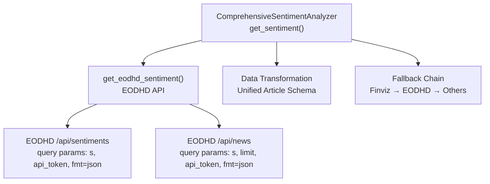
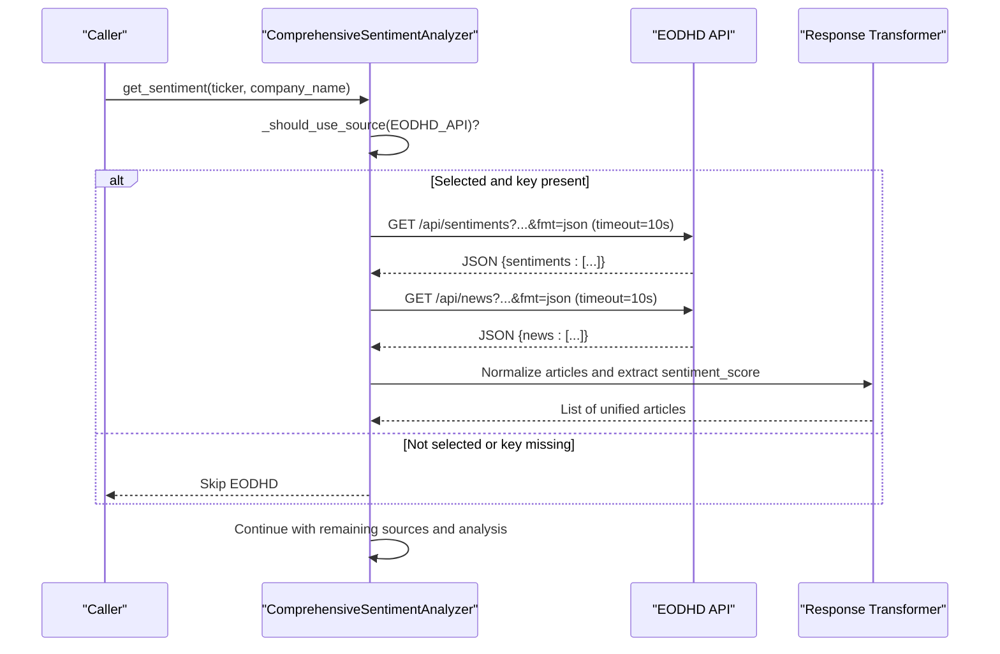
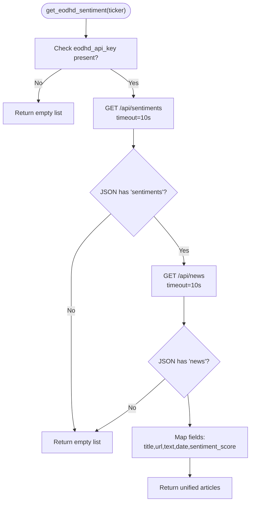
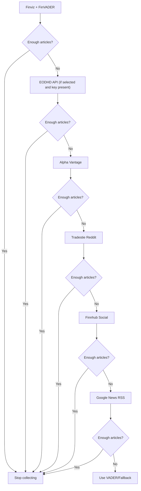
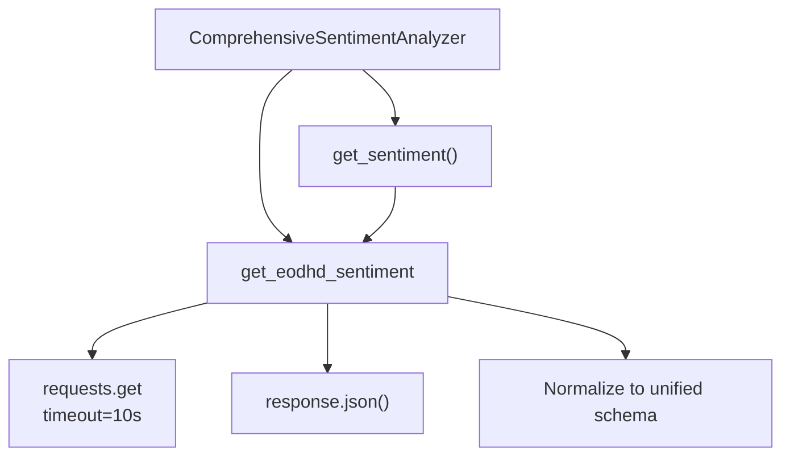

# EODHD API

<cite>
**Referenced Files in This Document**
- [news_sentiment.py](file://news_sentiment.py)
- [API_KEYS_GUIDE.md](file://docs/API_KEYS_GUIDE.md)
- [ALL_SOURCES_VERIFIED.md](file://docs/ALL_SOURCES_VERIFIED.md)
- [comprehensive_source_test.py](file://tests/comprehensive_source_test.py)
- [three_sources_verification.py](file://tests/three_sources_verification.py)
- [test_sentiment_sources.py](file://tests/test_sentiment_sources.py)
- [test_helpers.py](file://tests/test_helpers.py)
- [api_keys_demo.py](file://demos/api_keys_demo.py)
</cite>

## Table of Contents
1. [Introduction](#introduction)
2. [Project Structure](#project-structure)
3. [Core Components](#core-components)
4. [Architecture Overview](#architecture-overview)
5. [Detailed Component Analysis](#detailed-component-analysis)
6. [Dependency Analysis](#dependency-analysis)
7. [Performance Considerations](#performance-considerations)
8. [Troubleshooting Guide](#troubleshooting-guide)
9. [Conclusion](#conclusion)
10. [Appendices](#appendices)

## Introduction
This document focuses on the EODHD API integration within the sentiment analysis system. EODHD serves as a primary fallback for sentiment data, providing pre-calculated sentiment scores and news content. The implementation centers around the get_eodhd_sentiment method, which orchestrates API requests to EODHD’s sentiments and news endpoints, applies authentication via an API token, transforms the response into a unified article structure, and integrates seamlessly into the broader fallback chain. The document explains endpoint structure, query parameters, authentication, data transformation, error handling strategies (including timeouts), and performance considerations.

## Project Structure
The sentiment analysis module is implemented in a single file that defines the sentiment analyzer class, source enumerations, and convenience functions. The EODHD integration resides within the ComprehensiveSentimentAnalyzer class and participates in the multi-source fallback pipeline.

**Diagram sources**
- [news_sentiment.py](file://news_sentiment.py#L480-L516)
- [news_sentiment.py](file://news_sentiment.py#L737-L800)

**Section sources**
- [news_sentiment.py](file://news_sentiment.py#L737-L800)

## Core Components
- EODHD API integration: Implemented in get_eodhd_sentiment, which checks for an API key, constructs URLs for sentiments and news endpoints, performs HTTP requests with a 10-second timeout, parses JSON responses, and builds a normalized list of articles with sentiment_score.
- Fallback mechanism: The get_sentiment method iterates through sources in priority order; EODHD is invoked when the number of collected articles is below the target and the source is selected.
- Data transformation: Articles from EODHD are mapped to a uniform schema including title, url, text, source, date, and sentiment_score, enabling downstream analysis to use pre-computed scores transparently.

Key implementation references:
- EODHD method definition and request/response handling: [news_sentiment.py](file://news_sentiment.py#L480-L516)
- Fallback chain and selection logic: [news_sentiment.py](file://news_sentiment.py#L737-L800)
- Unified sentiment processing path: [news_sentiment.py](file://news_sentiment.py#L800-L895)

**Section sources**
- [news_sentiment.py](file://news_sentiment.py#L480-L516)
- [news_sentiment.py](file://news_sentiment.py#L737-L800)
- [news_sentiment.py](file://news_sentiment.py#L800-L895)

## Architecture Overview
The EODHD integration fits into a layered fallback architecture. The analyzer first attempts Finviz, then EODHD (if selected and configured), then other sources, and finally falls back to RSS. EODHD’s pre-computed sentiment scores are treated uniformly, allowing the system to bypass local analysis when available.

**Diagram sources**
- [news_sentiment.py](file://news_sentiment.py#L480-L516)
- [news_sentiment.py](file://news_sentiment.py#L737-L800)
- [news_sentiment.py](file://news_sentiment.py#L800-L895)

## Detailed Component Analysis

### EODHD API Integration: get_eodhd_sentiment
- Purpose: Provide pre-calculated sentiment data as a fallback source.
- Authentication: Requires an API token passed as api_token query parameter.
- Endpoints:
  - Sentiments endpoint: https://eodhd.com/api/sentiments
  - News endpoint: https://eodhd.com/api/news
- Query parameters:
  - s: Ticker symbol
  - api_token: API key
  - fmt=json: Response format
  - limit: Controls number of news items fetched per request
- Request pattern:
  - First call to sentiments endpoint
  - Second call to news endpoint for detailed articles
  - Both use a 10-second timeout
- Response parsing:
  - Parses JSON and checks for presence of sentiments and news arrays
  - Builds a list of articles with standardized fields
- Data transformation:
  - Maps title, link, content, date, and sentiment.score.compound to sentiment_score
  - Adds source identifier and preserves metadata

**Diagram sources**
- [news_sentiment.py](file://news_sentiment.py#L480-L516)

**Section sources**
- [news_sentiment.py](file://news_sentiment.py#L480-L516)

### Relationship to Other Sentiment Sources in the Priority Chain
- Primary source: Finviz + FinVADER
- Fallback: EODHD API (when selected and key provided)
- Additional sources: Alpha Vantage, Tradestie Reddit, Finnhub Social, Google News RSS
- Selection logic: The analyzer checks whether a given source is selected and whether sufficient articles have been collected before proceeding to the next source.

**Diagram sources**
- [news_sentiment.py](file://news_sentiment.py#L737-L800)

**Section sources**
- [news_sentiment.py](file://news_sentiment.py#L737-L800)

### Data Transformation and Normalization
- EODHD articles are transformed into a unified schema used across all sources:
  - title, url, text, source, date, sentiment_score
- This enables downstream analysis to treat pre-computed scores identically to locally computed scores, simplifying aggregation and labeling.

References:
- Unified schema construction: [news_sentiment.py](file://news_sentiment.py#L480-L516)
- Downstream usage of pre-computed scores: [news_sentiment.py](file://news_sentiment.py#L800-L895)

**Section sources**
- [news_sentiment.py](file://news_sentiment.py#L480-L516)
- [news_sentiment.py](file://news_sentiment.py#L800-L895)

### Error Handling Strategy
- Graceful degradation: If the API key is missing, the method logs a message and returns an empty list, allowing the fallback chain to continue.
- Network timeouts: Requests use a 10-second timeout; exceptions are caught and logged, and the method returns an empty list to continue fallback.
- Rate limiting and API failures: The method prints error messages and continues execution, ensuring robustness in production environments.
- Validation: Tests demonstrate graceful handling when keys are absent or invalid.

References:
- Timeout and exception handling: [news_sentiment.py](file://news_sentiment.py#L480-L516)
- Graceful skip behavior: [news_sentiment.py](file://news_sentiment.py#L480-L516)
- Test coverage for missing keys: [comprehensive_source_test.py](file://tests/comprehensive_source_test.py#L44-L68), [three_sources_verification.py](file://tests/three_sources_verification.py#L39-L52)
- Demo behavior with missing keys: [api_keys_demo.py](file://demos/api_keys_demo.py#L49-L58)

**Section sources**
- [news_sentiment.py](file://news_sentiment.py#L480-L516)
- [comprehensive_source_test.py](file://tests/comprehensive_source_test.py#L44-L68)
- [three_sources_verification.py](file://tests/three_sources_verification.py#L39-L52)
- [api_keys_demo.py](file://demos/api_keys_demo.py#L49-L58)

### API Endpoint Structure and Authentication
- Base URL: https://eodhd.com
- Endpoints:
  - /api/sentiments
  - /api/news
- Authentication: api_token query parameter
- Response format: JSON (fmt=json)
- Additional parameters:
  - s: Ticker symbol
  - limit: Number of news items to return (used in news endpoint)

References:
- Endpoint usage and parameters: [news_sentiment.py](file://news_sentiment.py#L480-L516)

**Section sources**
- [news_sentiment.py](file://news_sentiment.py#L480-L516)

### Integration with Fallback Mechanism
- The get_sentiment method orchestrates the entire pipeline and invokes get_eodhd_sentiment only when:
  - The source is selected
  - The number of collected articles is less than the target
- This ensures EODHD acts as a targeted fallback to augment results from earlier sources.

References:
- Fallback invocation: [news_sentiment.py](file://news_sentiment.py#L737-L800)

**Section sources**
- [news_sentiment.py](file://news_sentiment.py#L737-L800)

## Dependency Analysis
- Internal dependencies:
  - get_eodhd_sentiment depends on the analyzer’s headers and num_articles configuration.
  - Downstream analysis relies on the presence of sentiment_score to avoid recomputation.
- External dependencies:
  - EODHD API endpoints for sentiments and news.
  - requests library for HTTP calls with timeouts.
- Coupling and cohesion:
  - The method is cohesive around EODHD integration and minimally coupled to the rest of the analyzer.
  - The fallback chain centralizes source selection and iteration.

**Diagram sources**
- [news_sentiment.py](file://news_sentiment.py#L480-L516)
- [news_sentiment.py](file://news_sentiment.py#L737-L800)

**Section sources**
- [news_sentiment.py](file://news_sentiment.py#L480-L516)
- [news_sentiment.py](file://news_sentiment.py#L737-L800)

## Performance Considerations
- Speed advantage: EODHD provides pre-computed sentiment scores, avoiding local analysis overhead.
- Concurrency: The analyzer uses synchronous requests; for high-throughput scenarios, consider asynchronous patterns or batching.
- Timeouts: 10-second timeouts balance reliability with responsiveness; adjust based on network conditions.
- Caching: The analyzer includes optional Redis caching; consider leveraging it for EODHD responses to reduce repeated calls.
- Batch processing: The analyzer supports batch sentiment processing elsewhere, which can be adapted to leverage EODHD data when available.

[No sources needed since this section provides general guidance]

## Troubleshooting Guide
Common issues and resolutions:
- Invalid API key:
  - Symptom: EODHD API returns an error or the method logs an error and returns empty results.
  - Resolution: Verify the key is correct and active; consult the API keys guide for obtaining a key.
- Missing API key:
  - Symptom: The method prints a message indicating the key is not provided and skips EODHD.
  - Resolution: Provide a valid key or rely on other sources; the system gracefully degrades.
- Rate limiting:
  - Symptom: API responses slow or fail intermittently.
  - Resolution: Respect rate limits; consider caching or reducing request frequency.
- Malformed responses:
  - Symptom: JSON parsing fails or expected fields are missing.
  - Resolution: The method catches exceptions and continues; ensure the API is reachable and returning expected structures.
- Network timeouts:
  - Symptom: Requests exceed the 10-second timeout.
  - Resolution: Improve network stability or increase timeout cautiously; monitor logs for recurring failures.

References:
- API key guide and usage: [API_KEYS_GUIDE.md](file://docs/API_KEYS_GUIDE.md#L1-L30)
- Verified fallback behavior without keys: [ALL_SOURCES_VERIFIED.md](file://docs/ALL_SOURCES_VERIFIED.md#L106-L114)
- Test demonstrations: [comprehensive_source_test.py](file://tests/comprehensive_source_test.py#L44-L68), [three_sources_verification.py](file://tests/three_sources_verification.py#L39-L52)
- Demo behavior: [api_keys_demo.py](file://demos/api_keys_demo.py#L49-L58)

**Section sources**
- [API_KEYS_GUIDE.md](file://docs/API_KEYS_GUIDE.md#L1-L30)
- [ALL_SOURCES_VERIFIED.md](file://docs/ALL_SOURCES_VERIFIED.md#L106-L114)
- [comprehensive_source_test.py](file://tests/comprehensive_source_test.py#L44-L68)
- [three_sources_verification.py](file://tests/three_sources_verification.py#L39-L52)
- [api_keys_demo.py](file://demos/api_keys_demo.py#L49-L58)

## Conclusion
The EODHD API integration provides a robust, pre-computed sentiment fallback that accelerates the sentiment analysis pipeline. The get_eodhd_sentiment method implements secure authentication, structured endpoint usage, resilient error handling, and consistent data transformation. Together with the broader fallback chain, it ensures reliable sentiment computation across diverse operational contexts.

[No sources needed since this section summarizes without analyzing specific files]

## Appendices

### API Request Pattern and Response Parsing
- Request pattern:
  - Sentiments: GET /api/sentiments?...&fmt=json (timeout=10s)
  - News: GET /api/news?...&fmt=json (timeout=10s)
- Response parsing:
  - Check for sentiments and news arrays
  - Map fields to unified schema
  - Extract sentiment_score from sentiment.compound when available

References:
- [news_sentiment.py](file://news_sentiment.py#L480-L516)

**Section sources**
- [news_sentiment.py](file://news_sentiment.py#L480-L516)

### Relationship Between EODHD and Other Sources
- EODHD complements Finviz and other sources by providing pre-computed scores and additional news content.
- It participates in the priority chain only when selected and when the target number of articles has not yet been met.

References:
- [news_sentiment.py](file://news_sentiment.py#L737-L800)

**Section sources**
- [news_sentiment.py](file://news_sentiment.py#L737-L800)