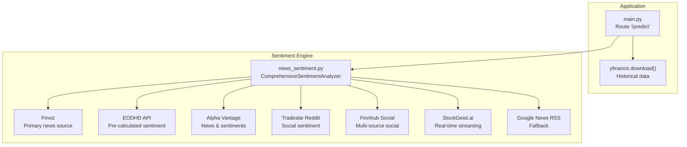
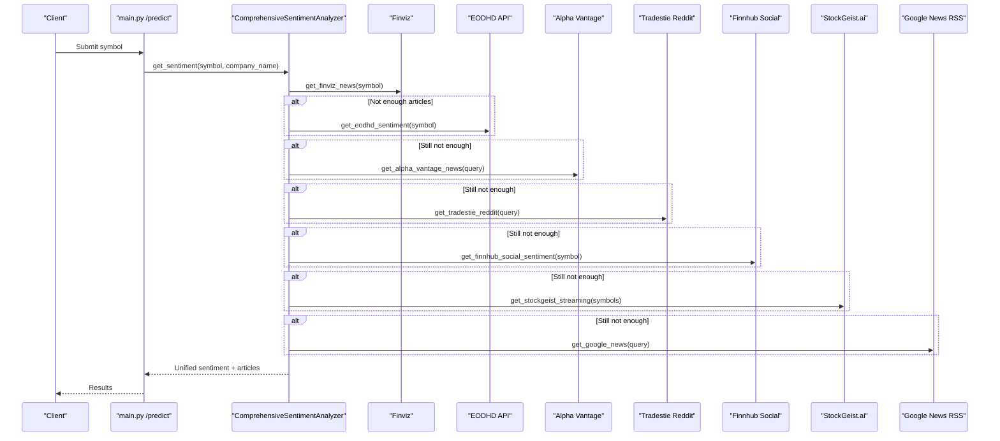
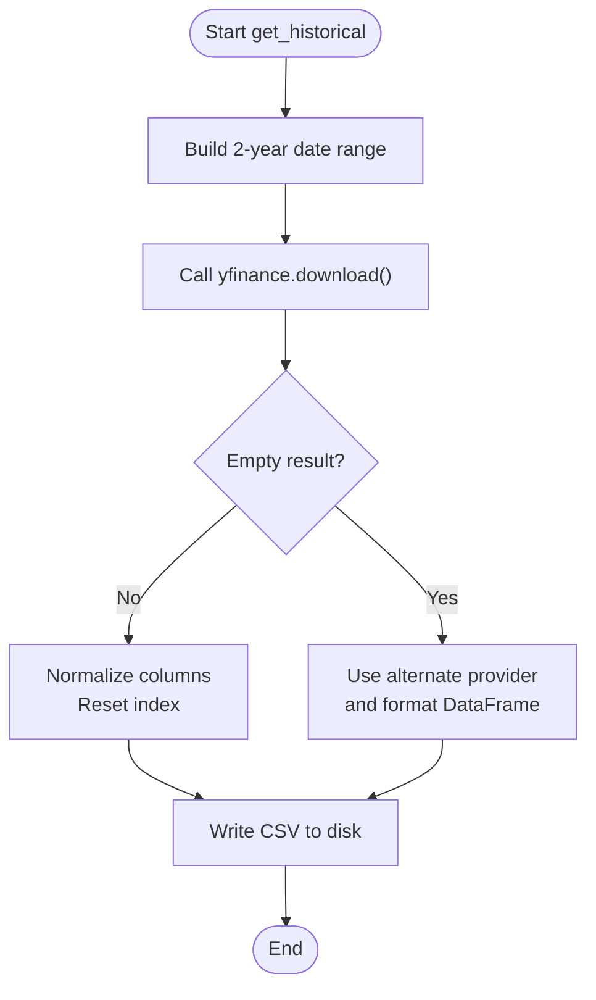
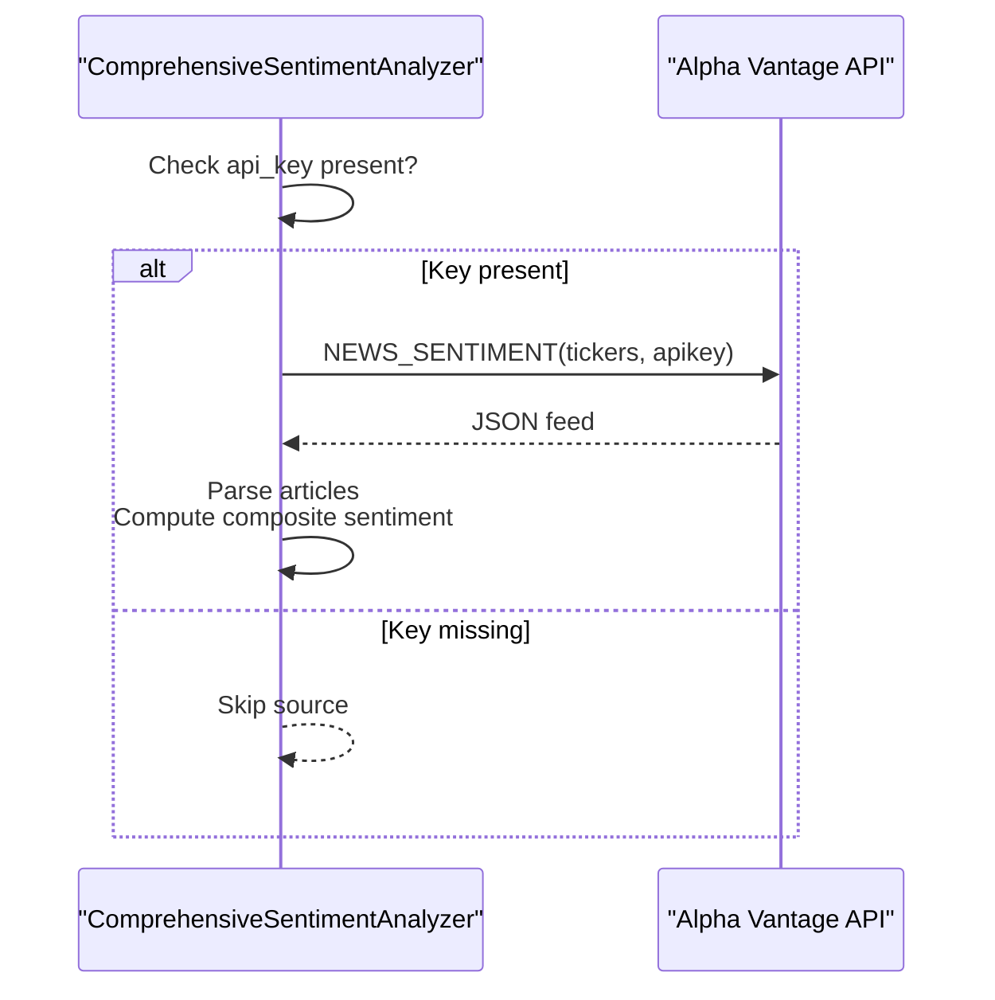
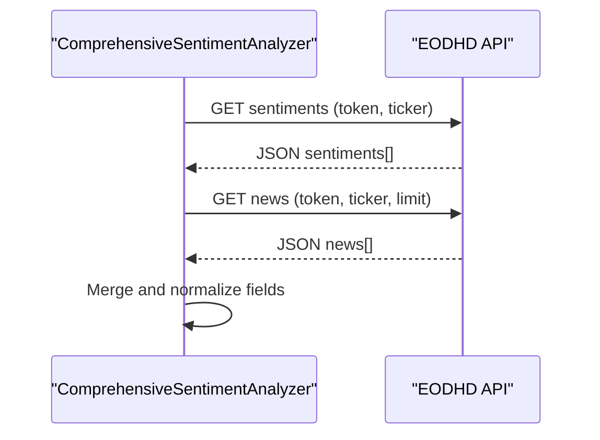
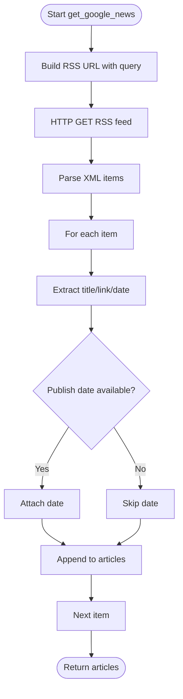
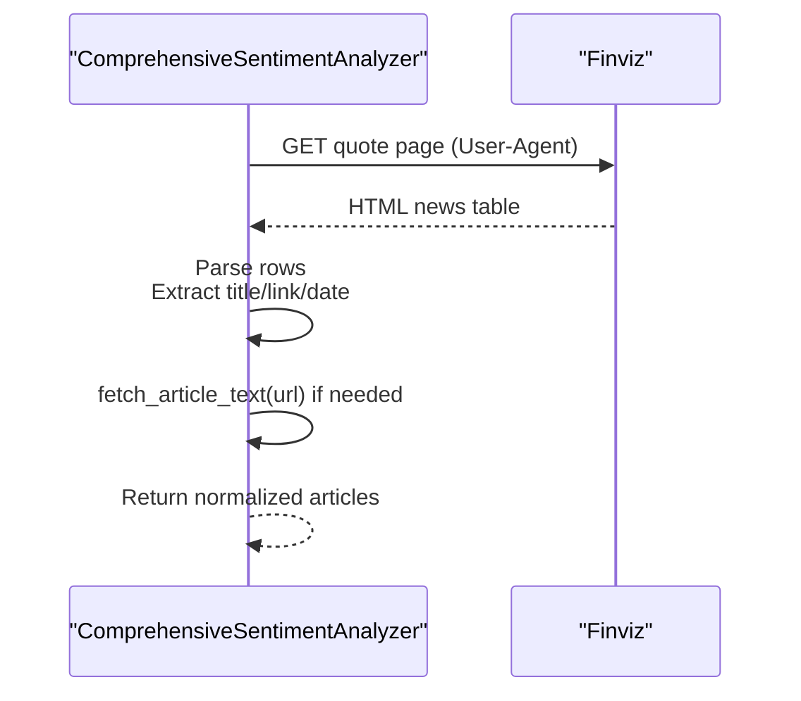
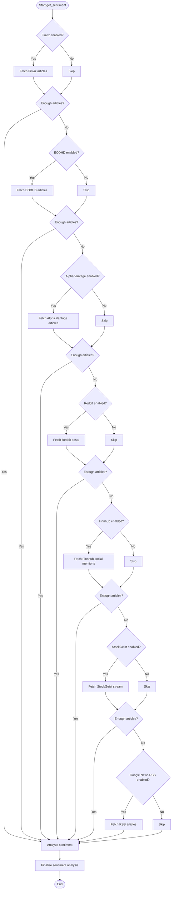
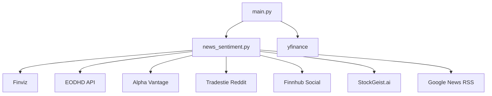

# External Integrations

<cite>
**Referenced Files in This Document**
- [news_sentiment.py](file://news_sentiment.py)
- [main.py](file://main.py)
- [demos/api_keys_demo.py](file://demos/api_keys_demo.py)
- [demos/selectable_sentiment_sources_demo.py](file://demos/selectable_sentiment_sources_demo.py)
- [tests/test_sentiment_sources.py](file://tests/test_sentiment_sources.py)
- [tests/test_fallback_mechanisms.py](file://tests/test_fallback_mechanisms.py)
- [docs/API_KEYS_GUIDE.md](file://docs/API_KEYS_GUIDE.md)
- [docs/ERROR_HANDLING_MONITORING.md](file://docs/ERROR_HANDLING_MONITORING.md)
</cite>

## Table of Contents
1. [Introduction](#introduction)
2. [Project Structure](#project-structure)
3. [Core Components](#core-components)
4. [Architecture Overview](#architecture-overview)
5. [Detailed Component Analysis](#detailed-component-analysis)
6. [Dependency Analysis](#dependency-analysis)
7. [Performance Considerations](#performance-considerations)
8. [Troubleshooting Guide](#troubleshooting-guide)
9. [Conclusion](#conclusion)
10. [Appendices](#appendices)

## Introduction
This section documents the external integrations used by the intelligent-stock-prediction system for sentiment analysis and historical price data. It covers:
- yfinance (historical price data retrieval)
- Alpha Vantage (financial data and news)
- EODHD API (pre-calculated sentiment)
- Google News RSS (fallback source)
- Finviz (primary news source)

For each integration, we explain authentication methods, endpoints used, rate limits, error handling strategies, data transformation logic, and the fallback pattern. We also include configuration options, reliability considerations, timeouts, caching strategies, and troubleshooting steps.

## Project Structure
The sentiment pipeline is primarily implemented in a dedicated module that orchestrates multiple data sources. Historical price data is fetched via yfinance in the main application route.

**Diagram sources**
- [main.py](file://main.py#L545-L581)
- [news_sentiment.py](file://news_sentiment.py#L311-L800)

**Section sources**
- [main.py](file://main.py#L545-L581)
- [news_sentiment.py](file://news_sentiment.py#L311-L800)

## Core Components
- Historical price data: yfinance integration in the prediction route.
- Sentiment data sources: Finviz (primary), EODHD API (fallback), Alpha Vantage (API), Tradestie Reddit (social), Finnhub Social (multi-source social), StockGeist.ai (real-time), Google News RSS (fallback).
- Fallback orchestration: The analyzer tries Finviz first, then API fallbacks, then social sources, and finally RSS if needed.
- Configuration: API keys supported for premium sources; use-case-specific defaults; optional Redis caching.

**Section sources**
- [news_sentiment.py](file://news_sentiment.py#L311-L800)
- [demos/api_keys_demo.py](file://demos/api_keys_demo.py#L1-L162)
- [docs/API_KEYS_GUIDE.md](file://docs/API_KEYS_GUIDE.md#L1-L246)

## Architecture Overview
The system integrates external services through a layered approach:
- Primary source: Finviz for fast, reliable headline news.
- API fallbacks: EODHD, Alpha Vantage, Finnhub Social, StockGeist.
- Social sentiment: Tradestie Reddit.
- Fallback: Google News RSS for broad coverage.
- Data transformation: Normalize to a unified article structure with sentiment scores.
- Reliability: Graceful degradation, timeouts, and logging.

**Diagram sources**
- [news_sentiment.py](file://news_sentiment.py#L737-L800)
- [news_sentiment.py](file://news_sentiment.py#L421-L581)
- [news_sentiment.py](file://news_sentiment.py#L583-L706)
- [news_sentiment.py](file://news_sentiment.py#L706-L740)

## Detailed Component Analysis

### yfinance (Historical Data Retrieval)
- Purpose: Retrieve historical price data for the prediction pipeline.
- Endpoint: Uses yfinance’s download function with start/end date range.
- Authentication: None required.
- Rate limits: Not applicable; subject to upstream provider policies.
- Error handling: Gracefully handles empty datasets by falling back to an alternate provider and saving a CSV.
- Data transformation: Ensures single-level column index, resets index to include Date, and writes CSV for downstream use.
- Reliability: Includes a fallback path to an alternate provider when yfinance returns empty data.
- Timeout handling: No explicit timeout in the shown code; consider adding request timeouts if extending to web APIs.
- Caching: Not implemented in the shown code; can be added at the application layer.

**Diagram sources**
- [main.py](file://main.py#L545-L581)

**Section sources**
- [main.py](file://main.py#L545-L581)

### Alpha Vantage (Financial Data and News)
- Authentication: API key required.
- Endpoints used:
  - News & Sentiments API (preferred): Query function NEWS_SENTIMENT with tickers parameter.
  - Alternative: Direct request endpoint for news sentiment feed.
- Rate limits: Free tier allows 5 calls/minute; premium tiers offer higher limits.
- Error handling: Graceful skip when API key is missing; fallback to other sources; graceful handling of network errors and JSON parsing failures.
- Data transformation: Unifies article fields (title, url, content, publishedAt/time_published) and computes a composite sentiment score from headline and content.
- Reliability: Dual-path implementation (newsapi client or direct requests) to maximize availability.
- Timeout handling: Requests use a 10-second timeout.
- Caching: Not implemented in the analyzer; can leverage application-level caching.

**Diagram sources**
- [news_sentiment.py](file://news_sentiment.py#L518-L581)

**Section sources**
- [news_sentiment.py](file://news_sentiment.py#L518-L581)
- [docs/API_KEYS_GUIDE.md](file://docs/API_KEYS_GUIDE.md#L31-L54)

### EODHD API (Pre-Calculated Sentiment)
- Authentication: API token required.
- Endpoints used:
  - Sentiment endpoint: Retrieve sentiment entries for a ticker.
  - News endpoint: Fetch detailed news items linked to sentiment.
- Rate limits: Vary by plan; free tier has limitations.
- Error handling: Graceful skip when API key is missing; safe JSON parsing; fallback to other sources.
- Data transformation: Maps returned fields to a unified article structure and attaches sentiment scores.
- Reliability: Two-step process (sentiment then news) with defensive checks.
- Timeout handling: Requests use a 10-second timeout.
- Caching: Not implemented in the analyzer.

**Diagram sources**
- [news_sentiment.py](file://news_sentiment.py#L480-L517)

**Section sources**
- [news_sentiment.py](file://news_sentiment.py#L480-L517)
- [docs/API_KEYS_GUIDE.md](file://docs/API_KEYS_GUIDE.md#L7-L18)

### Google News RSS (Fallback Source)
- Authentication: None required.
- Endpoint: RSS feed constructed from Google News search with a stock-related query.
- Rate limits: Not applicable; RSS feeds are public.
- Error handling: Safe XML parsing; optional publish date extraction if available; graceful fallback to headline-only when full text is unavailable.
- Data transformation: Extracts title, link, and optional publish date; normalizes to article structure.
- Reliability: Last-resort source to ensure minimum coverage.
- Timeout handling: Requests use a short timeout.
- Caching: Not implemented in the analyzer.

**Diagram sources**
- [news_sentiment.py](file://news_sentiment.py#L394-L420)

**Section sources**
- [news_sentiment.py](file://news_sentiment.py#L394-L420)

### Finviz (Primary News Source)
- Authentication: None required.
- Endpoint: Scrapes Finviz quote page for news table.
- Rate limits: Not applicable; scraping is client-side.
- Error handling: Robust exception handling; returns empty list on failure; uses a proper User-Agent header to avoid blocking.
- Data transformation: Parses headline, link, and optional publish date; fetches full article text when available; normalizes to article structure.
- Reliability: Fast and reliable for initial sentiment analysis; serves as the primary source.
- Timeout handling: Requests use a short timeout.
- Caching: Not implemented in the analyzer.

**Diagram sources**
- [news_sentiment.py](file://news_sentiment.py#L421-L468)
- [news_sentiment.py](file://news_sentiment.py#L469-L479)

**Section sources**
- [news_sentiment.py](file://news_sentiment.py#L421-L479)

### Fallback Pattern and Priority Configuration
- Priority order:
  1) Finviz (primary)
  2) EODHD API (fallback)
  3) Alpha Vantage (fallback)
  4) Tradestie Reddit (social)
  5) Finnhub Social (multi-source social)
  6) StockGeist.ai (real-time streaming)
  7) Google News RSS (last resort)
- Conditional selection: The analyzer checks whether a given source is included in the selected sources list and whether it has enough articles to meet the requested count.
- Use-case configurations: Defaults vary by use case (e.g., HFT prefers Finviz only; retail apps prefer Reddit + FinVADER; quant funds prefer Alpha Vantage + FinVADER).
- Graceful degradation: Missing API keys or network errors lead to skipping the affected source and continuing with others.

**Diagram sources**
- [news_sentiment.py](file://news_sentiment.py#L737-L800)

**Section sources**
- [news_sentiment.py](file://news_sentiment.py#L311-L419)
- [news_sentiment.py](file://news_sentiment.py#L737-L800)
- [tests/test_fallback_mechanisms.py](file://tests/test_fallback_mechanisms.py#L1-L296)

### Configuration Options and API Keys
- Supported API keys:
  - EODHD API token
  - Alpha Vantage API key
  - Finnhub API key
  - StockGeist API key
- Passing keys:
  - Constructor parameters for analyzer
  - Per-call parameters for convenience functions
  - Environment variables (recommended for security)
- Use-case-specific defaults:
  - HFT: Finviz + FinVADER only
  - Retail: Tradestie Reddit + FinVADER
  - Quant: Alpha Vantage + FinVADER
  - Academic: Google News RSS + FinVADER
  - Fintech: StockGeist + FinVADER

**Section sources**
- [news_sentiment.py](file://news_sentiment.py#L311-L380)
- [demos/api_keys_demo.py](file://demos/api_keys_demo.py#L1-L162)
- [docs/API_KEYS_GUIDE.md](file://docs/API_KEYS_GUIDE.md#L1-L246)

### Reliability, Timeouts, and Caching Strategies
- Reliability:
  - Graceful skip when API keys are missing
  - Exception handling for network errors and parsing failures
  - Fallback chain ensures minimum viable results
- Timeouts:
  - Short timeouts for Finviz and RSS
  - Moderate timeouts for API sources
- Caching:
  - Optional Redis caching is available in the analyzer but disabled by default
  - Cache key generation uses ticker and text hash
  - TTL configurable

**Section sources**
- [news_sentiment.py](file://news_sentiment.py#L708-L740)
- [docs/ERROR_HANDLING_MONITORING.md](file://docs/ERROR_HANDLING_MONITORING.md#L1-L120)

### Code Examples (API Call Patterns and Response Parsing)
- Finviz scraping:
  - Endpoint: Finviz quote page
  - Headers: User-Agent
  - Response parsing: HTML table rows to article objects
  - Reference: [news_sentiment.py](file://news_sentiment.py#L421-L468)
- EODHD API:
  - Endpoint: sentiments and news endpoints
  - Response parsing: JSON fields mapped to unified structure
  - Reference: [news_sentiment.py](file://news_sentiment.py#L480-L517)
- Alpha Vantage:
  - Endpoint: NEWS_SENTIMENT with tickers
  - Response parsing: feed items with composite sentiment
  - Reference: [news_sentiment.py](file://news_sentiment.py#L518-L581)
- Google News RSS:
  - Endpoint: RSS search feed
  - Response parsing: XML items to article objects
  - Reference: [news_sentiment.py](file://news_sentiment.py#L394-L420)
- yfinance historical data:
  - Endpoint: yfinance.download()
  - Response parsing: DataFrame normalization and CSV write
  - Reference: [main.py](file://main.py#L545-L581)

**Section sources**
- [news_sentiment.py](file://news_sentiment.py#L394-L581)
- [main.py](file://main.py#L545-L581)

## Dependency Analysis
- Internal dependencies:
  - main.py depends on yfinance for historical data.
  - main.py invokes sentiment functions from news_sentiment.py.
- External dependencies:
  - Finviz: HTML scraping
  - EODHD API: HTTPS JSON
  - Alpha Vantage: HTTPS JSON
  - Tradestie Reddit: HTTPS JSON
  - Finnhub Social: HTTPS JSON
  - StockGeist.ai: HTTPS streaming
  - Google News RSS: HTTPS RSS XML
- Coupling:
  - Analyzer encapsulates all external integrations, minimizing coupling in the main application.
- Cohesion:
  - Each integration is isolated with its own method, improving cohesion.

**Diagram sources**
- [main.py](file://main.py#L545-L581)
- [news_sentiment.py](file://news_sentiment.py#L311-L800)

**Section sources**
- [main.py](file://main.py#L545-L581)
- [news_sentiment.py](file://news_sentiment.py#L311-L800)

## Performance Considerations
- Parallelization: Async method exists for StockGeist streaming; other sources are synchronous.
- Concurrency: Consider adding asyncio for other API sources to reduce latency.
- Caching: Enable Redis caching to reduce repeated API calls.
- Rate limiting: Respect provider limits; implement backoff and jitter.
- Latency: Finviz and RSS are fast; API calls may add overhead.

[No sources needed since this section provides general guidance]

## Troubleshooting Guide
- API key issues:
  - Verify key correctness and plan limits
  - Check network connectivity
  - Use environment variables for secure storage
  - References: [docs/API_KEYS_GUIDE.md](file://docs/API_KEYS_GUIDE.md#L232-L246)
- Rate limit exceeded:
  - Reduce call frequency
  - Upgrade plan
  - Implement caching
  - References: [docs/API_KEYS_GUIDE.md](file://docs/API_KEYS_GUIDE.md#L224-L231)
- Network errors:
  - Short timeouts are used; consider increasing for unstable networks
  - Graceful fallback occurs automatically
  - References: [news_sentiment.py](file://news_sentiment.py#L394-L581)
- Missing API keys:
  - The system skips unavailable sources and continues
  - References: [demos/api_keys_demo.py](file://demos/api_keys_demo.py#L1-L162)
- Monitoring:
  - Use structured logging to track sentiment distribution and error rates
  - References: [docs/ERROR_HANDLING_MONITORING.md](file://docs/ERROR_HANDLING_MONITORING.md#L1-L120)

**Section sources**
- [docs/API_KEYS_GUIDE.md](file://docs/API_KEYS_GUIDE.md#L224-L246)
- [demos/api_keys_demo.py](file://demos/api_keys_demo.py#L1-L162)
- [news_sentiment.py](file://news_sentiment.py#L394-L581)
- [docs/ERROR_HANDLING_MONITORING.md](file://docs/ERROR_HANDLING_MONITORING.md#L1-L120)

## Conclusion
The system integrates multiple external data sources to deliver robust sentiment analysis with a clear fallback chain. Historical price data is sourced via yfinance. Premium sources (Alpha Vantage, EODHD, Finnhub, StockGeist) require API keys and offer richer data; free sources (Finviz, Reddit, RSS) ensure broad coverage. The analyzer’s design emphasizes resilience, configurability, and observability, enabling production-grade operation with graceful degradation and monitoring.

[No sources needed since this section summarizes without analyzing specific files]

## Appendices

### Appendix A: Use Case Configurations
- HFT: Finviz + FinVADER only
- Retail: Tradestie Reddit + FinVADER
- Quant: Alpha Vantage + FinVADER
- Academic: Google News RSS + FinVADER
- Fintech: StockGeist + FinVADER

**Section sources**
- [news_sentiment.py](file://news_sentiment.py#L346-L380)

### Appendix B: Demo Usage
- Selectable sources demo: Shows how to pick specific sources and run sentiment analysis.
- API keys demo: Demonstrates usage with and without API keys.

**Section sources**
- [demos/selectable_sentiment_sources_demo.py](file://demos/selectable_sentiment_sources_demo.py#L1-L136)
- [demos/api_keys_demo.py](file://demos/api_keys_demo.py#L1-L162)

### Appendix C: Tests Related to Integrations
- Unit tests for sentiment sources and fallback mechanisms validate behavior under various conditions.

**Section sources**
- [tests/test_sentiment_sources.py](file://tests/test_sentiment_sources.py#L1-L170)
- [tests/test_fallback_mechanisms.py](file://tests/test_fallback_mechanisms.py#L1-L296)