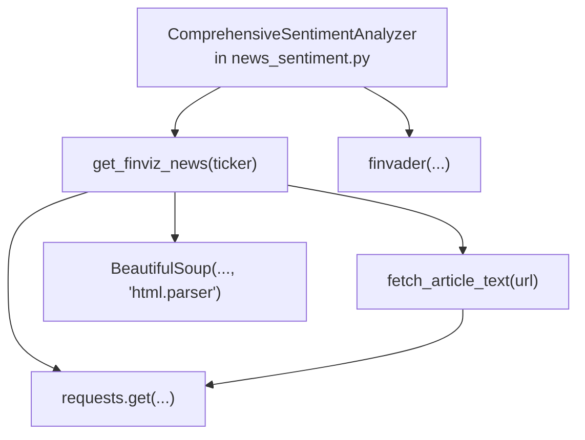
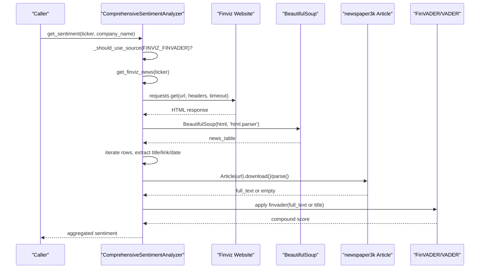
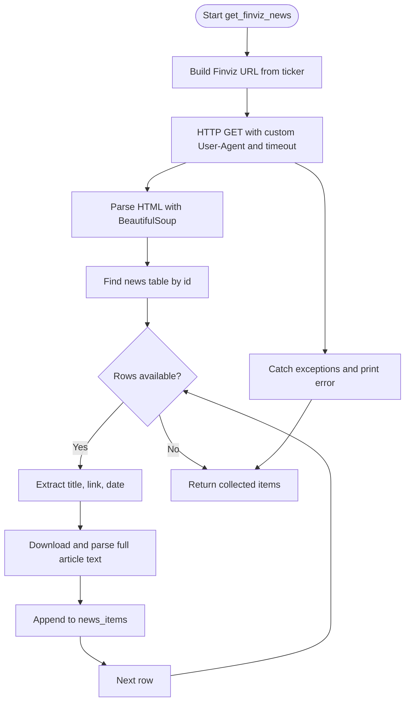
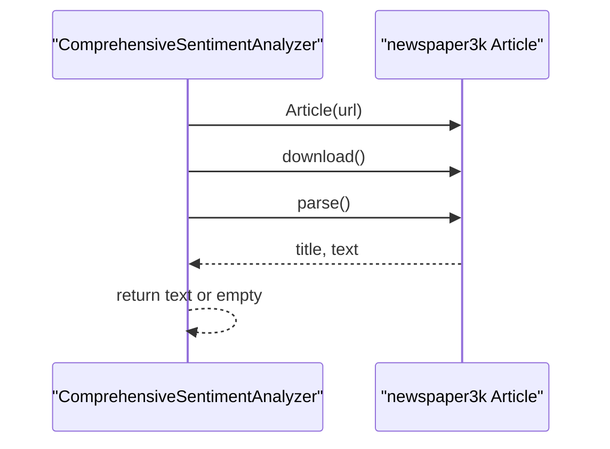
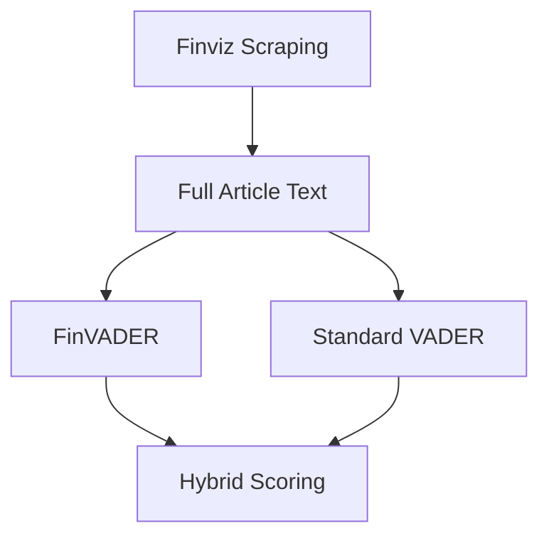
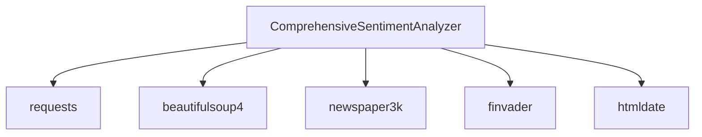

# Finviz Scraping

<cite>
**Referenced Files in This Document**
- [news_sentiment.py](file://news_sentiment.py)
- [README.md](file://README.md)
- [requirements.txt](file://requirements.txt)
- [tests/test_finvader_implementation.py](file://tests/test_finvader_implementation.py)
- [tests/test_sentiment_sources.py](file://tests/test_sentiment_sources.py)
- [demos/advanced_features_demo.py](file://demos/advanced_features_demo.py)
</cite>

## Table of Contents
1. [Introduction](#introduction)
2. [Project Structure](#project-structure)
3. [Core Components](#core-components)
4. [Architecture Overview](#architecture-overview)
5. [Detailed Component Analysis](#detailed-component-analysis)
6. [Dependency Analysis](#dependency-analysis)
7. [Performance Considerations](#performance-considerations)
8. [Troubleshooting Guide](#troubleshooting-guide)
9. [Conclusion](#conclusion)
10. [Appendices](#appendices)

## Introduction
This document explains the Finviz web scraping implementation that serves as the primary news source for fast and reliable financial news headlines. It focuses on the get_finviz_news method, covering URL construction, HTTP request configuration with a custom User-Agent header to avoid blocking, BeautifulSoup parsing of the news table, and extraction of headlines, links, and timestamps. It also documents the integration with full article text extraction using the newspaper3k library, error handling patterns, timeout configuration, and the relationship between Finviz scraping and the FinVADER sentiment analysis system.

## Project Structure
The Finviz scraping feature is implemented within the sentiment analysis module. The relevant implementation resides in the ComprehensiveSentimentAnalyzer class and is orchestrated by convenience functions that expose FinVADER-based sentiment analysis.

**Diagram sources**
- [news_sentiment.py](file://news_sentiment.py#L421-L479)
- [news_sentiment.py](file://news_sentiment.py#L800-L896)

**Section sources**
- [news_sentiment.py](file://news_sentiment.py#L421-L479)
- [news_sentiment.py](file://news_sentiment.py#L800-L896)

## Core Components
- get_finviz_news(ticker): Builds the Finviz quote URL, performs an HTTP GET request with a custom User-Agent header, parses the HTML with BeautifulSoup, extracts headlines and links from the news table, retrieves timestamps, and fetches full article text.
- fetch_article_text(url): Downloads and parses full article content using the newspaper3k library.
- FinVADER integration: The sentiment analysis pipeline applies FinVADER to the extracted text when available, otherwise falls back to standard VADER.

Key implementation references:
- Finviz scraping and article text extraction: [news_sentiment.py](file://news_sentiment.py#L421-L479)
- Full-text extraction with newspaper3k: [news_sentiment.py](file://news_sentiment.py#L469-L479)
- FinVADER application in sentiment pipeline: [news_sentiment.py](file://news_sentiment.py#L800-L896)

**Section sources**
- [news_sentiment.py](file://news_sentiment.py#L421-L479)
- [news_sentiment.py](file://news_sentiment.py#L469-L479)
- [news_sentiment.py](file://news_sentiment.py#L800-L896)

## Architecture Overview
The Finviz scraping workflow is part of a broader sentiment analysis pipeline. The flow below shows how Finviz is invoked as the primary source and how FinVADER is applied to the resulting articles.

**Diagram sources**
- [news_sentiment.py](file://news_sentiment.py#L421-L479)
- [news_sentiment.py](file://news_sentiment.py#L800-L896)

## Detailed Component Analysis

### get_finviz_news Method
- URL Construction: The method constructs the Finviz quote URL using the ticker symbol.
- HTTP Request Configuration: It sends an HTTP GET request with a custom User-Agent header to avoid 403 Forbidden responses.
- Timeout Configuration: The request uses a short timeout to keep the pipeline responsive.
- BeautifulSoup Parsing: It locates the news table by its identifier and iterates rows to extract headline text, link, and timestamp.
- Data Extraction: Headlines, links, and timestamps are captured per row. If a timestamp is not available, it remains unset.
- Full Article Text Extraction: For each article link, it attempts to download and parse the full article text using the newspaper3k library. If unavailable, it falls back to the headline text.
- Error Handling: The method catches exceptions during HTTP requests and parsing, printing a message and continuing.

**Diagram sources**
- [news_sentiment.py](file://news_sentiment.py#L421-L479)

**Section sources**
- [news_sentiment.py](file://news_sentiment.py#L421-L479)

### Full Article Text Extraction with newspaper3k
- Purpose: Retrieve the full article text for richer sentiment analysis.
- Behavior: For each article link, the method initializes an Article object, downloads the content, and parses it to obtain the title and text. If parsing fails, it returns an empty string, and the headline text is used as a fallback.

**Diagram sources**
- [news_sentiment.py](file://news_sentiment.py#L469-L479)

**Section sources**
- [news_sentiment.py](file://news_sentiment.py#L469-L479)

### Relationship Between Finviz Scraping and FinVADER
- Primary Source: Finviz is used as the primary source for fast and reliable headlines.
- FinVADER Integration: The sentiment analysis pipeline applies FinVADER to the full article text when available. If FinVADER is not available, it falls back to standard VADER.
- Hybrid Scoring: The system supports hybrid scoring that combines FinVADER with external API signals for improved accuracy.

**Diagram sources**
- [news_sentiment.py](file://news_sentiment.py#L800-L896)
- [news_sentiment.py](file://news_sentiment.py#L1003-L1027)

**Section sources**
- [news_sentiment.py](file://news_sentiment.py#L800-L896)
- [news_sentiment.py](file://news_sentiment.py#L1003-L1027)

## Dependency Analysis
- External Libraries:
  - requests: HTTP client for fetching Finviz pages.
  - BeautifulSoup: HTML parsing for extracting headlines and links.
  - newspaper3k: Full article text extraction.
  - finvader: Financial sentiment analysis library.
  - htmldate: Optional publish date extraction for RSS fallback.
- Internal Dependencies:
  - ComprehensiveSentimentAnalyzer encapsulates Finviz scraping, article text extraction, and FinVADER application.
  - Convenience functions expose FinVADER-based sentiment analysis for single symbols and batch processing.

**Diagram sources**
- [requirements.txt](file://requirements.txt#L1-L19)
- [news_sentiment.py](file://news_sentiment.py#L1-L70)

**Section sources**
- [requirements.txt](file://requirements.txt#L1-L19)
- [news_sentiment.py](file://news_sentiment.py#L1-L70)

## Performance Considerations
- Short Timeout: The Finviz request uses a short timeout to keep the pipeline responsive. This reduces latency but may drop slow responses.
- Minimal Parsing: The method targets the news table and iterates only the requested number of articles, limiting overhead.
- Full Text Retrieval: Fetching full article text adds latency. Consider batching and caching to reduce repeated downloads.
- FinVADER Availability: When FinVADER is available, it is applied directly; otherwise, standard VADER is used. This avoids unnecessary overhead.
- Batch Processing: The analyzer supports batch processing for multiple symbols, enabling vectorized FinVADER application for higher throughput.

Optimization tips:
- Use a caching layer (e.g., Redis) to cache article texts and sentiment results.
- Implement concurrent fetching for multiple symbols.
- Reduce num_articles for high-frequency scenarios to minimize request overhead.
- Prefer FinVADER when available for financial nuance and performance.

[No sources needed since this section provides general guidance]

## Troubleshooting Guide
Common issues and resolutions:
- Blocked Requests (403 Forbidden):
  - Cause: Missing or incorrect User-Agent header.
  - Resolution: Ensure the custom User-Agent header is included in the request.
  - Reference: [news_sentiment.py](file://news_sentiment.py#L421-L479)
- Parsing Errors:
  - Cause: Site structure changes or missing elements.
  - Resolution: Verify the presence of the news table and adjust selectors if needed. The method already handles missing dates gracefully.
  - Reference: [news_sentiment.py](file://news_sentiment.py#L421-L479)
- Network Issues:
  - Cause: Timeouts or connectivity problems.
  - Resolution: Increase timeout slightly or implement retry logic. The method prints errors and continues.
  - Reference: [news_sentiment.py](file://news_sentiment.py#L421-L479)
- Full Article Text Not Available:
  - Cause: Newspaper3k parsing failure or blocked article pages.
  - Resolution: The method falls back to headline text. Consider caching article content to avoid repeated downloads.
  - Reference: [news_sentiment.py](file://news_sentiment.py#L469-L479)
- FinVADER Not Installed:
  - Cause: finvader library not available.
  - Resolution: The system falls back to standard VADER. Install finvader for enhanced financial sentiment.
  - Reference: [requirements.txt](file://requirements.txt#L1-L19), [news_sentiment.py](file://news_sentiment.py#L800-L896)

**Section sources**
- [news_sentiment.py](file://news_sentiment.py#L421-L479)
- [news_sentiment.py](file://news_sentiment.py#L469-L479)
- [news_sentiment.py](file://news_sentiment.py#L800-L896)
- [requirements.txt](file://requirements.txt#L1-L19)

## Conclusion
The Finviz scraping implementation provides a fast and reliable source of financial news headlines. It uses a custom User-Agent header to avoid blocking, BeautifulSoup to parse the news table, and newspaper3k to enrich sentiment with full article text. The integration with FinVADER delivers financial-domain sentiment analysis, with a robust fallback to standard VADER. Proper error handling, timeouts, and optional caching enable efficient operation in production environments.

[No sources needed since this section summarizes without analyzing specific files]

## Appendices

### API Workflow References
- Finviz scraping method: [news_sentiment.py](file://news_sentiment.py#L421-L479)
- Full article text extraction: [news_sentiment.py](file://news_sentiment.py#L469-L479)
- FinVADER application in pipeline: [news_sentiment.py](file://news_sentiment.py#L800-L896)
- Convenience function for FinVADER-based sentiment: [news_sentiment.py](file://news_sentiment.py#L1192-L1200)
- Tests verifying Finviz scraping and FinVADER availability: [tests/test_finvader_implementation.py](file://tests/test_finvader_implementation.py#L1-L106)
- Tests mocking HTTP requests for Finviz: [tests/test_sentiment_sources.py](file://tests/test_sentiment_sources.py#L25-L52)
- Demo usage of FinVADER with Finviz: [demos/advanced_features_demo.py](file://demos/advanced_features_demo.py#L92-L115)

**Section sources**
- [news_sentiment.py](file://news_sentiment.py#L421-L479)
- [news_sentiment.py](file://news_sentiment.py#L469-L479)
- [news_sentiment.py](file://news_sentiment.py#L800-L896)
- [news_sentiment.py](file://news_sentiment.py#L1192-L1200)
- [tests/test_finvader_implementation.py](file://tests/test_finvader_implementation.py#L1-L106)
- [tests/test_sentiment_sources.py](file://tests/test_sentiment_sources.py#L25-L52)
- [demos/advanced_features_demo.py](file://demos/advanced_features_demo.py#L92-L115)