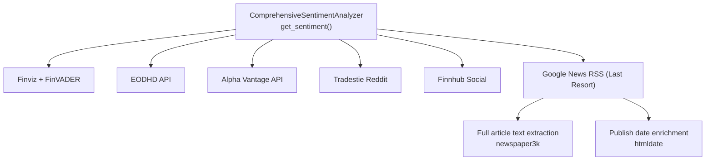
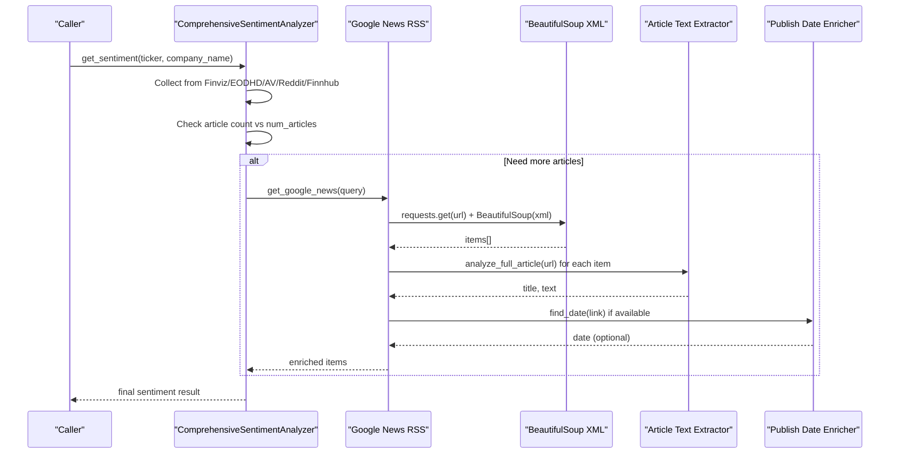
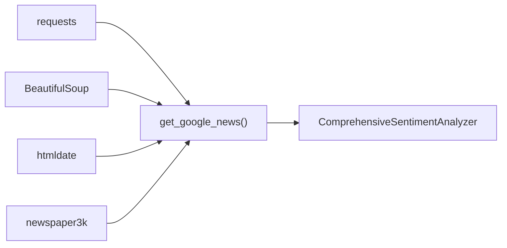

# Google News RSS

<cite>
**Referenced Files in This Document**
- [news_sentiment.py](file://news_sentiment.py)
- [requirements.txt](file://requirements.txt)
- [demos/selectable_sentiment_sources_demo.py](file://demos/selectable_sentiment_sources_demo.py)
- [tests/all_sources_integration_test.py](file://tests/all_sources_integration_test.py)
- [tests/comprehensive_source_test.py](file://tests/comprehensive_source_test.py)
- [docs/ALL_SOURCES_VERIFIED.md](file://docs/ALL_SOURCES_VERIFIED.md)
</cite>

## Table of Contents
1. [Introduction](#introduction)
2. [Project Structure](#project-structure)
3. [Core Components](#core-components)
4. [Architecture Overview](#architecture-overview)
5. [Detailed Component Analysis](#detailed-component-analysis)
6. [Dependency Analysis](#dependency-analysis)
7. [Performance Considerations](#performance-considerations)
8. [Troubleshooting Guide](#troubleshooting-guide)
9. [Conclusion](#conclusion)

## Introduction
This document explains the Google News RSS integration as the last-resort sentiment source in the sentiment analysis pipeline. It covers how the RSS feed URL is constructed dynamically, how XML is parsed with BeautifulSoup, how items are extracted, and how the system enriches content with publish dates when available. It also documents the fallback hierarchy, integration with the article text extraction system, reliability considerations, troubleshooting guidance, and performance tips.

## Project Structure
The Google News RSS integration lives within the sentiment analysis module and participates in the broader fallback chain. The relevant files are:
- news_sentiment.py: Contains the RSS fetching and parsing logic, the fallback chain, and convenience functions for single-source usage.
- requirements.txt: Declares the htmldate dependency used for publish date extraction.
- demos/selectable_sentiment_sources_demo.py: Demonstrates using Google News RSS as a single source.
- tests/all_sources_integration_test.py and tests/comprehensive_source_test.py: Verify the RSS fallback behavior and end-to-end pipeline.
- docs/ALL_SOURCES_VERIFIED.md: Confirms the RSS fallback is verified as part of the overall pipeline.

**Diagram sources**
- [news_sentiment.py](file://news_sentiment.py#L737-L800)
- [news_sentiment.py](file://news_sentiment.py#L393-L420)
- [news_sentiment.py](file://news_sentiment.py#L380-L393)
- [requirements.txt](file://requirements.txt#L1-L19)

**Section sources**
- [news_sentiment.py](file://news_sentiment.py#L393-L420)
- [news_sentiment.py](file://news_sentiment.py#L737-L800)
- [requirements.txt](file://requirements.txt#L1-L19)

## Core Components
- RSS fetcher: Builds the Google News RSS URL with a dynamic query parameter and retrieves the XML.
- XML parser: Uses BeautifulSoup with the XML parser to extract items.
- Item extractor: Iterates over items, extracting title, link, and optionally publish date.
- Data enrichment: Attempts to enrich publish dates using htmldate when available.
- Fallback integration: The RSS source is invoked only when the requested number of articles is not met by earlier sources.

Key implementation references:
- RSS URL construction and parsing: [news_sentiment.py](file://news_sentiment.py#L393-L420)
- Fallback invocation: [news_sentiment.py](file://news_sentiment.py#L778-L799)
- Full-text extraction integration: [news_sentiment.py](file://news_sentiment.py#L380-L393)

**Section sources**
- [news_sentiment.py](file://news_sentiment.py#L393-L420)
- [news_sentiment.py](file://news_sentiment.py#L778-L799)
- [news_sentiment.py](file://news_sentiment.py#L380-L393)

## Architecture Overview
The Google News RSS is the final fallback in the sentiment pipeline. The analyzer checks whether enough articles were collected from higher-priority sources; if not, it invokes the RSS fetcher to collect additional articles, then enriches them with full-text content and publish dates.

**Diagram sources**
- [news_sentiment.py](file://news_sentiment.py#L737-L800)
- [news_sentiment.py](file://news_sentiment.py#L393-L420)
- [news_sentiment.py](file://news_sentiment.py#L380-L393)

## Detailed Component Analysis

### RSS Feed URL Construction and Request Pattern
- Dynamic query parameter: The RSS URL is constructed using a query derived from either the company name or the ticker symbol.
- Query composition: The query is appended with a stock suffix to bias results toward stock-related coverage.
- Regionalization: The URL includes locale and country parameters to target US English results.
- Request headers: A standard User-Agent header is used to reduce blocking risk.
- Timeout: A short timeout is configured to keep the pipeline responsive.

References:
- URL construction and request: [news_sentiment.py](file://news_sentiment.py#L393-L400)
- Query derivation in fallback chain: [news_sentiment.py](file://news_sentiment.py#L778-L784)

**Section sources**
- [news_sentiment.py](file://news_sentiment.py#L393-L400)
- [news_sentiment.py](file://news_sentiment.py#L778-L784)

### XML Parsing with BeautifulSoup
- Parser choice: The RSS XML is parsed using the XML parser in BeautifulSoup.
- Item discovery: The code locates all item nodes and limits the number of items to the configured article cap.
- Field extraction: For each item, the title, link, and optionally publish date are captured.

References:
- XML parsing and item extraction: [news_sentiment.py](file://news_sentiment.py#L399-L419)

**Section sources**
- [news_sentiment.py](file://news_sentiment.py#L399-L419)

### Data Enrichment with Publish Dates
- Optional enrichment: When the htmldate library is available, the system attempts to extract the publish date from the article link.
- Availability guard: The code checks for the presence of the htmldate library before attempting enrichment.
- Graceful fallback: If enrichment fails, the item proceeds without a publish date.

References:
- htmldate availability and usage: [news_sentiment.py](file://news_sentiment.py#L59-L66), [news_sentiment.py](file://news_sentiment.py#L403-L410)

**Section sources**
- [news_sentiment.py](file://news_sentiment.py#L59-L66)
- [news_sentiment.py](file://news_sentiment.py#L403-L410)

### Integration with Article Text Extraction
- Full-text retrieval: For each RSS item, the system attempts to download and parse the full article text using the article text extraction utility.
- Fallback behavior: If full-text extraction fails, the system falls back to using the RSS item’s title as the text.
- Metadata propagation: The extracted title and text are attached to the item before adding it to the final collection.

References:
- Full-text extraction and fallback: [news_sentiment.py](file://news_sentiment.py#L380-L393), [news_sentiment.py](file://news_sentiment.py#L789-L798)

**Section sources**
- [news_sentiment.py](file://news_sentiment.py#L380-L393)
- [news_sentiment.py](file://news_sentiment.py#L789-L798)

### Fallback Hierarchy Role
- Priority order: The analyzer tries Finviz, then EODHD API, then Alpha Vantage, then Reddit, then Finnhub, and finally Google News RSS as a last resort.
- Trigger condition: Google News RSS is invoked only when the number of collected articles is less than the requested cap.
- Query selection: The query used for RSS is derived from the company name or ticker, mirroring the behavior of other sources.

References:
- Fallback chain and trigger: [news_sentiment.py](file://news_sentiment.py#L737-L800), [news_sentiment.py](file://news_sentiment.py#L778-L784)

**Section sources**
- [news_sentiment.py](file://news_sentiment.py#L737-L800)
- [news_sentiment.py](file://news_sentiment.py#L778-L784)

### Single-Source Usage Example
- Convenience function: There is a dedicated function to run sentiment analysis using only Google News RSS.
- Demo usage: The demo script shows how to call this function and interpret results.

References:
- Single-source function: [news_sentiment.py](file://news_sentiment.py#L1234-L1241)
- Demo usage: [demos/selectable_sentiment_sources_demo.py](file://demos/selectable_sentiment_sources_demo.py#L52-L65)

**Section sources**
- [news_sentiment.py](file://news_sentiment.py#L1234-L1241)
- [demos/selectable_sentiment_sources_demo.py](file://demos/selectable_sentiment_sources_demo.py#L52-L65)

## Dependency Analysis
- External libraries:
  - requests: Used to fetch the RSS XML.
  - BeautifulSoup: Used to parse the XML and extract items.
  - htmldate: Optional dependency for publish date extraction.
  - newspaper3k: Used to download and parse full article text.
- Internal dependencies:
  - The analyzer composes the RSS items into the unified article list and applies the same sentiment analysis logic as other sources.

**Diagram sources**
- [news_sentiment.py](file://news_sentiment.py#L393-L420)
- [news_sentiment.py](file://news_sentiment.py#L380-L393)
- [requirements.txt](file://requirements.txt#L1-L19)

**Section sources**
- [news_sentiment.py](file://news_sentiment.py#L393-L420)
- [news_sentiment.py](file://news_sentiment.py#L380-L393)
- [requirements.txt](file://requirements.txt#L1-L19)

## Performance Considerations
- RSS parsing cost: RSS parsing is lightweight and fast, suitable for fallback use.
- Network latency: The RSS request uses a short timeout to keep the pipeline responsive; adjust timeouts carefully to avoid blocking the overall sentiment computation.
- Content quality: RSS items often lack full-text content; the system compensates by downloading and parsing full articles, which adds overhead but improves sentiment accuracy.
- Rate limiting: The RSS endpoint is generally permissive, but repeated polling should still respect reasonable intervals to avoid potential throttling.
- Parallelism: The analyzer’s fallback chain is synchronous; if you need to parallelize RSS fetching across multiple tickers, consider external orchestration.

[No sources needed since this section provides general guidance]

## Troubleshooting Guide
Common issues and remedies:
- RSS feed unavailability or malformed XML:
  - Symptom: Parsing errors or empty results.
  - Action: Verify the RSS URL and query parameters; ensure the environment has access to the internet and that the RSS endpoint is reachable.
  - Reference: RSS request and parsing: [news_sentiment.py](file://news_sentiment.py#L393-L419)
- Network timeouts:
  - Symptom: Exceptions during requests.get.
  - Action: Increase timeout slightly or retry with backoff; consider proxy or regional settings if applicable.
  - Reference: RSS request with timeout: [news_sentiment.py](file://news_sentiment.py#L393-L400)
- Missing content or short titles:
  - Symptom: Items without full-text content.
  - Action: The system falls back to using the RSS title; if you require full-text, ensure the article extraction succeeds or consider increasing num_articles to capture more diverse sources.
  - References: Fallback behavior and full-text extraction: [news_sentiment.py](file://news_sentiment.py#L380-L393), [news_sentiment.py](file://news_sentiment.py#L789-L798)
- Publish date enrichment failures:
  - Symptom: Missing publish dates.
  - Action: Confirm htmldate is installed; if not available, the system gracefully continues without dates.
  - Reference: htmldate availability and usage: [news_sentiment.py](file://news_sentiment.py#L59-L66), [news_sentiment.py](file://news_sentiment.py#L403-L410)
- RSS not triggering:
  - Symptom: Not seeing RSS items in the final result.
  - Action: Ensure the requested article count is high enough to exceed earlier sources; verify that Google News is included in selected sources.
  - References: Fallback chain and trigger: [news_sentiment.py](file://news_sentiment.py#L737-L800), [news_sentiment.py](file://news_sentiment.py#L778-L784)

**Section sources**
- [news_sentiment.py](file://news_sentiment.py#L393-L419)
- [news_sentiment.py](file://news_sentiment.py#L380-L393)
- [news_sentiment.py](file://news_sentiment.py#L789-L798)
- [news_sentiment.py](file://news_sentiment.py#L59-L66)
- [news_sentiment.py](file://news_sentiment.py#L737-L800)
- [news_sentiment.py](file://news_sentiment.py#L778-L784)

## Conclusion
The Google News RSS integration serves as a robust last-resort source that expands coverage when higher-priority sources are insufficient. It constructs a targeted RSS URL, parses XML efficiently, extracts items, enriches publish dates when available, and integrates seamlessly with the article text extraction system. The fallback hierarchy ensures continuity of sentiment analysis even under adverse conditions, while tests and demonstrations confirm its practical effectiveness.

[No sources needed since this section summarizes without analyzing specific files]