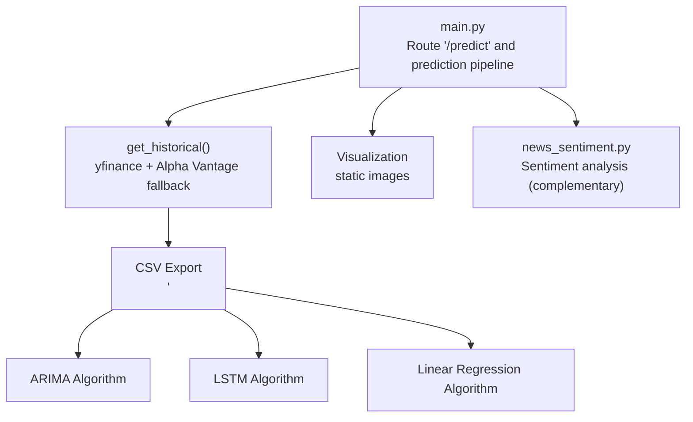
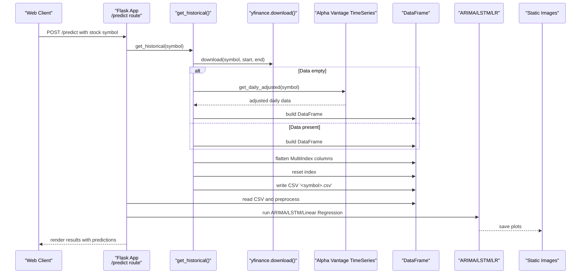
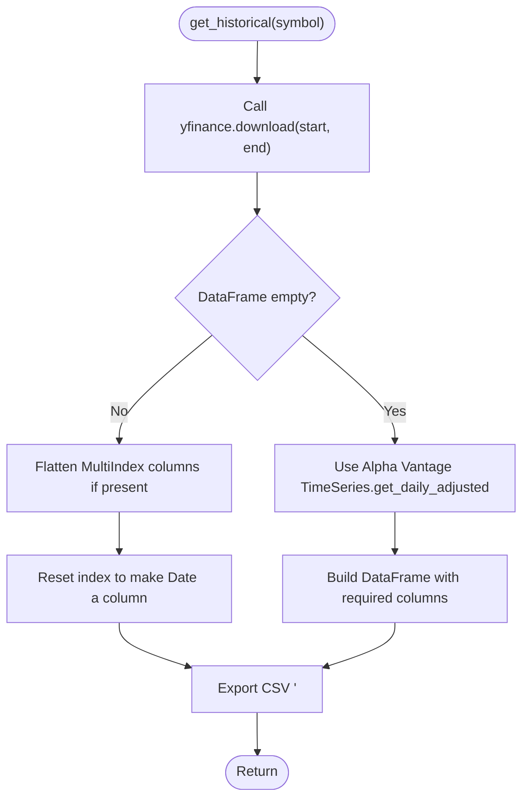
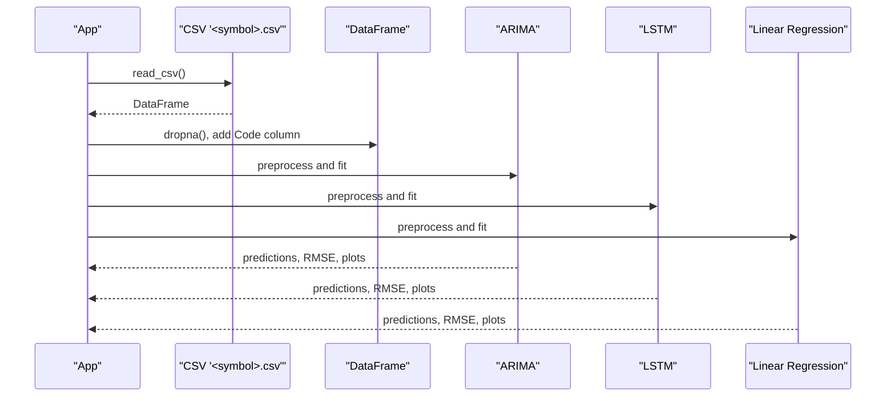
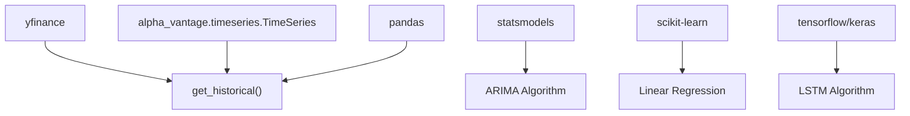

# yfinance Integration

<cite>
**Referenced Files in This Document**
- [main.py](file://main.py)
- [news_sentiment.py](file://news_sentiment.py)
- [requirements.txt](file://requirements.txt)
- [tests/test_e2e_api_perf_security_deployment.py](file://tests/test_e2e_api_perf_security_deployment.py)
- [tests/test_prediction_pipeline.py](file://tests/test_prediction_pipeline.py)
</cite>

## Table of Contents
1. [Introduction](#introduction)
2. [Project Structure](#project-structure)
3. [Core Components](#core-components)
4. [Architecture Overview](#architecture-overview)
5. [Detailed Component Analysis](#detailed-component-analysis)
6. [Dependency Analysis](#dependency-analysis)
7. [Performance Considerations](#performance-considerations)
8. [Troubleshooting Guide](#troubleshooting-guide)
9. [Conclusion](#conclusion)

## Introduction
This section documents how the intelligent-stock-prediction system integrates yfinance to retrieve historical stock price data, including the parameters and date ranges used, the implementation of the get_historical function, error handling for empty data, and the Alpha Vantage fallback. It also explains the data transformation process, including handling of MultiIndex columns and CSV export, and demonstrates how yfinance data is integrated into the prediction pipeline for ARIMA, LSTM, and Linear Regression models. Finally, it covers the relationship between yfinance data and other components such as the prediction engine and visualization, along with common issues, troubleshooting guidance, and performance considerations.

## Project Structure
The yfinance integration is primarily implemented in the main application module and is complemented by sentiment analysis utilities and tests that validate API behavior and error handling.

**Diagram sources**
- [main.py](file://main.py#L545-L980)
- [news_sentiment.py](file://news_sentiment.py#L1-L200)

**Section sources**
- [main.py](file://main.py#L545-L980)
- [requirements.txt](file://requirements.txt#L1-L19)

## Core Components
- Data retrieval function: get_historical retrieves two-year historical data using yfinance and flattens MultiIndex columns.
- Fallback mechanism: When yfinance returns empty data, the system falls back to Alpha Vantage’s TimeSeries API and exports a compatible CSV.
- Data transformation: The function resets the index, ensures a flat column structure, and writes a CSV file for downstream consumption.
- Prediction pipeline: The CSV is read and transformed into a DataFrame with a Code column, then passed to ARIMA, LSTM, and Linear Regression algorithms.
- Visualization: Model outputs are plotted and saved as static images for display.

Key implementation references:
- get_historical function and fallback: [main.py](file://main.py#L549-L581)
- CSV export and preprocessing: [main.py](file://main.py#L910-L940)
- ARIMA preprocessing and plotting: [main.py](file://main.py#L584-L641)
- LSTM preprocessing and plotting: [main.py](file://main.py#L646-L779)
- Linear Regression preprocessing and plotting: [main.py](file://main.py#L780-L845)

**Section sources**
- [main.py](file://main.py#L549-L980)

## Architecture Overview
The yfinance integration sits at the front of the prediction pipeline. It supplies historical OHLCV data that is transformed and consumed by multiple forecasting models. The Alpha Vantage fallback ensures continuity when yfinance fails or returns empty data.

**Diagram sources**
- [main.py](file://main.py#L545-L980)

## Detailed Component Analysis

### get_historical: Data Retrieval and Transformation
- Parameters and date range:
  - Retrieves two years of daily historical data using yfinance.download with start and end dates computed from the current date.
  - Reference: [main.py](file://main.py#L550-L553)
- MultiIndex handling:
  - If the DataFrame has MultiIndex columns (a recent change in yfinance), the function flattens the columns to a single level.
  - Reference: [main.py](file://main.py#L555-L558)
- Index normalization:
  - Resets the index so that Date becomes a regular column.
  - Reference: [main.py](file://main.py#L559-L560)
- CSV export:
  - Writes the DataFrame to a CSV file named after the stock symbol.
  - Reference: [main.py](file://main.py#L562-L563)
- Empty data handling and Alpha Vantage fallback:
  - If the DataFrame is empty, the function switches to Alpha Vantage’s TimeSeries.get_daily_adjusted to fetch adjusted daily data, restructures it into required columns, and writes a CSV.
  - Reference: [main.py](file://main.py#L564-L581)

**Diagram sources**
- [main.py](file://main.py#L549-L581)

**Section sources**
- [main.py](file://main.py#L549-L581)

### CSV Preprocessing and Pipeline Integration
- CSV creation:
  - After get_historical, the system reads the CSV and performs preprocessing steps before feeding models.
  - Reference: [main.py](file://main.py#L910-L940)
- DataFrame construction:
  - Drops NA values, adds a Code column with the stock symbol, concatenates with the original DataFrame, and passes the result to models.
  - Reference: [main.py](file://main.py#L920-L933)
- Model integration:
  - ARIMA: Converts Close to Price, sets Date as index, splits into train/test, fits ARIMA, computes RMSE, and saves plots.
    - Reference: [main.py](file://main.py#L584-L641)
  - LSTM: Scales Close prices, constructs sequences with 7-day windows, trains an LSTM model, forecasts, computes RMSE, and saves plots.
    - Reference: [main.py](file://main.py#L646-L779)
  - Linear Regression: Creates a target variable shifted forward by 7 days, splits into train/test, scales features, fits Linear Regression, forecasts, computes RMSE, and saves plots.
    - Reference: [main.py](file://main.py#L780-L845)

**Diagram sources**
- [main.py](file://main.py#L910-L980)

**Section sources**
- [main.py](file://main.py#L910-L980)

### Relationship Between yfinance Data and Other Components
- Prediction engine:
  - The DataFrame produced from CSV is the backbone for all models. Each model expects a time series-like structure with a Date index and a Price column (derived from Close).
  - References:
    - ARIMA preprocessing: [main.py](file://main.py#L584-L641)
    - LSTM preprocessing: [main.py](file://main.py#L646-L779)
    - Linear Regression preprocessing: [main.py](file://main.py#L780-L845)
- Data visualization:
  - Plots are generated and saved under static images for ARIMA, LSTM, and Linear Regression, enabling frontend rendering.
  - References:
    - ARIMA plots: [main.py](file://main.py#L611-L633)
    - LSTM plots: [main.py](file://main.py#L754-L761)
    - Linear Regression plots: [main.py](file://main.py#L823-L831)

**Section sources**
- [main.py](file://main.py#L584-L845)

## Dependency Analysis
- External libraries:
  - yfinance is used for historical data retrieval.
  - Alpha Vantage is used as a fallback for adjusted daily data.
  - pandas is used for DataFrame manipulation and CSV export.
  - statsmodels, scikit-learn, and TensorFlow/Keras are used for modeling.
  - References:
    - Dependencies: [requirements.txt](file://requirements.txt#L1-L19)
    - Alpha Vantage import and usage: [main.py](file://main.py#L9-L11)
    - yfinance import and usage: [main.py](file://main.py#L18-L20)

**Diagram sources**
- [main.py](file://main.py#L9-L20)
- [requirements.txt](file://requirements.txt#L1-L19)

**Section sources**
- [main.py](file://main.py#L9-L20)
- [requirements.txt](file://requirements.txt#L1-L19)

## Performance Considerations
- Data size and memory:
  - Two years of daily data can be substantial. Ensure efficient DataFrame operations and avoid unnecessary copies.
  - Consider limiting the number of stocks processed in batch scenarios.
- Model training overhead:
  - LSTM training is computationally intensive. Tune epochs and batch size appropriately.
  - Use GPU acceleration if available.
- I/O operations:
  - CSV export and read operations should be minimized. If multiple models require the same data, reuse the DataFrame in memory.
- Network reliability:
  - Implement retries and timeouts for external APIs to mitigate transient failures.
- Caching:
  - For frequent requests, consider caching recent data to reduce repeated downloads.

[No sources needed since this section provides general guidance]

## Troubleshooting Guide

### API Rate Limits
- Symptom: Requests fail intermittently or return throttled responses.
- Mitigation:
  - Reduce request frequency.
  - Implement exponential backoff with jitter.
  - Cache results locally for short periods.
  - Consider upgrading to a premium plan if rate limits are strict.

[No sources needed since this section provides general guidance]

### Data Formatting Changes
- Symptom: Column names differ or MultiIndex appears unexpectedly.
- Resolution:
  - Use the flattening logic to convert MultiIndex columns to single-level.
  - Reset the index to ensure Date is a column.
  - Verify required columns (Open, High, Low, Close, Adj Close, Volume) exist before passing to models.
  - References:
    - MultiIndex flattening: [main.py](file://main.py#L555-L558)
    - Index reset: [main.py](file://main.py#L559-L560)

**Section sources**
- [main.py](file://main.py#L555-L560)

### Network Timeouts and Failures
- Symptom: yfinance.download raises exceptions or returns empty DataFrames.
- Resolution:
  - Wrap the call in a try-except block and trigger the Alpha Vantage fallback.
  - Validate symbol correctness and exchange availability.
  - Retry with backoff and consider alternate sources.
  - References:
    - get_historical fallback: [main.py](file://main.py#L564-L581)
    - Test coverage for fallback: [tests/test_e2e_api_perf_security_deployment.py](file://tests/test_e2e_api_perf_security_deployment.py#L18-L41)
    - Test coverage for graceful error handling: [tests/test_prediction_pipeline.py](file://tests/test_prediction_pipeline.py#L152-L177)

**Section sources**
- [main.py](file://main.py#L564-L581)
- [tests/test_e2e_api_perf_security_deployment.py](file://tests/test_e2e_api_perf_security_deployment.py#L18-L41)
- [tests/test_prediction_pipeline.py](file://tests/test_prediction_pipeline.py#L152-L177)

### Empty Data Scenarios
- Symptom: CSV is empty or missing.
- Resolution:
  - Ensure get_historical runs successfully and writes the CSV.
  - Confirm Alpha Vantage fallback is triggered when yfinance fails.
  - Validate that the CSV is readable and contains required columns.
  - References:
    - CSV creation and fallback: [main.py](file://main.py#L562-L581)
    - CSV read and preprocessing: [main.py](file://main.py#L910-L940)

**Section sources**
- [main.py](file://main.py#L562-L581)
- [main.py](file://main.py#L910-L940)

## Conclusion
The yfinance integration in the intelligent-stock-prediction system is designed to be resilient and adaptable. It retrieves two-year daily historical data, normalizes column structures, and persists the data to CSV for downstream consumption. When yfinance fails or returns empty data, the system seamlessly falls back to Alpha Vantage. The resulting DataFrame is then transformed and fed into ARIMA, LSTM, and Linear Regression models, with visualizations saved for display. Robust error handling, fallback mechanisms, and preprocessing steps ensure the pipeline remains functional under varying conditions. For production deployments, consider adding caching, retry strategies, and performance tuning to optimize throughput and reliability.