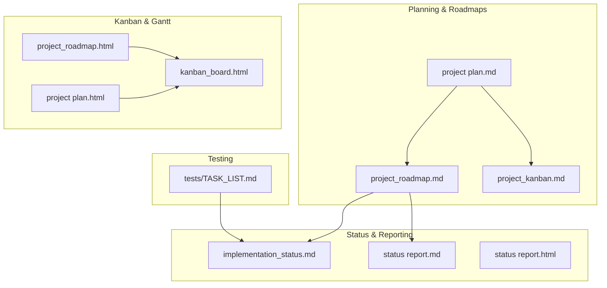
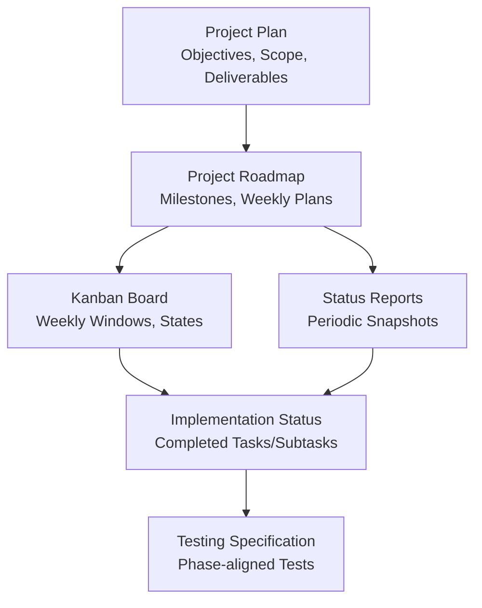
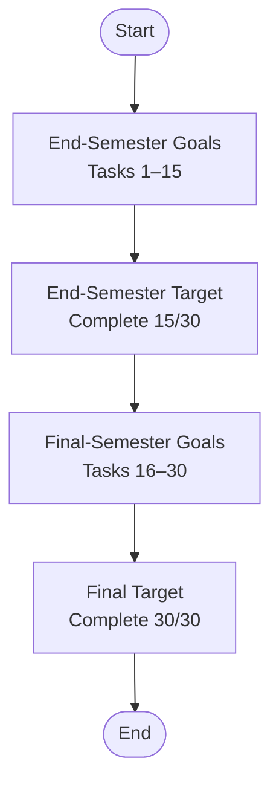
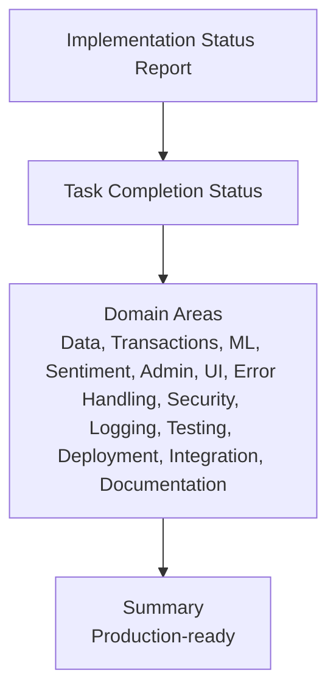
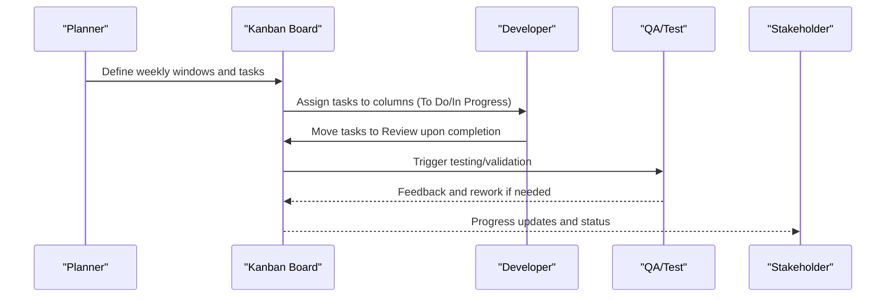
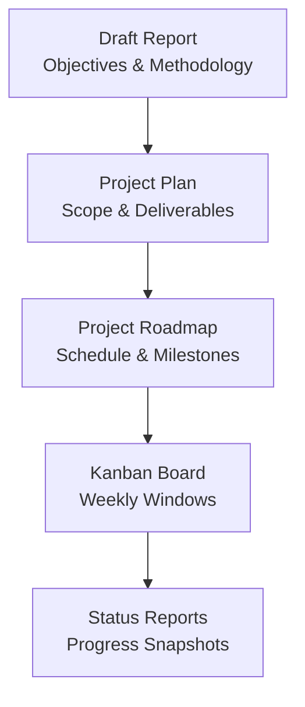
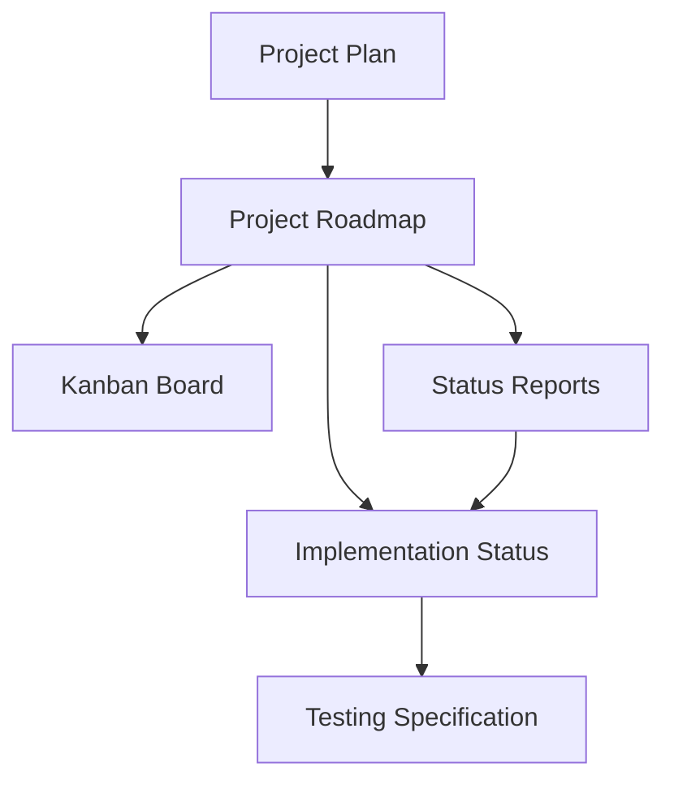

# Project Management & Status

<cite>
**Referenced Files in This Document**
- [project_roadmap.md](file://status_reports/project_roadmap.md)
- [implementation_status.md](file://status_reports/implementation_status.md)
- [project plan.md](file://status_reports/project plan.md)
- [project_kanban.md](file://status_reports/project_kanban.md)
- [status report.md](file://status_reports/status report.md)
- [project_roadmap.html](file://status_reports/project_roadmap.html)
- [project plan.html](file://status_reports/project plan.html)
- [kanban_board.html](file://status_reports/kanban_board.html)
- [status report.html](file://status_reports/status report.html)
- [TASK_LIST.md](file://tests/TASK_LIST.md)
- [draft-report.md](file://draft-report.md)
</cite>

## Table of Contents
1. [Introduction](#introduction)
2. [Project Structure](#project-structure)
3. [Core Components](#core-components)
4. [Architecture Overview](#architecture-overview)
5. [Detailed Component Analysis](#detailed-component-analysis)
6. [Dependency Analysis](#dependency-analysis)
7. [Performance Considerations](#performance-considerations)
8. [Troubleshooting Guide](#troubleshooting-guide)
9. [Conclusion](#conclusion)
10. [Appendices](#appendices)

## Introduction
This section consolidates the project’s management artifacts and development status to provide a clear, actionable view of progress, priorities, and next steps. It synthesizes the roadmap, implementation status, kanban workflow, and testing plan to help contributors interpret current focus areas, upcoming features, and deprecations, and to understand how status reports inform development decisions and stakeholder communication.

## Project Structure
The project maintains a set of dedicated status and planning documents that capture:
- Roadmap: high-level goals, milestones, and weekly plans
- Implementation status: detailed completion of tasks and subtasks
- Project plan: objectives, scope, deliverables, and Gantt-derived schedule
- Kanban board: weekly workflow visualization and task states
- Status reports: periodic progress snapshots and near-term focus
- Testing specification: comprehensive task list aligned with implementation phases

**Diagram sources**
- [project plan.md](file://status_reports/project plan.md#L1-L126)
- [project_roadmap.md](file://status_reports/project_roadmap.md#L1-L78)
- [project_kanban.md](file://status_reports/project_kanban.md#L1-L96)
- [implementation_status.md](file://status_reports/implementation_status.md#L1-L521)
- [status report.md](file://status_reports/status report.md#L1-L72)
- [kanban_board.html](file://status_reports/kanban_board.html#L1-L472)
- [project_roadmap.html](file://status_reports/project_roadmap.html#L1-L325)
- [project plan.html](file://status_reports/project plan.html#L1-L481)
- [TASK_LIST.md](file://tests/TASK_LIST.md#L1-L466)

**Section sources**
- [project plan.md](file://status_reports/project plan.md#L1-L126)
- [project_roadmap.md](file://status_reports/project_roadmap.md#L1-L78)
- [project_kanban.md](file://status_reports/project_kanban.md#L1-L96)
- [implementation_status.md](file://status_reports/implementation_status.md#L1-L521)
- [status report.md](file://status_reports/status report.md#L1-L72)
- [kanban_board.html](file://status_reports/kanban_board.html#L1-L472)
- [project_roadmap.html](file://status_reports/project_roadmap.html#L1-L325)
- [project plan.html](file://status_reports/project plan.html#L1-L481)
- [TASK_LIST.md](file://tests/TASK_LIST.md#L1-L466)

## Core Components
- Roadmap and milestones: define end-of-semester and final-year targets, with weekly progression windows for feature groups.
- Implementation status: validates that core platform tasks are complete and outlines completed subtasks across domains (data, transactions, ML, sentiment, admin, UI, error handling, security, logging, testing, deployment).
- Kanban board: visualizes weekly task windows, current states (To Do, In Progress, Review, Done), and progress bars.
- Status reports: provide periodic snapshots of task completion and near-term focus areas.
- Testing specification: maps testing tasks to implementation phases and ensures comprehensive coverage across models, routes, and workflows.

**Section sources**
- [project_roadmap.md](file://status_reports/project_roadmap.md#L1-L78)
- [implementation_status.md](file://status_reports/implementation_status.md#L1-L521)
- [project_kanban.md](file://status_reports/project_kanban.md#L1-L96)
- [status report.md](file://status_reports/status report.md#L1-L72)
- [TASK_LIST.md](file://tests/TASK_LIST.md#L1-L466)

## Architecture Overview
The project management architecture aligns planning, execution, and validation:
- Planning documents (project plan, roadmap) define scope, objectives, and schedule.
- Kanban captures weekly windows and task states.
- Implementation status consolidates completed work and subtasks.
- Status reports reflect current progress and next focus.
- Testing specification ties test coverage to implementation phases.

**Diagram sources**
- [project plan.md](file://status_reports/project plan.md#L1-L126)
- [project_roadmap.md](file://status_reports/project_roadmap.md#L1-L78)
- [project_kanban.md](file://status_reports/project_kanban.md#L1-L96)
- [implementation_status.md](file://status_reports/implementation_status.md#L1-L521)
- [status report.md](file://status_reports/status report.md#L1-L72)
- [TASK_LIST.md](file://tests/TASK_LIST.md#L1-L466)

## Detailed Component Analysis

### Roadmap and Milestones
- End-semester goals (Tasks 1–15): six tasks completed, nine remaining; target to finish by end-semester.
- Final-semester goals (Tasks 16–30): comprehensive testing, performance/security testing, usability/accessibility, compatibility, regression/recovery, acceptance, automation, and documentation.
- Weekly progress plan: structured windows for sentiment, dividend, admin; user dashboard and visualization; security hardening; logging/testing/deployment; integration/docs/performance; security/usability/compatibility; accessibility/regression/recovery; acceptance/automation/documentation.

**Diagram sources**
- [project_roadmap.md](file://status_reports/project_roadmap.md#L1-L78)

**Section sources**
- [project_roadmap.md](file://status_reports/project_roadmap.md#L1-L78)

### Implementation Status Tracking and Metrics
- Executive summary confirms all core tasks are completed and the system is production-ready.
- Metrics include task completion status across domains (data, transactions, ML, sentiment, admin, UI, error handling, security, logging, testing, deployment, integration, documentation).
- Progress tracking shows current status (tasks completed/in-progress/remaining) and milestone targets.

**Diagram sources**
- [implementation_status.md](file://status_reports/implementation_status.md#L1-L521)

**Section sources**
- [implementation_status.md](file://status_reports/implementation_status.md#L1-L521)

### Kanban Board Workflow and Task Management
- Weekly windows: Core Features (W6–7), User Interface (W8–9), Security & Testing (W10–11), Final Review (W12–15).
- Columns: To Do (high priority), In Progress (medium), Review (medium), Done (completed).
- Progress overview: completed, in-progress, remaining, and current week metrics.
- Recent activity highlights updates and completed tasks.

**Diagram sources**
- [project_kanban.md](file://status_reports/project_kanban.md#L1-L96)
- [kanban_board.html](file://status_reports/kanban_board.html#L1-L472)

**Section sources**
- [project_kanban.md](file://status_reports/project_kanban.md#L1-L96)
- [kanban_board.html](file://status_reports/kanban_board.html#L1-L472)

### Historical Context and Evolution of Priorities
- Project plan documents the objectives, scope, deliverables, and Gantt-derived schedule.
- Draft report contextualizes the project’s goals, methodologies, and evolution from requirements to implementation.
- The roadmap reflects adjustments to weekly windows and task grouping over time.

**Diagram sources**
- [draft-report.md](file://draft-report.md#L1-L334)
- [project plan.md](file://status_reports/project plan.md#L1-L126)
- [project_roadmap.md](file://status_reports/project_roadmap.md#L1-L78)
- [project_kanban.md](file://status_reports/project_kanban.md#L1-L96)
- [status report.md](file://status_reports/status report.md#L1-L72)

**Section sources**
- [draft-report.md](file://draft-report.md#L1-L334)
- [project plan.md](file://status_reports/project plan.md#L1-L126)
- [project_roadmap.md](file://status_reports/project_roadmap.md#L1-L78)
- [project_kanban.md](file://status_reports/project_kanban.md#L1-L96)
- [status report.md](file://status_reports/status report.md#L1-L72)

### How Status Reports Inform Decisions and Communication
- Periodic status reports consolidate progress, highlight next focus areas, and communicate cadence to stakeholders.
- Implementation status reports validate completion and readiness for production.
- Kanban boards visually communicate current state and upcoming windows to contributors and stakeholders.

**Section sources**
- [status report.md](file://status_reports/status report.md#L1-L72)
- [implementation_status.md](file://status_reports/implementation_status.md#L1-L521)
- [project_kanban.md](file://status_reports/project_kanban.md#L1-L96)

### Guidance for New Contributors
- Interpret roadmap milestones and weekly plans to understand current focus and upcoming features.
- Use implementation status to locate completed subtasks and verify readiness of components.
- Follow kanban columns and weekly windows to align contributions with current priorities.
- Align testing efforts with the comprehensive task list to ensure coverage across models, routes, and workflows.

**Section sources**
- [project_roadmap.md](file://status_reports/project_roadmap.md#L1-L78)
- [implementation_status.md](file://status_reports/implementation_status.md#L1-L521)
- [project_kanban.md](file://status_reports/project_kanban.md#L1-L96)
- [TASK_LIST.md](file://tests/TASK_LIST.md#L1-L466)

### Current Focus Areas, Upcoming Features, and Deprecations
- Current focus areas (as reflected in recent status and roadmap):
  - End-semester completion of core features (sentiment, dividend, admin).
  - User dashboard core and portfolio visualization.
  - Security hardening and production deployment.
  - Test infrastructure setup and core unit tests.
- Upcoming features (planned in roadmap and kanban):
  - User dashboard core interface and portfolio visualization.
  - Production security and deployment hardening.
  - Test infrastructure and core unit tests.
- Deprecations:
  - No explicit deprecations are documented in the referenced artifacts; contributors should rely on roadmap updates and implementation status for current feature validity.

**Section sources**
- [project_roadmap.md](file://status_reports/project_roadmap.md#L1-L78)
- [project_kanban.md](file://status_reports/project_kanban.md#L1-L96)
- [implementation_status.md](file://status_reports/implementation_status.md#L1-L521)

## Dependency Analysis
The status and planning artifacts depend on each other to maintain alignment:
- Project plan informs roadmap and kanban windows.
- Roadmap drives implementation status and testing specification.
- Kanban visualizes progress and communicates to stakeholders.
- Status reports aggregate and present progress to contributors and stakeholders.

**Diagram sources**
- [project plan.md](file://status_reports/project plan.md#L1-L126)
- [project_roadmap.md](file://status_reports/project_roadmap.md#L1-L78)
- [project_kanban.md](file://status_reports/project_kanban.md#L1-L96)
- [implementation_status.md](file://status_reports/implementation_status.md#L1-L521)
- [status report.md](file://status_reports/status report.md#L1-L72)
- [TASK_LIST.md](file://tests/TASK_LIST.md#L1-L466)

**Section sources**
- [project plan.md](file://status_reports/project plan.md#L1-L126)
- [project_roadmap.md](file://status_reports/project_roadmap.md#L1-L78)
- [project_kanban.md](file://status_reports/project_kanban.md#L1-L96)
- [implementation_status.md](file://status_reports/implementation_status.md#L1-L521)
- [status report.md](file://status_reports/status report.md#L1-L72)
- [TASK_LIST.md](file://tests/TASK_LIST.md#L1-L466)

## Performance Considerations
- Testing specification includes performance and load tests to validate concurrent operations, model performance, scalability, and response time benchmarks.
- Kanban and roadmap allocate explicit time windows for performance and security testing, ensuring readiness for production.

**Section sources**
- [TASK_LIST.md](file://tests/TASK_LIST.md#L1-L466)
- [project_roadmap.md](file://status_reports/project_roadmap.md#L1-L78)
- [project_kanban.md](file://status_reports/project_kanban.md#L1-L96)

## Troubleshooting Guide
- Use implementation status to verify whether a feature is complete and ready for integration.
- Consult status reports for current progress and next focus to avoid duplicated effort.
- Align testing tasks with the comprehensive task list to ensure coverage and catch regressions early.
- Refer to kanban columns to understand current state and dependencies for cross-team coordination.

**Section sources**
- [implementation_status.md](file://status_reports/implementation_status.md#L1-L521)
- [status report.md](file://status_reports/status report.md#L1-L72)
- [TASK_LIST.md](file://tests/TASK_LIST.md#L1-L466)
- [project_kanban.md](file://status_reports/project_kanban.md#L1-L96)

## Conclusion
The project’s management artifacts provide a cohesive framework for planning, executing, and validating development. The roadmap and milestones define clear targets, the kanban board visualizes weekly progress, implementation status confirms completion, and the testing specification ensures comprehensive coverage. Together, these artifacts inform development decisions, guide contributors, and facilitate transparent stakeholder communication.

## Appendices
- Additional references for context:
  - Project plan and roadmap HTML versions for rendered visuals and Gantt charts.
  - Draft report for historical context and methodology.

**Section sources**
- [project_plan.html](file://status_reports/project plan.html#L1-L481)
- [project_roadmap.html](file://status_reports/project_roadmap.html#L1-L325)
- [draft-report.md](file://draft-report.md#L1-L334)