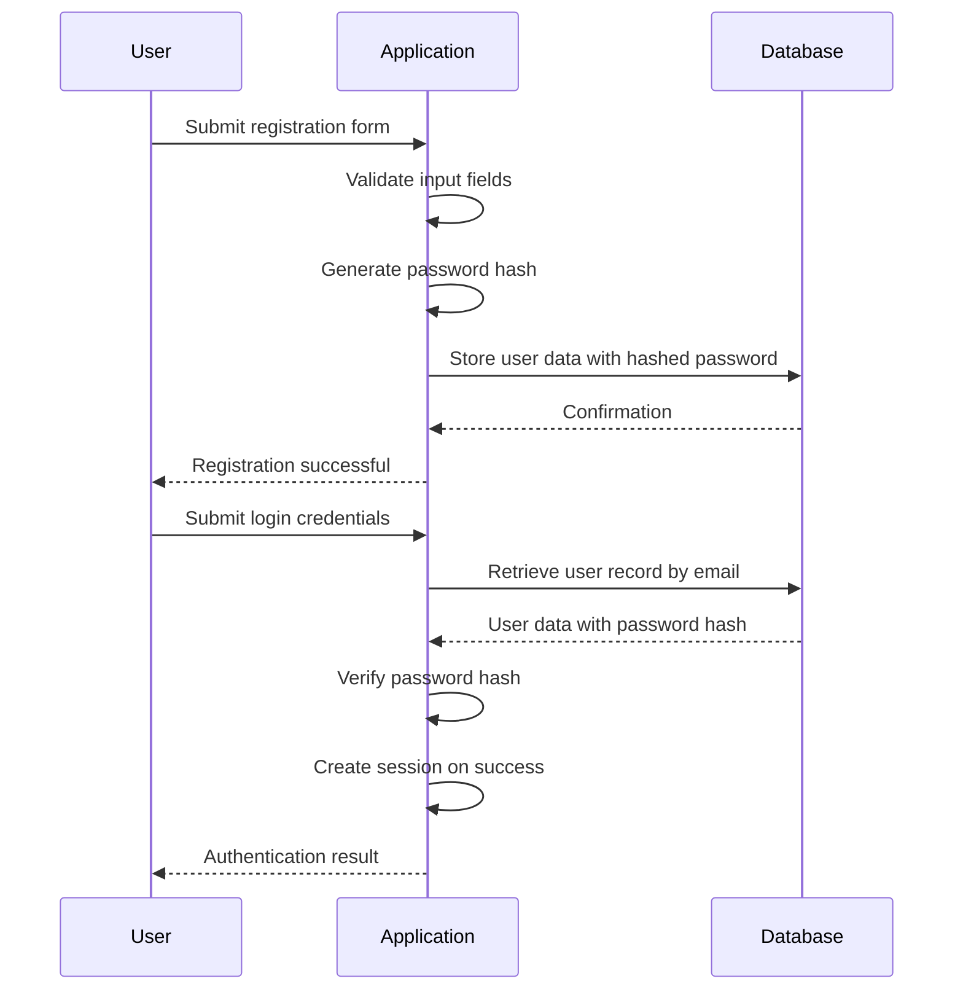

# Security Considerations

<cite>
**Referenced Files in This Document**   
- [main.py](file://main.py)
- [test_authentication.py](file://tests/test_authentication.py)
- [test_e2e_api_perf_security_deployment.py](file://tests/test_e2e_api_perf_security_deployment.py)
- [templates/register.html](file://templates/register.html)
- [templates/login.html](file://templates/login.html)
- [templates/dashboard.html](file://templates/dashboard.html)
</cite>

## Table of Contents
1. [Authentication Mechanisms](#authentication-mechanisms)
2. [Password Security](#password-security)
3. [Role-Based Access Control](#role-based-access-control)
4. [CSRF Protection](#csrf-protection)
5. [Input Validation and Sanitization](#input-validation-and-sanitization)
6. [SQL Injection Prevention](#sql-injection-prevention)
7. [Security Testing](#security-testing)
8. [API Security](#api-security)
9. [Data Privacy](#data-privacy)
10. [Secure Deployment Practices](#secure-deployment-practices)
11. [Security Headers](#security-headers)
12. [Protection Against Common Web Vulnerabilities](#protection-against-common-web-vulnerabilities)
13. [Production Hardening Guidelines](#production-hardening-guidelines)

## Authentication Mechanisms

The intelligent-stock-prediction application implements a comprehensive authentication system with user registration, login/logout functionality, and session management. The system uses Flask's session mechanism to maintain user state across requests.

User registration is handled through the `/register` endpoint, which requires email, username, password, and password confirmation. The system validates that all fields are present, passwords match, and that the email/username are not already registered. Upon successful registration, the user is redirected to the login page with a success message.

The login process at the `/login` endpoint verifies user credentials against the database. When a user successfully authenticates, the system clears any existing session data and creates a new session with the user's ID and role stored in the session. The `last_login_at` timestamp is updated in the database to track user activity. The login process also enforces account status by checking the `is_active` flag, preventing inactive accounts from logging in.

Session management is implemented through Flask's built-in session handling. Upon logout via the `/logout` endpoint, the entire session is cleared using `session.clear()`, effectively terminating the user's session. The application uses server-side sessions with the session data stored in the client's cookie, encrypted with the application's secret key.

**Section sources**
- [main.py](file://main.py#L199-L248)
- [test_authentication.py](file://tests/test_authentication.py#L14-L142)

## Password Security

The application implements robust password security practices using Flask's `werkzeug.security` module for password hashing. Passwords are never stored in plain text; instead, they are securely hashed using a strong cryptographic algorithm before being stored in the database.

When a user registers or changes their password, the plaintext password is passed through the `generate_password_hash()` function, which creates a secure hash using a strong algorithm (typically bcrypt, PBKDF2, or similar). This hash is then stored in the `password_hash` field of the User model. The hashing process includes salting to prevent rainbow table attacks, ensuring that even identical passwords result in different hash values.

During authentication, the provided password is verified using the `check_password()` method, which internally uses `check_password_hash()` to compare the provided password with the stored hash. This approach ensures that the plaintext password is never compared directly with the stored value, and the original password cannot be retrieved from the hash.

The implementation includes tests that verify password hashing is working correctly, confirming that the stored hash is different from the plaintext password and that the hash length is appropriate for the chosen algorithm. The tests also verify that the same password generates different hashes due to salting, which is a critical security feature.



**Diagram sources**
- [main.py](file://main.py#L30-L31)
- [main.py](file://main.py#L55)
- [main.py](file://main.py#L62-L64)

**Section sources**
- [main.py](file://main.py#L30-L31)
- [main.py](file://main.py#L217)
- [main.py](file://main.py#L62-L64)
- [test_authentication.py](file://tests/test_authentication.py#L294-L310)

## Role-Based Access Control

The application implements a role-based access control (RBAC) system to enforce different levels of access based on user roles. The User model includes a `role` field with a default value of 'user', and an 'admin' role is supported for administrative functions.

Access control is enforced through the `login_required` decorator, which protects routes that require authentication. This decorator can optionally specify a required role, restricting access to users with specific roles. For example, the admin dashboard at `/admin` is protected with `@login_required(role='admin')`, ensuring that only users with the 'admin' role can access it.

The decorator checks for the presence of `user_id` in the session to verify authentication. If a role is specified, it also verifies that the `user_role` in the session matches the required role. Users without the required role receive a 403 Forbidden response.

The application defines several protected routes with different access requirements:
- Public routes: `/`, `/register`, `/login`
- Authenticated user routes: `/dashboard`, `/trade/*`, `/funds/topup`, `/dividends/record`
- Admin-only routes: `/admin`, `/admin/brokers`, `/admin/companies`

This hierarchical access control ensures that regular users can access their portfolio and trading functionality while preventing them from accessing administrative features. The system also redirects unauthenticated users to the login page when they attempt to access protected routes.

**Section sources**
- [main.py](file://main.py#L139-L151)
- [main.py](file://main.py#L251-L252)
- [main.py](file://main.py#L436-L437)
- [test_authentication.py](file://tests/test_authentication.py#L216-L252)

## CSRF Protection

The application implements Cross-Site Request Forgery (CSRF) protection to prevent unauthorized commands from being transmitted from a user that the website trusts. The CSRF protection mechanism generates a unique token for each user session and requires this token to be submitted with all state-changing requests (POST, PUT, DELETE).

The CSRF token is generated by the `generate_csrf_token()` function, which checks if a token already exists in the session. If not, it creates a new token using `secrets.token_urlsafe(32)` and stores it in the session. This token is made available to templates through `app.jinja_env.globals['csrf_token'] = generate_csrf_token`, allowing it to be included in forms.

All forms that perform state-changing operations include a hidden input field with the CSRF token:

```html
<input type="hidden" name="csrf_token" value="{{ csrf_token() }}">
```

Before processing any state-changing request, the application calls `verify_csrf()`, which compares the token in the session with the token submitted in the form. If the tokens don't match or if either is missing, the request is aborted with a 400 Bad Request response.

The application's templates consistently include the CSRF token in all forms, including registration, login, trading operations, and administrative functions. Security tests verify that the CSRF protection mechanism is functioning correctly by confirming that tokens are generated and stored in the session.

**Section sources**
- [main.py](file://main.py#L121-L136)
- [main.py](file://main.py#L202)
- [main.py](file://main.py#L229)
- [main.py](file://main.py#L271)
- [templates/register.html](file://templates/register.html#L80)
- [templates/login.html](file://templates/login.html#L80)
- [test_authentication.py](file://tests/test_authentication.py#L197-L213)

## Input Validation and Sanitization

The application implements comprehensive input validation to ensure data integrity and prevent various security vulnerabilities. Validation occurs at multiple levels: client-side through HTML5 form attributes and server-side in the application logic.

Client-side validation is implemented using HTML5 attributes in the form fields:
- `required` attribute ensures fields cannot be left empty
- `type="email"` validates email format
- `type="number"` with `min` attribute for numeric inputs
- `minlength="8"` for password fields

Server-side validation is performed in the route handlers before any data processing or database operations. The validation checks include:
- Presence validation: ensuring required fields are not empty
- Format validation: checking email format and data types
- Value validation: ensuring numeric values are positive and within reasonable ranges
- Business logic validation: checking sufficient funds for transactions

For example, in the trading functionality, the application validates that the quantity is a positive integer, the symbol is provided, and the user has sufficient wallet balance (including commission) before executing a trade. Similarly, the funds top-up and dividend recording functions validate that amounts are positive and properly formatted.

The application uses try-catch blocks to handle type conversion errors, such as when converting string inputs to integers or decimals. Invalid inputs result in user-friendly error messages displayed through the flash messaging system.

Input sanitization is also performed by stripping whitespace from string inputs and converting text to lowercase where appropriate (such as email addresses). The application avoids using user input directly in SQL queries or system commands, instead using parameterized queries and proper data type conversion.

**Section sources**
- [main.py](file://main.py#L207-L216)
- [main.py](file://main.py#L275-L282)
- [main.py](file://main.py#L334-L341)
- [main.py](file://main.py#L383-L391)
- [templates/register.html](file://templates/register.html#L83-L95)

## SQL Injection Prevention

The application prevents SQL injection attacks by using SQLAlchemy's ORM (Object-Relational Mapping) layer, which automatically parameterizes all database queries. This approach ensures that user input is properly escaped and separated from the SQL command structure, eliminating the risk of SQL injection.

Instead of constructing SQL queries by string concatenation, the application uses SQLAlchemy's query methods that handle parameterization automatically. For example, when querying for a user by email:

```python
user = User.query.filter_by(email=email).first()
```

This generates a parameterized query where the email value is treated as a parameter rather than part of the SQL command text. Similarly, more complex queries use SQLAlchemy's filter expressions:

```python
existing = User.query.filter((User.email == email) | (User.username == username)).first()
```

The security test suite includes a specific test for SQL injection prevention that attempts to log in with a malicious email parameter containing SQL code: `"admin' OR '1'='1"`. The test verifies that this attempt fails and does not result in unauthorized access, confirming that the application properly handles such inputs.

By using the ORM layer consistently throughout the application, all database interactions are protected against SQL injection. This includes user authentication, data retrieval for the dashboard, trading operations, and administrative functions. The parameterized queries ensure that even if an attacker manages to inject SQL code through input fields, it will be treated as literal data rather than executable code.

**Section sources**
- [main.py](file://main.py#L232)
- [main.py](file://main.py#L213)
- [test_e2e_api_perf_security_deployment.py](file://tests/test_e2e_api_perf_security_deployment.py#L155-L165)

## Security Testing

The application includes a comprehensive security testing suite that verifies the effectiveness of various security controls and protections. The tests are organized in the `test_e2e_api_perf_security_deployment.py` file under the `TestSecurity` class and cover multiple security aspects.

The security test suite includes:
- SQL injection prevention tests that attempt to exploit login with malicious SQL payloads
- XSS (Cross-Site Scripting) prevention tests that submit script tags in input fields
- Password hashing verification tests that confirm passwords are stored as hashes
- CSRF protection tests that verify token generation and validation
- Session security tests that validate session creation and management

The SQL injection test specifically attempts to log in with a malicious email parameter containing SQL code (`"admin' OR '1'='1"`) and verifies that the login fails and no session is created. This confirms that the application's query parameterization is working correctly.

The XSS prevention test submits a script tag in the symbol field of a trade request and verifies that the response does not contain the script tag or that the request is rejected. This ensures that user input is properly sanitized or validated before being processed or displayed.

Password hashing tests verify that passwords are stored as hashes by creating a test user and confirming that the stored password hash is different from the plaintext password and has appropriate length. The tests also verify that the same password generates different hashes due to salting.

The test suite also includes penetration testing scenarios that simulate various attack vectors and verify that the application responds appropriately by rejecting malicious requests, displaying appropriate error messages, and maintaining system security.

**Section sources**
- [test_e2e_api_perf_security_deployment.py](file://tests/test_e2e_api_perf_security_deployment.py#L152-L214)

## API Security

The application implements several API security measures to protect its endpoints and ensure secure communication. While primarily a web application with server-rendered pages, it includes API-like endpoints for various operations.

Key API security features include:
- Authentication and authorization for all sensitive endpoints
- CSRF protection for all state-changing requests
- Input validation and sanitization
- Rate limiting considerations (implied by performance testing)
- Secure session management

The application's endpoints follow a consistent security pattern: public endpoints for registration and login, authenticated endpoints for user functionality, and role-restricted endpoints for administrative functions. Each endpoint validates the request method, authenticates the user when required, and authorizes access based on user role.

The application uses environment variables for configuration, including `SECRET_KEY` and `DATABASE_URL`, which can be set to secure values in production. The `SECRET_KEY` is used to sign session cookies and should be a long, random string in production.

API endpoints that perform state changes (POST, PUT, DELETE) require CSRF tokens, while read-only endpoints (GET) do not. This follows security best practices by protecting against unauthorized state changes while allowing efficient data retrieval.

The application also includes security headers in its responses, such as cache control headers to prevent sensitive data from being cached by browsers or intermediaries.

**Section sources**
- [main.py](file://main.py#L42-L48)
- [main.py](file://main.py#L191-L196)
- [test_e2e_api_perf_security_deployment.py](file://tests/test_e2e_api_perf_security_deployment.py#L221-L235)

## Data Privacy

The application implements several data privacy measures to protect user information and comply with privacy best practices. User data is stored in a SQLite database (or PostgreSQL in production) with sensitive information properly protected.

Password privacy is maintained through secure hashing, ensuring that plaintext passwords are never stored in the database. The application uses strong cryptographic hashing algorithms with salting to protect user credentials.

User identification is handled through unique email addresses and usernames, with the system preventing duplicate values for these fields. The application stores minimal personal information, collecting only email, username, and role for user accounts.

Session data is kept to a minimum, storing only the user ID and role in the session cookie. This follows the principle of least privilege and reduces the amount of sensitive data stored in client-side cookies.

The application includes a user activation flag (`is_active`) that allows administrators to disable accounts without deleting user data, providing a privacy-preserving way to manage user access.

Data access is controlled through the role-based access control system, ensuring that users can only access their own data and administrative users can only access data they are authorized to view. For example, users can only view and modify their own portfolio and transaction data.

The application also implements proper data disposal practices by using SQLAlchemy's delete operations to remove records when appropriate, such as when a user sells all shares of a stock.

**Section sources**
- [main.py](file://main.py#L51-L61)
- [main.py](file://main.py#L233)
- [main.py](file://main.py#L361-L362)

## Secure Deployment Practices

The application is designed with secure deployment practices in mind, following configuration and operational security best practices. The application uses environment variables for configuration, allowing sensitive settings to be managed outside of the codebase.

Key deployment security features include:
- Configurable `SECRET_KEY` that should be set to a strong, random value in production
- Configurable database URL that can point to a production database
- Debug mode that should be disabled in production
- Gunicorn compatibility for production deployment

The application's configuration uses environment variables with fallback values for development:

```python
app.config['SECRET_KEY'] = os.environ.get('SECRET_KEY', 'CHANGE_ME_IN_PRODUCTION')
app.config['SQLALCHEMY_DATABASE_URI'] = os.environ.get('DATABASE_URL', 'sqlite:///sams_database.db')
```

This pattern ensures that production deployments use secure, environment-specific values while allowing convenient defaults for development.

The deployment testing suite includes checks for proper configuration of these environment variables, verifying that the application can access the database and that security settings are properly configured.

The application is compatible with Gunicorn, a production-grade WSGI server, as verified by the deployment readiness tests. This allows the application to be deployed in a production environment with proper process management and request handling.

Security testing also verifies that the application starts successfully and that all components are accessible, ensuring a smooth deployment process.

**Section sources**
- [main.py](file://main.py#L42-L45)
- [test_e2e_api_perf_security_deployment.py](file://tests/test_e2e_api_perf_security_deployment.py#L221-L235)
- [test_e2e_api_perf_security_deployment.py](file://tests/test_e2e_api_perf_security_deployment.py#L258-L263)

## Security Headers

The application implements security headers to enhance client-side security and protect against various web-based attacks. The most notable security header implementation is in the `add_header` function, which is applied to all responses using the `@app.after_request` decorator.

The `add_header` function sets the following cache control headers:
- `Pragma: no-cache` - Instructs HTTP/1.0 caches to not cache the response
- `Cache-Control: no-cache, no-store, must-revalidate` - Instructs HTTP/1.1 caches to not cache the response and to revalidate with the server
- `Expires: 0` - Sets the expiration date to the past, indicating the response is already expired

These headers prevent browsers and intermediaries from caching sensitive data, such as dashboard information, portfolio details, and transaction history. This is particularly important for applications that may be accessed from shared or public computers.

The application also configures session cookies with security attributes:
- `SESSION_COOKIE_HTTPONLY = True` - Prevents JavaScript access to the session cookie, protecting against XSS attacks
- `SESSION_COOKIE_SAMESITE = 'Lax'` - Provides some protection against CSRF attacks by restricting when cookies are sent with cross-site requests

While the application could benefit from additional security headers such as Content Security Policy (CSP), X-Content-Type-Options, and X-Frame-Options, the implemented headers provide a solid foundation for basic security.

**Section sources**
- [main.py](file://main.py#L46-L47)
- [main.py](file://main.py#L190-L196)

## Protection Against Common Web Vulnerabilities

The application implements protections against several common web vulnerabilities beyond the specific security features already discussed.

For Cross-Site Scripting (XSS) protection, the application relies on multiple layers of defense:
- Input validation that restricts the format and content of user inputs
- Server-side processing that treats user input as data rather than executable code
- Template rendering that automatically escapes variables by default in Jinja2 templates

The security test suite includes an XSS prevention test that attempts to submit a script tag in the symbol field of a trade request. The test verifies that the application either rejects the input or properly escapes it, preventing script execution.

For Insecure Direct Object References (IDOR), the application implements proper authorization checks on all data access. When retrieving data, the application always verifies that the requesting user has permission to access the requested resource. For example, when accessing portfolio items or transactions, the application filters by the current user's ID:

```python
items = PortfolioItem.query.filter_by(user_id=user.id).all()
transactions = Transaction.query.filter_by(user_id=user.id).order_by(Transaction.created_at.desc()).limit(20).all()
```

This pattern prevents users from accessing data belonging to other users by manipulating object identifiers.

The application also protects against other common vulnerabilities:
- Mass assignment protection by explicitly specifying which fields to set from user input
- Error handling that doesn't leak sensitive information
- Proper session management with session clearing on logout
- Rate limiting considerations (implied by performance testing)

The comprehensive test suite helps ensure that these protections are effective by simulating various attack scenarios and verifying the application's response.

**Section sources**
- [main.py](file://main.py#L255-L256)
- [main.py](file://main.py#L257-L258)
- [test_e2e_api_perf_security_deployment.py](file://tests/test_e2e_api_perf_security_deployment.py#L167-L176)

## Production Hardening Guidelines

To ensure secure production deployment of the intelligent-stock-prediction application, the following hardening guidelines should be followed:

1. **Environment Configuration**:
   - Set a strong, random `SECRET_KEY` environment variable
   - Configure `DATABASE_URL` to point to a production database (preferably PostgreSQL)
   - Set `DEBUG=False` to disable debug mode and prevent sensitive information disclosure

2. **Server Configuration**:
   - Deploy using Gunicorn or another production WSGI server
   - Use a reverse proxy (such as Nginx) to handle SSL termination and static files
   - Implement proper process monitoring and logging

3. **Security Settings**:
   - Ensure HTTPS is enabled for all production traffic
   - Consider implementing additional security headers (CSP, X-Content-Type-Options, etc.)
   - Set up proper error handling and logging without sensitive data exposure

4. **Database Security**:
   - Use strong credentials for database access
   - Implement regular backups with secure storage
   - Consider database encryption for sensitive data

5. **Monitoring and Maintenance**:
   - Implement application monitoring and alerting
   - Set up regular security updates for dependencies
   - Conduct periodic security reviews and penetration testing

6. **Access Control**:
   - Limit administrative access to trusted personnel
   - Implement strong password policies for all users
   - Consider multi-factor authentication for administrative accounts

7. **Backup and Recovery**:
   - Implement regular automated backups
   - Test backup restoration procedures regularly
   - Store backups in secure, offsite locations

Following these guidelines will help ensure that the application remains secure and resilient in a production environment, protecting user data and maintaining service availability.

**Section sources**
- [main.py](file://main.py#L42-L48)
- [test_e2e_api_perf_security_deployment.py](file://tests/test_e2e_api_perf_security_deployment.py#L221-L278)