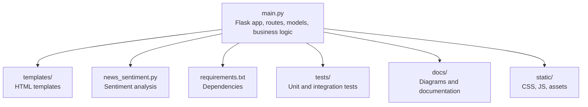
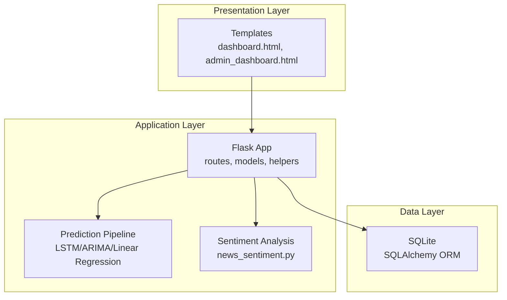
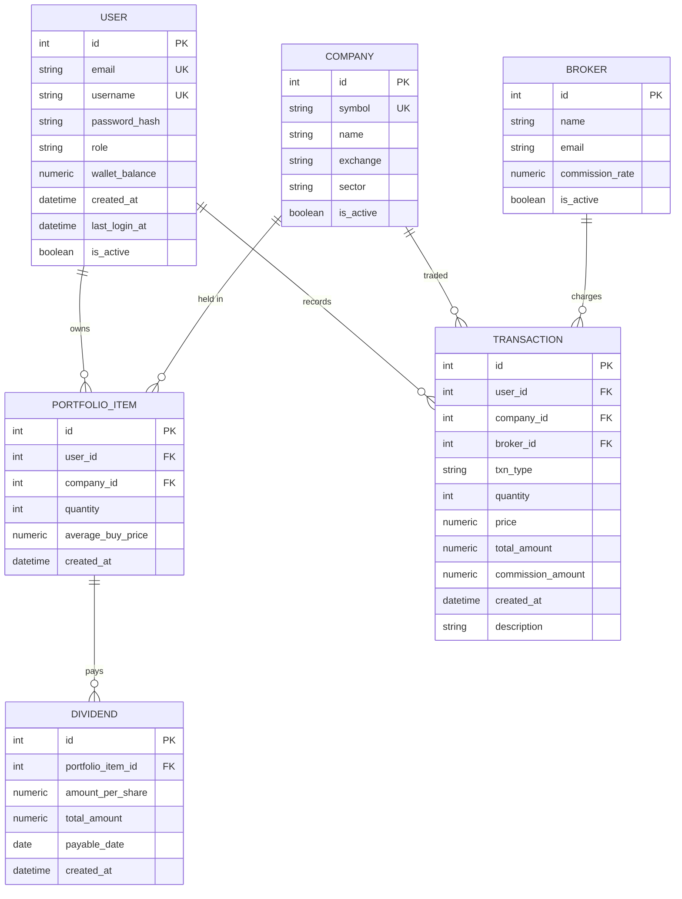
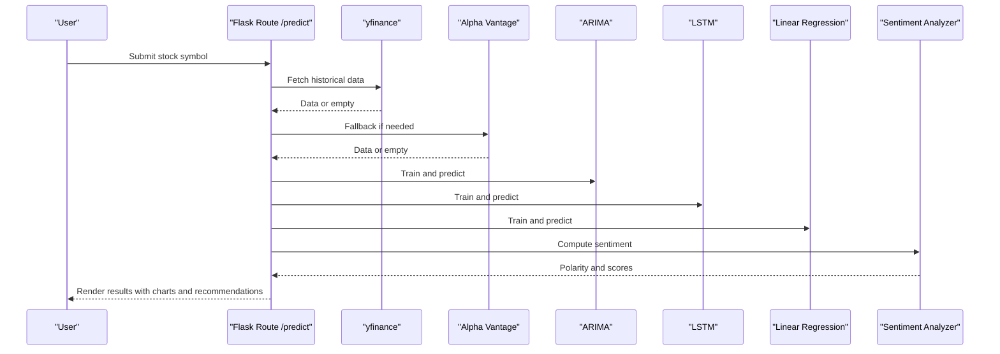
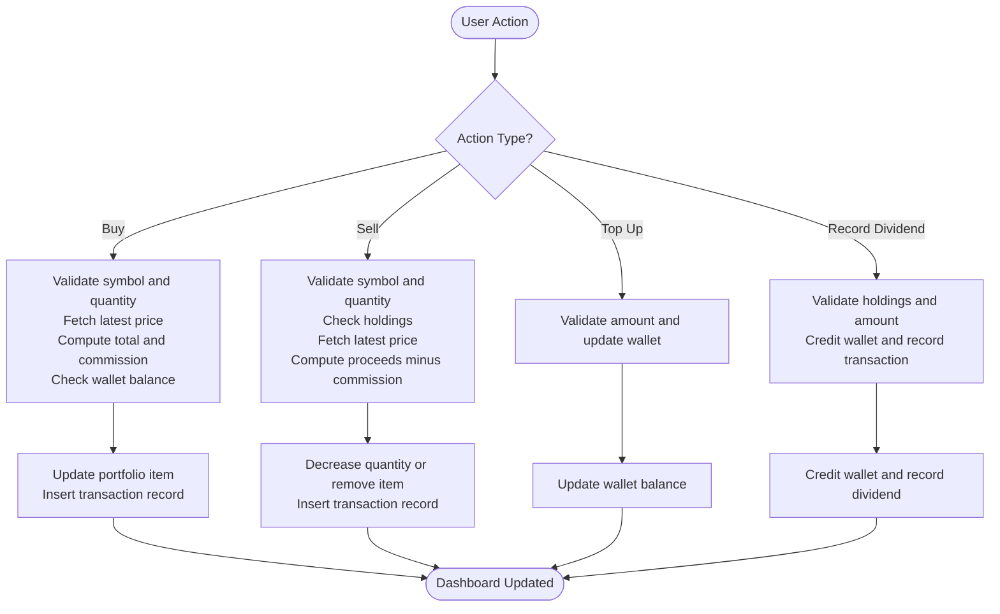
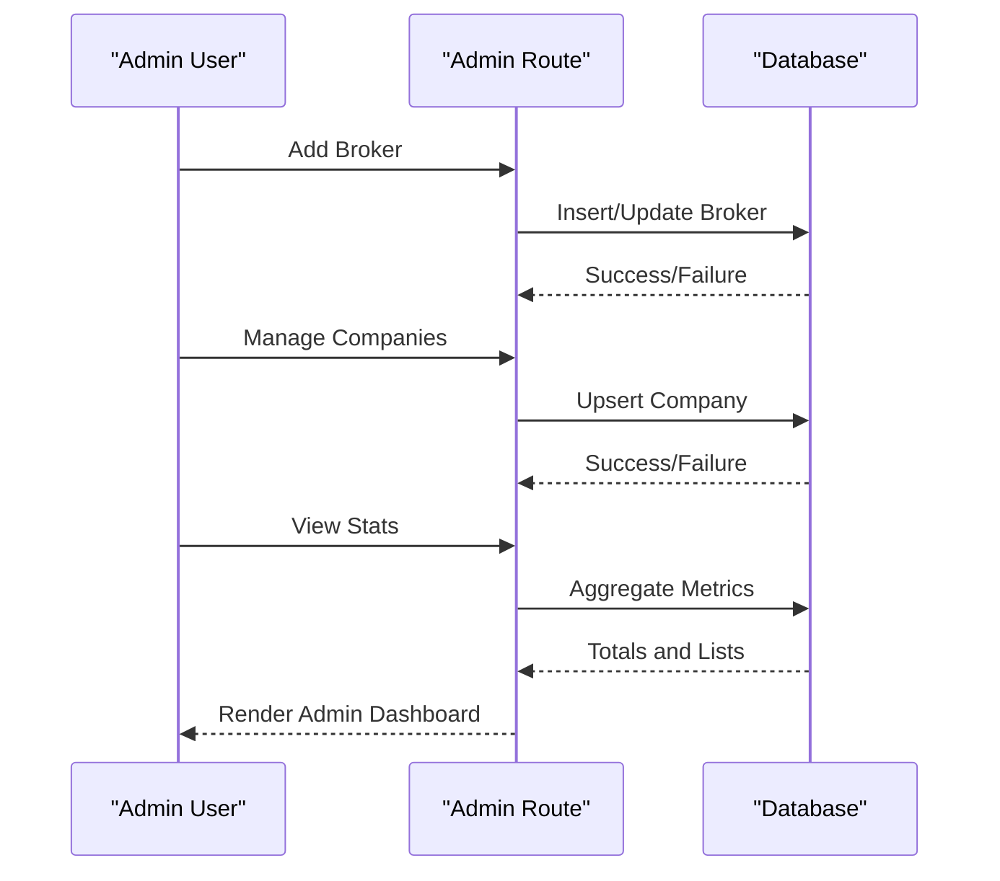
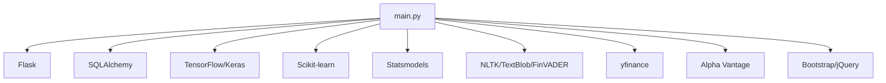

# System Overview

<cite>
**Referenced Files in This Document**
- [README.md](file://README.md)
- [main.py](file://main.py)
- [news_sentiment.py](file://news_sentiment.py)
- [requirements.txt](file://requirements.txt)
- [templates/dashboard.html](file://templates/dashboard.html)
- [templates/admin_dashboard.html](file://templates/admin_dashboard.html)
- [draft-report.md](file://draft-report.md)
- [pytest.ini](file://pytest.ini)
- [tests/test_database_models.py](file://tests/test_database_models.py)
- [tests/test_trading_operations.py](file://tests/test_trading_operations.py)
</cite>

## Table of Contents
1. [Introduction](#introduction)
2. [Project Structure](#project-structure)
3. [Core Components](#core-components)
4. [Architecture Overview](#architecture-overview)
5. [Detailed Component Analysis](#detailed-component-analysis)
6. [Dependency Analysis](#dependency-analysis)
7. [Performance Considerations](#performance-considerations)
8. [Troubleshooting Guide](#troubleshooting-guide)
9. [Conclusion](#conclusion)

## Introduction
This section introduces the intelligent-stock-prediction system as a full-stack web application that combines machine learning-based stock prediction with sentiment analysis and integrated portfolio management. The system enables simulated trading, provides predictive analytics, and supports investment decision-making for students, researchers, and amateur investors. It bridges gaps in isolated prediction tools by embedding forecasting models into an end-to-end management workflow with transparent dashboards.

Key goals:
- Enable simulated trading with virtual wallet and portfolio tracking
- Provide predictive analytics using LSTM, ARIMA, and Linear Regression models
- Integrate sentiment analysis from multiple financial news sources
- Support investment decision-making through explainable dashboards and recommendations
- Offer admin monitoring and system controls

Target audience:
- Students exploring stock markets and ML applications
- Researchers evaluating prediction models and sentiment integration
- Amateur investors practicing portfolio strategies in a risk-free environment

Unique features:
- Commission tracking and dividend recording
- Three-tier architecture with Flask backend, SQLite database, and responsive frontend
- Integration points for Alpha Vantage and yfinance
- Admin dashboard for user/company/broker management and transaction monitoring

**Section sources**
- [README.md](file://README.md#L19-L41)
- [README.md](file://README.md#L142-L158)
- [draft-report.md](file://draft-report.md#L1-L10)

## Project Structure
The repository organizes the system into modular components:
- Application entry point and routing logic
- Machine learning prediction pipeline
- Sentiment analysis module
- Database models and ORM configuration
- Templates for user and admin dashboards
- Documentation and diagrams
- Tests and configuration

**Diagram sources**
- [main.py](file://main.py#L1-L60)
- [requirements.txt](file://requirements.txt#L1-L20)
- [templates/dashboard.html](file://templates/dashboard.html#L1-L40)
- [news_sentiment.py](file://news_sentiment.py#L1-L40)

**Section sources**
- [README.md](file://README.md#L159-L174)
- [main.py](file://main.py#L1-L60)
- [requirements.txt](file://requirements.txt#L1-L20)

## Core Components
- Flask backend: Routes for authentication, trading, prediction, and admin controls; session-based security; CSRF protection; database initialization
- SQLite database: SQLAlchemy ORM models for User, Company, Broker, PortfolioItem, Transaction, and Dividend
- Prediction engine: LSTM, ARIMA, and Linear Regression models for seven-day forecasting
- Sentiment analysis: Multi-source aggregation (Finviz, alternative APIs, RSS) with FinVADER and VADER
- Frontend dashboards: User dashboard for portfolio and trading, admin dashboard for monitoring and configuration

Practical examples:
- Default admin credentials for initial access
- Common user workflows: register, login, simulate trades, record dividends, view predictions
- Admin workflows: manage brokers, companies, and monitor transactions

Integration points:
- Alpha Vantage and yfinance for market data
- Multiple sentiment sources for enriched context

**Section sources**
- [README.md](file://README.md#L136-L158)
- [README.md](file://README.md#L104-L135)
- [main.py](file://main.py#L1-L60)
- [news_sentiment.py](file://news_sentiment.py#L1-L40)

## Architecture Overview
The system follows a three-tier architecture:
- Presentation layer: HTML, CSS, Bootstrap, and JavaScript for responsive UI
- Application layer: Python/Flask backend implementing business logic, prediction models, and data processing
- Data layer: SQLite database managed through SQLAlchemy ORM

**Diagram sources**
- [main.py](file://main.py#L1-L60)
- [news_sentiment.py](file://news_sentiment.py#L1-L40)
- [templates/dashboard.html](file://templates/dashboard.html#L1-L40)
- [templates/admin_dashboard.html](file://templates/admin_dashboard.html#L1-L40)

**Section sources**
- [README.md](file://README.md#L73-L83)
- [draft-report.md](file://draft-report.md#L113-L122)

## Detailed Component Analysis

### Database Models and ORM
The system defines core entities with relationships:
- User: authentication, profile, wallet balance, roles, activity tracking
- Company: stock metadata (symbol, name, exchange, sector, active flag)
- Broker: broker configuration with commission rates and active status
- PortfolioItem: user holdings with average buy price and quantity
- Transaction: buy/sell/dividend records with amounts, fees, and descriptions
- Dividend: dividend payouts linked to portfolio items

**Diagram sources**
- [main.py](file://main.py#L51-L120)

**Section sources**
- [main.py](file://main.py#L51-L120)
- [tests/test_database_models.py](file://tests/test_database_models.py#L1-L120)

### Prediction Pipeline
The prediction route orchestrates:
- Historical data retrieval via yfinance and Alpha Vantage fallback
- Data preprocessing and CSV export
- Training and evaluation of ARIMA, LSTM, and Linear Regression models
- Visualization outputs and seven-day forecast
- Sentiment analysis integration for recommendation

**Diagram sources**
- [main.py](file://main.py#L545-L960)
- [news_sentiment.py](file://news_sentiment.py#L737-L800)

**Section sources**
- [main.py](file://main.py#L545-L960)
- [news_sentiment.py](file://news_sentiment.py#L737-L800)

### Trading and Portfolio Management
The system supports:
- Simulated buy/sell operations with commission calculations
- Wallet funding and dividend recording
- Portfolio aggregation and valuation
- Transaction logging with broker and commission details

**Diagram sources**
- [main.py](file://main.py#L268-L434)
- [main.py](file://main.py#L172-L185)

**Section sources**
- [main.py](file://main.py#L268-L434)
- [templates/dashboard.html](file://templates/dashboard.html#L138-L230)
- [tests/test_trading_operations.py](file://tests/test_trading_operations.py#L1-L120)

### Admin Dashboard and Monitoring
Administrators can:
- Manage brokers (name, email, commission rate)
- Configure companies (symbol, name, exchange, sector, active)
- Monitor system statistics (users, companies, brokers, transactions, total commission, total volume)
- View recent transactions and top symbols

**Diagram sources**
- [main.py](file://main.py#L436-L490)
- [main.py](file://main.py#L492-L540)
- [templates/admin_dashboard.html](file://templates/admin_dashboard.html#L137-L310)

**Section sources**
- [main.py](file://main.py#L436-L540)
- [templates/admin_dashboard.html](file://templates/admin_dashboard.html#L1-L120)

## Dependency Analysis
External libraries and integrations:
- Flask for web framework and routing
- SQLAlchemy for ORM and database abstraction
- TensorFlow/Keras and Scikit-learn for ML models
- Statsmodels for ARIMA
- NLTK, TextBlob, and FinVADER for sentiment analysis
- yfinance and Alpha Vantage for market data
- Bootstrap and jQuery for frontend

**Diagram sources**
- [requirements.txt](file://requirements.txt#L1-L20)
- [main.py](file://main.py#L1-L40)

**Section sources**
- [requirements.txt](file://requirements.txt#L1-L20)
- [main.py](file://main.py#L1-L40)

## Performance Considerations
- Local deployment: The application runs on a standard Flask server; SQLite is suitable for development and small-scale usage
- Model inference: LSTM training is computationally intensive; consider reducing epochs or using lighter models for interactive demos
- Data retrieval: yfinance and Alpha Vantage calls may be rate-limited; implement caching or batching for frequent requests
- Frontend rendering: Charts and tables can be heavy; defer non-critical rendering until after initial page load
- Session and CSRF: Enforced security measures protect against common attacks but add overhead; tune cookie settings for production deployments

[No sources needed since this section provides general guidance]

## Troubleshooting Guide
Common setup and runtime issues:
- Missing API keys: Ensure Alpha Vantage key is configured for fallback data retrieval
- Database initialization: The application initializes tables on startup; verify SQLite connectivity and permissions
- Dependency installation: Install all packages from requirements.txt; some packages may require system-level dependencies
- Headless browser for scraping: Selenium-based scrapers may fail without proper drivers; ensure chromedriver is available or adjust scraping logic
- CSRF protection: Forms require CSRF tokens; ensure templates include token fields
- Testing environment: Use pytest configuration to run targeted test suites

**Section sources**
- [pytest.ini](file://pytest.ini#L1-L56)
- [tests/test_database_models.py](file://tests/test_database_models.py#L1-L60)
- [tests/test_trading_operations.py](file://tests/test_trading_operations.py#L1-L60)

## Conclusion
The intelligent-stock-prediction system delivers a cohesive, educational platform that combines ML-driven stock prediction with sentiment analysis and integrated portfolio management. Its three-tier architecture, clear separation of concerns, and comprehensive dashboards support both learning and experimentation. Administrators gain visibility and control, while users benefit from simulated trading, commission tracking, and dividend recording. The system’s modular design and documented workflows facilitate maintenance, extension, and deployment across diverse environments.

[No sources needed since this section summarizes without analyzing specific files]