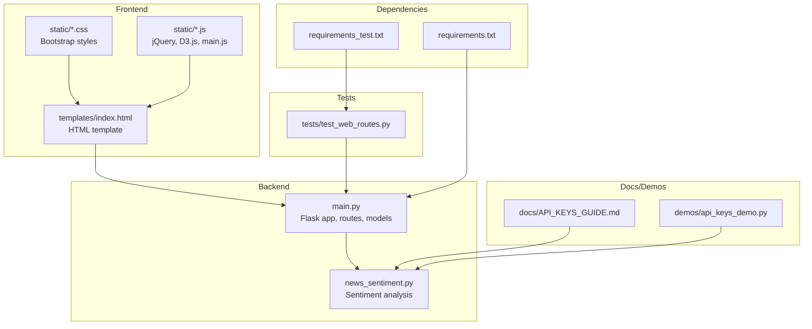
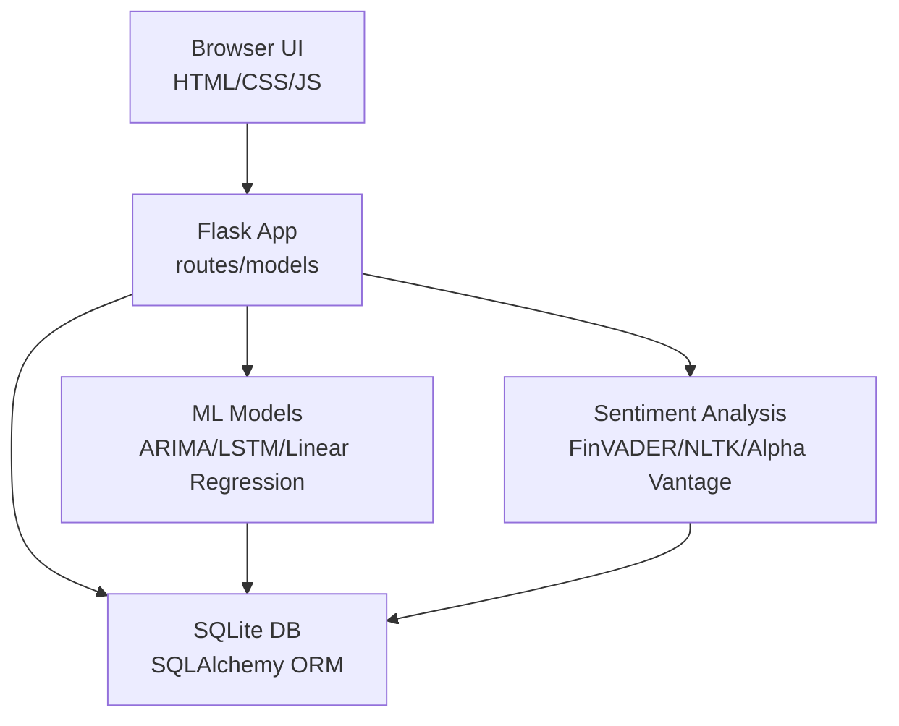
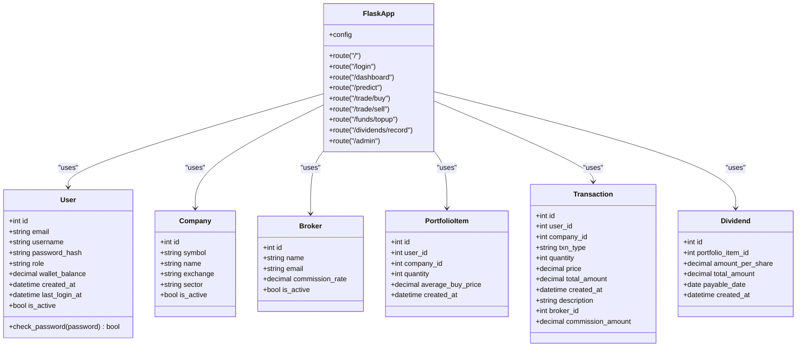
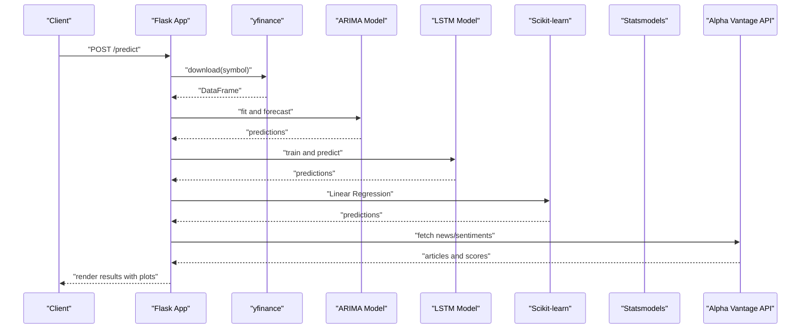
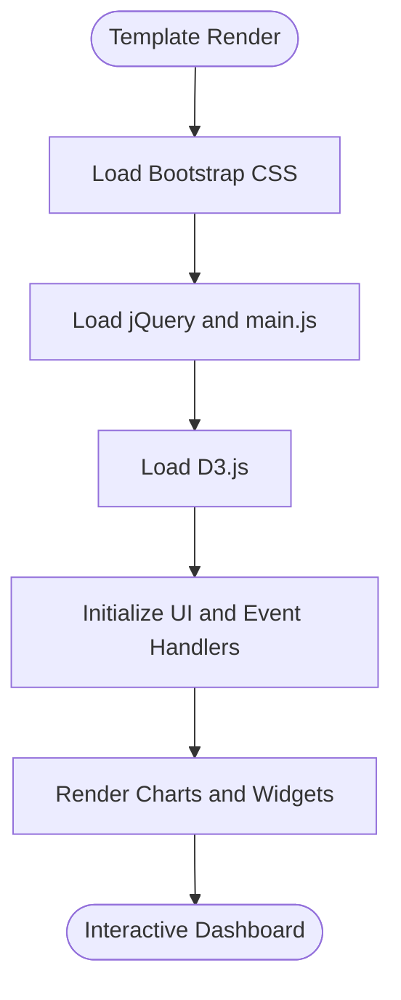
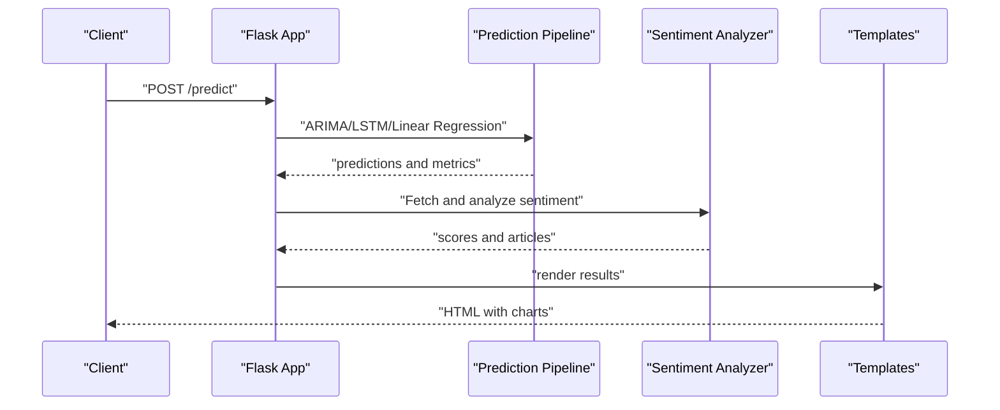
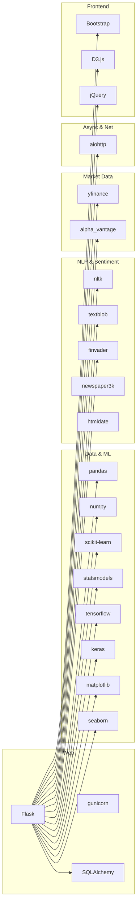

# Technology Stack & Dependencies

<cite>
**Referenced Files in This Document**
- [README.md](file://README.md)
- [requirements.txt](file://requirements.txt)
- [requirements_test.txt](file://requirements_test.txt)
- [main.py](file://main.py)
- [news_sentiment.py](file://news_sentiment.py)
- [templates/index.html](file://templates/index.html)
- [static/main.js](file://static/main.js)
- [static/d3.min.js](file://static/d3.min.js)
- [static/jquery-RES.min.js](file://static/jquery-RES.min.js)
- [static/bootstrap.min-RES.css](file://static/bootstrap.min-RES.css)
- [docs/API_KEYS_GUIDE.md](file://docs/API_KEYS_GUIDE.md)
- [demos/api_keys_demo.py](file://demos/api_keys_demo.py)
- [tests/test_web_routes.py](file://tests/test_web_routes.py)
</cite>

## Table of Contents
1. [Introduction](#introduction)
2. [Project Structure](#project-structure)
3. [Core Components](#core-components)
4. [Architecture Overview](#architecture-overview)
5. [Detailed Component Analysis](#detailed-component-analysis)
6. [Dependency Analysis](#dependency-analysis)
7. [Performance Considerations](#performance-considerations)
8. [Troubleshooting Guide](#troubleshooting-guide)
9. [Conclusion](#conclusion)

## Introduction
This document details the technology stack and dependencies of the intelligent-stock-prediction application. It covers the Backend (Python, Flask, SQLAlchemy, SQLite), Machine Learning & Analytics (TensorFlow/Keras, Scikit-learn, Statsmodels, NLTK, TextBlob, FinVADER, yfinance, Alpha Vantage), and Frontend (HTML5/CSS3, Bootstrap, JavaScript, D3.js, jQuery). It also documents external API dependencies, authentication mechanisms, rate limits, practical examples from requirements.txt, integration patterns between Flask routes and ML predictions, common dependency conflicts, installation pitfalls, virtual environment setup, and performance implications of key libraries like TensorFlow.

## Project Structure
The application is organized into:
- Backend: Flask application entry point and routing logic
- Machine Learning & Analytics: Prediction models and sentiment analysis
- Frontend: Templates and static assets (Bootstrap, D3.js, jQuery)
- Documentation and Demos: API keys guide and demonstration scripts
- Tests: Integration and component tests

**Diagram sources**
- [main.py](file://main.py#L1-L120)
- [news_sentiment.py](file://news_sentiment.py#L1-L120)
- [templates/index.html](file://templates/index.html#L1-L120)
- [static/bootstrap.min-RES.css](file://static/bootstrap.min-RES.css#L1-L20)
- [static/d3.min.js](file://static/d3.min.js#L1-L20)
- [static/jquery-RES.min.js](file://static/jquery-RES.min.js#L1-L20)
- [static/main.js](file://static/main.js#L1-L40)
- [docs/API_KEYS_GUIDE.md](file://docs/API_KEYS_GUIDE.md#L1-L60)
- [demos/api_keys_demo.py](file://demos/api_keys_demo.py#L1-L40)
- [tests/test_web_routes.py](file://tests/test_web_routes.py#L1-L40)
- [requirements.txt](file://requirements.txt#L1-L20)
- [requirements_test.txt](file://requirements_test.txt#L1-L20)

**Section sources**
- [README.md](file://README.md#L49-L72)
- [requirements.txt](file://requirements.txt#L1-L20)
- [requirements_test.txt](file://requirements_test.txt#L1-L20)

## Core Components
- Backend
  - Python 3.7+ runtime
  - Flask for web framework
  - SQLAlchemy for ORM and SQLite database
- Machine Learning & Analytics
  - TensorFlow/Keras for deep learning models
  - Scikit-learn for preprocessing and baselines
  - Statsmodels for ARIMA modeling
  - NLTK, TextBlob, FinVADER for sentiment analysis
  - yfinance for market data retrieval
  - Alpha Vantage for financial data API
- Frontend
  - HTML5/CSS3, Bootstrap, JavaScript
  - D3.js for data visualization
  - jQuery for DOM manipulation

**Section sources**
- [README.md](file://README.md#L49-L72)
- [requirements.txt](file://requirements.txt#L1-L20)

## Architecture Overview
The system follows a three-tier architecture:
- Presentation Layer: HTML, CSS, Bootstrap, JavaScript
- Application Layer: Python/Flask backend implementing business logic, prediction models, and data processing
- Data Layer: SQLite database managed through SQLAlchemy ORM

**Diagram sources**
- [README.md](file://README.md#L73-L83)
- [main.py](file://main.py#L1-L120)
- [news_sentiment.py](file://news_sentiment.py#L1-L120)

## Detailed Component Analysis

### Backend: Flask, SQLAlchemy, SQLite
- Flask app initialization and configuration
  - Secret key, database URI, session cookie settings
  - CSRF token generation and verification
- Database models for users, companies, brokers, portfolio items, transactions, dividends
- Route handlers for authentication, trading, funds, dividends, admin, and prediction
- Integration with yfinance for stock price retrieval and plotting

**Diagram sources**
- [main.py](file://main.py#L41-L120)
- [main.py](file://main.py#L111-L189)

**Section sources**
- [main.py](file://main.py#L41-L120)
- [main.py](file://main.py#L111-L189)

### Machine Learning & Analytics: TensorFlow/Keras, Scikit-learn, Statsmodels, NLTK, TextBlob, FinVADER, yfinance, Alpha Vantage
- Prediction pipeline
  - ARIMA modeling for time series forecasting
  - LSTM neural network for complex pattern recognition
  - Linear Regression baseline
  - Data preprocessing and evaluation metrics
- Sentiment analysis
  - FinVADER and NLTK VADER for financial sentiment
  - TextBlob for basic polarity/subjectivity
  - Multiple API integrations (Alpha Vantage, EODHD, Finnhub, StockGeist, Tradestie)
  - Web scraping (Finviz) with robust error handling
- Data sources
  - yfinance for historical market data
  - Alpha Vantage for news and sentiments

**Diagram sources**
- [main.py](file://main.py#L545-L800)
- [news_sentiment.py](file://news_sentiment.py#L518-L581)

**Section sources**
- [main.py](file://main.py#L545-L800)
- [news_sentiment.py](file://news_sentiment.py#L1-L120)
- [news_sentiment.py](file://news_sentiment.py#L518-L581)

### Frontend: HTML5/CSS3, Bootstrap, JavaScript, D3.js, jQuery
- Templates and static assets
  - Bootstrap for responsive design
  - D3.js for interactive visualizations
  - jQuery for DOM manipulation and AJAX
- Integration with Flask rendering and static asset serving

**Diagram sources**
- [templates/index.html](file://templates/index.html#L1-L120)
- [static/bootstrap.min-RES.css](file://static/bootstrap.min-RES.css#L1-L20)
- [static/jquery-RES.min.js](file://static/jquery-RES.min.js#L1-L20)
- [static/d3.min.js](file://static/d3.min.js#L1-L20)
- [static/main.js](file://static/main.js#L1-L40)

**Section sources**
- [templates/index.html](file://templates/index.html#L1-L120)
- [static/bootstrap.min-RES.css](file://static/bootstrap.min-RES.css#L1-L20)
- [static/jquery-RES.min.js](file://static/jquery-RES.min.js#L1-L20)
- [static/d3.min.js](file://static/d3.min.js#L1-L20)
- [static/main.js](file://static/main.js#L1-L40)

### External API Dependencies and Authentication
- Alpha Vantage
  - Requires API key; free tier allows limited calls per minute/day
  - Used for news and sentiments
- EODHD
  - Requires API key; provides pre-calculated sentiment
- Finnhub Social Sentiment
  - Requires API key; offers multi-source social sentiment
- StockGeist.ai
  - Requires API key; provides real-time streaming
- Finviz + FinVADER
  - No API key required; fast HTML scraping with financial sentiment
- Tradestie Reddit
  - No API key required; 15-minute updates with raw Reddit posts
- Google News RSS
  - No API key required; RSS feed parsing

Authentication and rate limits are documented in the API keys guide. The system gracefully skips unavailable sources when keys are not provided.

**Section sources**
- [docs/API_KEYS_GUIDE.md](file://docs/API_KEYS_GUIDE.md#L1-L120)
- [docs/API_KEYS_GUIDE.md](file://docs/API_KEYS_GUIDE.md#L120-L246)
- [news_sentiment.py](file://news_sentiment.py#L518-L581)

### Integration Patterns Between Flask Routes and ML Predictions
- The prediction route orchestrates fetching data, running ARIMA/LSTM/Linear Regression, and generating visualizations
- Sentiment analysis is integrated to enrich the prediction context
- Results are rendered via templates and served as static images for charts

**Diagram sources**
- [main.py](file://main.py#L545-L800)
- [news_sentiment.py](file://news_sentiment.py#L737-L800)
- [templates/index.html](file://templates/index.html#L468-L586)

**Section sources**
- [main.py](file://main.py#L545-L800)
- [news_sentiment.py](file://news_sentiment.py#L737-L800)
- [templates/index.html](file://templates/index.html#L468-L586)

## Dependency Analysis
- Python packages grouped by function
  - Web framework and server: Flask, gunicorn
  - Database: SQLAlchemy
  - Data and ML: pandas, numpy, scikit-learn, statsmodels, tensorflow, keras
  - Visualization: matplotlib, seaborn
  - NLP and sentiment: nltk, textblob, finvader, newspaper3k, htmldate
  - Market data: yfinance, alpha_vantage
  - Async and networking: aiohttp
  - Frontend assets: Bootstrap, D3.js, jQuery
- Testing dependencies: pytest, pytest-cov, pytest-mock, pytest-flask, pytest-asyncio, pytest-benchmark, pytest-xdist, pytest-html, pytest-ordering, tox, locust

**Diagram sources**
- [requirements.txt](file://requirements.txt#L1-L20)
- [requirements_test.txt](file://requirements_test.txt#L1-L36)

**Section sources**
- [requirements.txt](file://requirements.txt#L1-L20)
- [requirements_test.txt](file://requirements_test.txt#L1-L36)

## Performance Considerations
- TensorFlow and Keras
  - GPU acceleration is recommended for LSTM training/inference
  - Reduce batch size and epochs during development
  - Use mixed precision where supported
  - Persist trained models to disk and reuse for inference
- ARIMA
  - Tune order parameters carefully to avoid overfitting
  - Use appropriate data window sizes for forecasting
- Scikit-learn preprocessing
  - Normalize/standardize features consistently
  - Use pipelines to avoid data leakage
- D3.js visualizations
  - Defer heavy chart rendering until after initial page load
  - Use SVG canvases efficiently and avoid frequent DOM updates
- API calls
  - Respect rate limits; implement caching and retries
  - Use asynchronous requests where possible

[No sources needed since this section provides general guidance]

## Troubleshooting Guide
- Virtual environment setup
  - Use Python 3.7+ and create a virtual environment before installing dependencies
  - Activate the environment before running the application
- Dependency conflicts
  - Pin compatible versions as shown in requirements.txt
  - Avoid mixing system and virtual environment installations
- Installation pitfalls
  - Ensure system-level dependencies for D3.js and Bootstrap are served correctly
  - Confirm static assets are loaded from the static directory
- Testing
  - Use pytest with the provided test configuration
  - Mock external dependencies (e.g., Alpha Vantage) in tests
- API keys
  - Follow the API keys guide to configure keys securely
  - Use environment variables for production deployments

**Section sources**
- [README.md](file://README.md#L104-L135)
- [docs/API_KEYS_GUIDE.md](file://docs/API_KEYS_GUIDE.md#L190-L246)
- [tests/test_web_routes.py](file://tests/test_web_routes.py#L163-L183)

## Conclusion
The intelligent-stock-prediction application integrates a robust backend (Flask, SQLAlchemy, SQLite), a comprehensive machine learning stack (TensorFlow/Keras, Scikit-learn, Statsmodels), and a modern frontend (Bootstrap, D3.js, jQuery). External APIs (Alpha Vantage, EODHD, Finnhub, StockGeist) and sentiment sources (FinVADER, NLTK, TextBlob) enrich the prediction pipeline. The system emphasizes secure configuration, graceful fallbacks, and performance-conscious design choices.