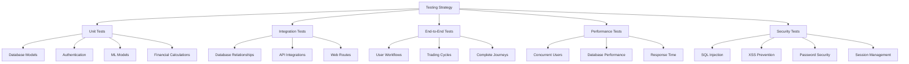
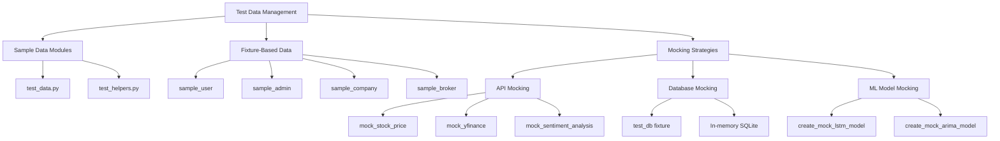
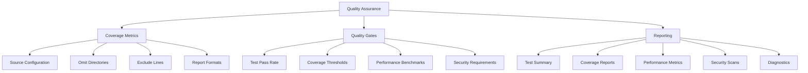

# Testing Strategy

<cite>
**Referenced Files in This Document**   
- [pytest.ini](file://pytest.ini)
- [tests/run_all_tests.py](file://tests/run_all_tests.py)
- [tests/conftest.py](file://tests/conftest.py)
- [tests/README.md](file://tests/README.md)
- [tests/test_database_models.py](file://tests/test_database_models.py)
- [tests/test_lstm_model.py](file://tests/test_lstm_model.py)
- [tests/test_e2e_api_perf_security_deployment.py](file://tests/test_e2e_api_perf_security_deployment.py)
- [tests/test_helpers.py](file://tests/test_helpers.py)
- [tests/test_data.py](file://tests/test_data.py)
- [tests/test_authentication.py](file://tests/test_authentication.py)
- [tests/test_web_routes.py](file://tests/test_web_routes.py)
- [docs/COMPREHENSIVE_TESTING_FRAMEWORK.md](file://docs/COMPREHENSIVE_TESTING_FRAMEWORK.md)
- [requirements_test.txt](file://requirements_test.txt)
</cite>

## Table of Contents
1. [Introduction](#introduction)
2. [Multi-Layered Testing Approach](#multi-layered-testing-approach)
3. [Test Organization and Framework Configuration](#test-organization-and-framework-configuration)
4. [Test Data Management and Mocking Strategies](#test-data-management-and-mocking-strategies)
5. [CI/CD Integration](#cicd-integration)
6. [Guidance for Writing and Running Tests](#guidance-for-writing-and-running-tests)
7. [Testing Challenges for ML Components and Financial Calculations](#testing-challenges-for-ml-components-and-financial-calculations)
8. [Test Coverage Metrics and Quality Gates](#test-coverage-metrics-and-quality-gates)
9. [Conclusion](#conclusion)

## Introduction

The intelligent-stock-prediction system employs a comprehensive testing strategy to ensure reliability, accuracy, and robustness across all components. This document details the multi-layered testing approach, covering unit, integration, end-to-end, performance, and security tests. The framework is designed to validate both traditional software components and specialized machine learning models, with particular attention to financial calculation precision and model stability. The testing infrastructure supports continuous integration and deployment, providing quality gates that ensure code reliability before production release.

**Section sources**
- [docs/COMPREHENSIVE_TESTING_FRAMEWORK.md](file://docs/COMPREHENSIVE_TESTING_FRAMEWORK.md)
- [tests/README.md](file://tests/README.md)

## Multi-Layered Testing Approach

The testing strategy implements a comprehensive five-layer approach to ensure complete coverage of the intelligent-stock-prediction system.

### Unit Tests
Unit tests focus on individual functions and components, ensuring isolated functionality correctness. The framework includes unit tests for:
- Database models (User, Company, Broker, PortfolioItem, Transaction, Dividend)
- Authentication and authorization logic
- Machine learning models (LSTM, ARIMA, Linear Regression)
- Sentiment analysis components
- Financial calculation functions

Each unit test verifies specific functionality with minimal dependencies, using mocks where necessary to isolate the component under test.

### Integration Tests
Integration tests validate interactions between components and systems. The framework includes integration tests for:
- Database relationships and constraints
- API integrations (yfinance, Alpha Vantage)
- Prediction pipeline integration
- Web route interactions
- Component verification and comprehensive source testing

These tests ensure that components work together as expected, validating data flow and interface contracts.

### End-to-End Tests
End-to-end tests validate complete user workflows and business processes:
- Registration to prediction flow
- Full trading cycles (top-up → buy → sell → dividend)
- Complete user journeys from login to portfolio management
- API, performance, security, and deployment workflows

These tests simulate real user interactions, ensuring the system functions correctly from the user's perspective.

### Performance Tests
Performance tests evaluate system behavior under load:
- Concurrent user handling (up to 100 users)
- Database query performance with bulk data
- Response time benchmarks
- Load testing scenarios (light, medium, heavy)

The framework includes performance tests that measure response times and system stability under various load conditions.

### Security Tests
Security tests validate protection against common vulnerabilities:
- SQL injection prevention
- XSS attack prevention
- Password hashing and security
- CSRF protection
- Session management security
- Role-based access control

These tests ensure the system is protected against common web application vulnerabilities.



**Diagram sources**
- [tests/test_database_models.py](file://tests/test_database_models.py#L15-L356)
- [tests/test_e2e_api_perf_security_deployment.py](file://tests/test_e2e_api_perf_security_deployment.py#L106-L296)
- [tests/test_authentication.py](file://tests/test_authentication.py#L14-L336)

**Section sources**
- [tests/test_database_models.py](file://tests/test_database_models.py#L1-L356)
- [tests/test_lstm_model.py](file://tests/test_lstm_model.py#L1-L303)
- [tests/test_e2e_api_perf_security_deployment.py](file://tests/test_e2e_api_perf_security_deployment.py#L1-L296)

## Test Organization and Framework Configuration

The testing framework is organized in the tests/ directory with a clear structure that supports comprehensive coverage and maintainability.

### Test Directory Structure
The tests/ directory contains:
- Individual test files for each component and functionality
- Helper modules for test utilities and data
- Configuration files for the testing framework
- Documentation for test procedures and guidelines

The organization follows a phase-based approach with 15 distinct test phases, each focusing on specific aspects of the system.

### Pytest Configuration
The pytest.ini file configures the testing framework with the following settings:

```ini
[pytest]
python_files = test_*.py
python_classes = Test*
python_functions = test_*
minversion = 6.0
pythonpath = .
addopts =
    -ra
    --strict-markers
    --strict-config
    --showlocals
    --tb=short

markers =
    unit: Unit tests (fast, isolated)
    integration: Integration tests (slower, test component interactions)
    ml: Machine learning model tests
    slow: Slow running tests
    security: Security and vulnerability tests

[coverage:run]
source = .
omit =
    */venv/*
    */tests/*
    */__pycache__/*
    */site-packages/*

[coverage:report]
exclude_lines =
    pragma: no cover
    def __repr__
    raise AssertionError
    raise NotImplementedError
    if __name__ == .__main__.:
    if TYPE_CHECKING:
    @abstractmethod

[tool:pytest]
testpaths = tests
filterwarnings =
    ignore::DeprecationWarning
    ignore::PendingDeprecationWarning
```

Key configuration elements include:
- Test discovery patterns for Python files, classes, and functions
- Markers for test categorization (unit, integration, ml, slow, security)
- Coverage configuration to measure code coverage
- Warning filters to ignore specific deprecation warnings
- Test paths configuration to specify the tests directory

### Test Markers
The framework uses pytest markers to categorize tests:
- `@pytest.mark.unit`: Fast, isolated unit tests
- `@pytest.mark.integration`: Integration tests for component interactions
- `@pytest.mark.ml`: Tests for machine learning models
- `@pytest.mark.slow`: Slow-running tests that can be skipped
- `@pytest.mark.security`: Security and vulnerability tests

These markers allow selective test execution based on category, enabling faster feedback during development.

**Section sources**
- [pytest.ini](file://pytest.ini#L1-L56)
- [tests/README.md](file://tests/README.md#L56-L150)

## Test Data Management and Mocking Strategies

The testing framework employs comprehensive strategies for test data management and external dependency mocking to ensure reliable and repeatable tests.

### Test Data Management
Test data is managed through multiple approaches:

#### Sample Data Modules
The framework includes dedicated modules for test data:
- `test_data.py`: Contains realistic sample data for users, companies, brokers, transactions, and sentiment analysis
- `test_helpers.py`: Provides utility functions for generating test data and mock objects

Sample data includes:
- User accounts with various roles and balances
- Company information for major stocks (AAPL, GOOGL, TSLA, etc.)
- Broker configurations with different commission rates
- Transaction data with various types and amounts
- Sentiment analysis data with positive, negative, and neutral polarities

#### Fixture-Based Data
Pytest fixtures in `conftest.py` provide consistent test data across test modules:
- `sample_user`: Sample regular user account
- `sample_admin`: Sample admin user account
- `sample_company`: Sample company/stock
- `sample_broker`: Sample broker
- `sample_portfolio_item`: Sample portfolio holding
- `sample_transactions`: Sample buy and sell transactions

These fixtures ensure consistent test data across all tests, reducing duplication and improving maintainability.

### Mocking Strategies for External APIs
The framework employs comprehensive mocking to isolate tests from external dependencies:

#### API Mocking
External APIs are mocked using pytest fixtures and unittest.mock:
- `mock_stock_price`: Mocks stock price retrieval
- `mock_yfinance`: Mocks yfinance API integration
- `mock_sentiment_analysis`: Mocks sentiment analysis API
- `mock_requests_get`: Mocks various API endpoints (Finviz, Alpha Vantage, EODHD)

These mocks simulate API responses with predefined data, ensuring tests are not dependent on network connectivity or API availability.

#### Database Mocking
The framework uses an in-memory SQLite database for testing:
- `test_db` fixture creates a fresh database for each test
- Database schema is created and destroyed for each test
- Test data is isolated between tests

This approach ensures database tests are fast and do not interfere with each other.

#### Machine Learning Model Mocking
ML models are mocked to avoid lengthy training times:
- `create_mock_lstm_model()`: Creates a mock LSTM model
- `create_mock_arima_model()`: Creates a mock ARIMA model
- `sample_stock_data` fixture: Provides sample stock data for ML testing

These mocks allow ML component tests to focus on integration and functionality rather than model training.



**Diagram sources**
- [tests/test_data.py](file://tests/test_data.py#L1-L340)
- [tests/test_helpers.py](file://tests/test_helpers.py#L1-L282)
- [tests/conftest.py](file://tests/conftest.py#L1-L273)

**Section sources**
- [tests/test_data.py](file://tests/test_data.py#L1-L340)
- [tests/test_helpers.py](file://tests/test_helpers.py#L1-L282)
- [tests/conftest.py](file://tests/conftest.py#L1-L273)

## CI/CD Integration

The testing framework is fully integrated with CI/CD pipelines to ensure code quality and reliability throughout the development lifecycle.

### Automated Test Execution
Tests run automatically on:
- Push to main/master/develop branches
- Pull requests
- Daily scheduled runs at 2 AM UTC

The CI/CD configuration ensures that all tests are executed before code is merged or deployed, providing immediate feedback on code changes.

### GitHub Actions Workflow
The framework includes a GitHub Actions workflow for continuous integration:
- Sets up Python environment
- Installs dependencies from requirements.txt and requirements_test.txt
- Runs the comprehensive test suite
- Generates coverage reports

This automated workflow ensures consistent test execution across all environments.

### Quality Gates
The CI/CD pipeline enforces quality gates:
- All tests must pass before merge
- Minimum test coverage thresholds
- Security vulnerability scanning
- Code quality checks

These gates prevent low-quality code from entering the codebase, maintaining high standards for reliability and security.

**Section sources**
- [tests/README.md](file://tests/README.md#L165-L173)
- [docs/COMPREHENSIVE_TESTING_FRAMEWORK.md](file://docs/COMPREHENSIVE_TESTING_FRAMEWORK.md#L150-L173)

## Guidance for Writing and Running Tests

This section provides comprehensive guidance for writing new tests and running test suites within the intelligent-stock-prediction system.

### Writing New Tests
When adding new tests, follow these best practices:

#### Test Structure
- Organize tests by functionality in the appropriate test file
- Use descriptive test names that clearly indicate what is being tested
- Group related tests in classes with clear names
- Follow the AAA pattern (Arrange, Act, Assert) for test structure

#### Test Isolation
- Ensure each test is independent and can run in isolation
- Use fixtures to set up test data and state
- Clean up after tests to avoid side effects
- Mock external dependencies to isolate the component under test

#### Test Coverage
- Aim for comprehensive coverage of functionality
- Test both success and failure cases
- Include edge cases and boundary conditions
- Verify error handling and recovery

### Running Test Suites
The framework provides multiple ways to run tests:

#### Master Test Runner
The `run_all_tests.py` script provides a comprehensive interface for running tests:

```bash
# Run all tests
python tests/run_all_tests.py

# Run specific phase
python tests/run_all_tests.py --phase 1

# Run with coverage
python tests/run_all_tests.py --coverage

# Run unit tests only
python tests/run_all_tests.py --unit

# Run integration tests only
python tests/run_all_tests.py --integration
```

#### Direct Pytest Commands
Tests can also be run directly with pytest:

```bash
# Run all tests
pytest tests/

# Run specific test file
pytest tests/test_database_models.py -v

# Run tests with specific marker
pytest -m unit

# Run tests with coverage
pytest --cov=. --cov-report=html --cov-report=term
```

#### Test Phases
The framework organizes tests into 15 phases:
1. Database Models
2. Authentication & Authorization
3. Portfolio Management
4. Trading Operations
5. LSTM Model
6. ARIMA Model
7. Linear Regression Model
8. Sentiment Analysis Sources
9. Prediction Pipeline Integration
10. Web Routes Integration
11-15. API, E2E, Performance, Security, Deployment

Each phase can be run independently for focused testing.

```mermaid
graph TD
A[Running Tests] --> B[Master Test Runner]
A --> C[Direct Pytest Commands]
B --> B1[Run All Tests]
B --> B2[Run Specific Phase]
B --> B3[Run with Coverage]
B --> B4[Run Unit Tests Only]
B --> B5[Run Integration Tests Only]
C --> C1[Run All Tests]
C --> C2[Run Specific File]
C --> C3[Run with Marker]
C --> C4[Run with Coverage]
D[Writing Tests] --> D1[Test Structure]
D --> D2[Test Isolation]
D --> D3[Test Coverage]
D1 --> D1a[Descriptive Names]
D1 --> D1b[Group in Classes]
D1 --> D1c[AAA Pattern]
D2 --> D2a[Independent Tests]
D2 --> D2b[Use Fixtures]
D2 --> D2c[Clean Up]
D2 --> D2d[Mock Dependencies]
D3 --> D3a[Success Cases]
D3 --> D3b[Failure Cases]
D3 --> D3c[Edge Cases]
D3 --> D3d[Error Handling]
```



**Diagram sources**
- [tests/run_all_tests.py](file://tests/run_all_tests.py#L1-L160)
- [tests/README.md](file://tests/README.md#L19-L55)

**Section sources**
- [tests/run_all_tests.py](file://tests/run_all_tests.py#L1-L160)
- [tests/README.md](file://tests/README.md#L19-L55)

## Testing Challenges for ML Components and Financial Calculations

The intelligent-stock-prediction system faces unique testing challenges for machine learning components and financial calculations, which require specialized approaches.

### ML Component Testing Challenges
Testing machine learning components presents several challenges:

#### Model Stability
- ML models can produce slightly different results between runs due to random initialization
- Testing must account for acceptable variance in predictions
- Deterministic testing requires fixed random seeds

#### Data Drift
- Model performance can degrade as market conditions change
- Tests must validate model performance on current data
- Regular retraining and validation are required

#### Training Time
- ML model training can be time-consuming
- Tests should avoid lengthy training when possible
- Mock models can be used for integration testing

#### Prediction Accuracy
- ML predictions are probabilistic, not deterministic
- Tests must validate accuracy within acceptable ranges
- Error metrics (RMSE, MAE) are used to quantify performance

### Financial Calculation Testing Challenges
Financial calculations require extreme precision and reliability:

#### Precision and Rounding
- Financial calculations must maintain exact precision
- Decimal arithmetic is used instead of floating-point
- Rounding rules must be consistently applied
- Tests verify calculations to the cent

#### Commission Calculations
- Broker commissions must be calculated accurately
- Tests validate commission amounts for various transaction types
- Edge cases (minimum commissions, tiered rates) are thoroughly tested

#### Portfolio Valuation
- Portfolio values must be calculated correctly
- Tests verify valuation with various holding types and quantities
- Dividend calculations are validated for accuracy

#### Transaction Processing
- Buy and sell transactions must update balances correctly
- Tests validate transaction processing with various scenarios
- Error conditions (insufficient funds, invalid quantities) are tested

```mermaid
graph TD
A[Testing Challenges] --> B[ML Components]
A --> C[Financial Calculations]
B --> B1[Model Stability]
B --> B2[Data Drift]
B --> B3[Training Time]
B --> B4[Prediction Accuracy]
B1 --> B1a[Random Initialization]
B1 --> B1b[Acceptable Variance]
B1 --> B1c[Fixed Seeds]
B2 --> B2a[Market Changes]
B2 --> B2b[Current Data]
B2 --> B2c[Regular Validation]
B3 --> B3a[Time-Consuming]
B3 --> B3b[Avoid Training]
B3 --> B3c[Use Mocks]
B4 --> B4a[Probabilistic]
B4 --> B4b[Acceptable Ranges]
B4 --> B4c[Error Metrics]
C --> C1[Precision]
C --> C2[Commission]
C --> C3[Portfolio]
C --> C4[Transactions]
C1 --> C1a[Decimal Arithmetic]
C1 --> C1b[Rounding Rules]
C1 --> C1c[Cent Accuracy]
C2 --> C2a[Accurate Calculations]
C2 --> C2b[Various Types]
C2 --> C2c[Edge Cases]
C3 --> C3a[Correct Valuation]
C3 --> C3b[Various Holdings]
C3 --> C3c[Dividends]
C4 --> C4a[Balance Updates]
C4 --> C4b[Various Scenarios]
C4 --> C4c[Error Conditions]
```



**Diagram sources**
- [tests/test_lstm_model.py](file://tests/test_lstm_model.py#L218-L260)
- [tests/test_database_models.py](file://tests/test_database_models.py#L249-L356)
- [tests/test_helpers.py](file://tests/test_helpers.py#L270-L282)

**Section sources**
- [tests/test_lstm_model.py](file://tests/test_lstm_model.py#L218-L260)
- [tests/test_database_models.py](file://tests/test_database_models.py#L249-L356)

## Test Coverage Metrics and Quality Gates

The testing framework includes comprehensive metrics and quality gates to ensure code quality and reliability.

### Coverage Metrics
The framework measures test coverage using pytest-cov, with the following configuration:

```ini
[coverage:run]
source = .
omit =
    */venv/*
    */tests/*
    */__pycache__/*
    */site-packages/*

[coverage:report]
exclude_lines =
    pragma: no cover
    def __repr__
    raise AssertionError
    raise NotImplementedError
    if __name__ == .__main__.:
    if TYPE_CHECKING:
    @abstractmethod
```

Coverage reports are generated in multiple formats:
- HTML report (htmlcov/index.html)
- Terminal output with percentage coverage
- Detailed line-by-line coverage information

### Quality Gates
The CI/CD pipeline enforces the following quality gates:

#### Test Pass Rate
- All tests must pass before merge
- No failing tests allowed in main branches
- Pull requests require passing tests

#### Coverage Thresholds
- Minimum 80% code coverage required
- Critical components require higher coverage
- Coverage cannot decrease without justification

#### Performance Benchmarks
- Response times must meet performance requirements
- Database queries must be optimized
- System must handle expected load

#### Security Requirements
- No known security vulnerabilities
- Passwords must be properly hashed
- Input validation must prevent injection attacks

### Reporting and Diagnostics
The framework provides detailed reporting:
- Test execution summary with pass/fail status
- Coverage statistics and reports
- Performance metrics and benchmarks
- Security scan results
- Diagnostic information for troubleshooting

These metrics and gates ensure that only high-quality, reliable code is deployed to production.



**Diagram sources**
- [pytest.ini](file://pytest.ini#L31-L49)
- [tests/run_all_tests.py](file://tests/run_all_tests.py#L91-L106)
- [tests/README.md](file://tests/README.md#L157-L163)

**Section sources**
- [pytest.ini](file://pytest.ini#L31-L49)
- [tests/run_all_tests.py](file://tests/run_all_tests.py#L91-L106)

## Conclusion

The intelligent-stock-prediction system employs a comprehensive, multi-layered testing strategy that ensures reliability, accuracy, and robustness across all components. The framework combines unit, integration, end-to-end, performance, and security tests to provide complete coverage of the system's functionality. With a well-organized test structure, comprehensive mocking strategies, and CI/CD integration, the testing framework supports rapid development while maintaining high quality standards. Specialized approaches address the unique challenges of testing machine learning components and financial calculations, ensuring model stability and calculation precision. The framework's coverage metrics and quality gates provide objective measures of code quality, enabling confident deployment to production. This comprehensive testing strategy is essential for maintaining the reliability and trustworthiness of the intelligent-stock-prediction system in a financial context.