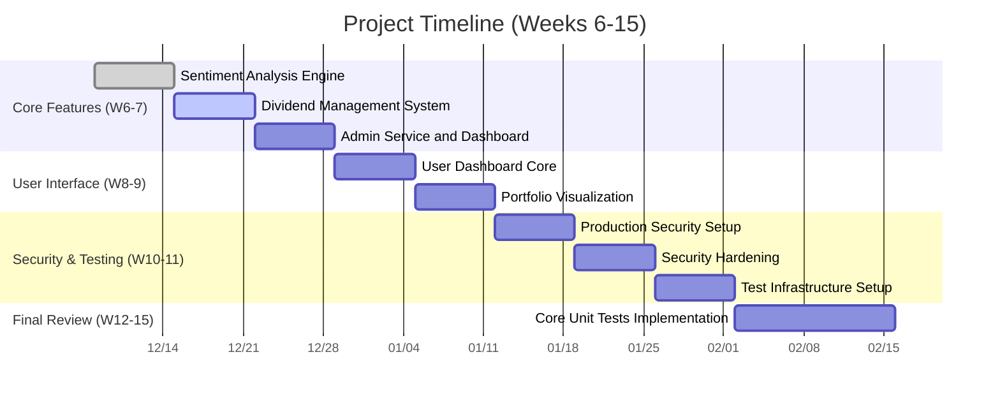

# Project Kanban Board

**Semester: End-Semester Review**  
**Last Updated:** 2025-12-05 01:38:00 IST

## 🚀 To Do (Week 6-7)

### Core Features
- [ ] **7. Sentiment Analysis Engine**
  - [ ] Set up 7-tier data source hierarchy
  - [ ] Integrate FinVADER
  - [ ] Configure batch processing

- [ ] **8. Dividend Management System**
  - [ ] Design database schema
  - [ ] Implement transaction logic
  - [ ] Create portfolio integration

- [ ] **9. Admin Service and Dashboard**
  - [ ] Set up role-based access
  - [ ] Build admin interfaces
  - [ ] Configure secure sessions

## 🔄 In Progress (Week 8-11)

### User Interface
- [ ] **10. User Dashboard Core**
  - [ ] Connect frontend with backend
  - [ ] Build dashboard template
  - [ ] Display wallet/portfolio summary

- [ ] **11. Portfolio Visualization**
  - [ ] Show current holdings
  - [ ] Display transaction history
  - [ ] Implement real-time P&L

### Security & Testing
- [ ] **12. Production Security**
  - [ ] Configure environment variables
  - [ ] Harden session security
  - [ ] Automate database setup

- [ ] **13. Security Hardening**
  - [ ] Implement CSRF protection
  - [ ] Configure secure cookies
  - [ ] Set up secrets management

## ✅ Done (Weeks 1-5)

### Completed Tasks
1. Project setup and database foundation
2. Authentication system
3. Portfolio management system
4. Stock repository and data management
5. Transaction engine
6. ML prediction service

---

## 📊 Progress Overview
- **Completed:** 6/15 (40%)
- **In Progress:** 0/15 (0%)
- **Remaining:** 9/15 (60%)
- **Current Week:** 5/15 (33% of semester)

## 🔄 Recent Activity
- **2025-12-05**: Updated roadmap with Kanban view
- **2025-11-27**: Completed ML prediction service
- **2025-11-20**: Implemented transaction engine

*Auto-generated on 2025-12-05 01:38:00 IST*
